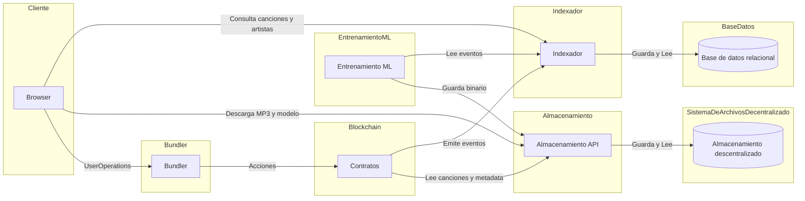

# Wave3 - Walking Skeleton

Implementación mínima de extremo a extremo para verificar la arquitectura completa de una dApp descentralizada con indexación, storage IPFS y procesamiento de datos.

## 🌐 Ambiente Productivo

**Frontend:** https://wave3-s4p8.onrender.com

**APIs:**
- **Ponder GraphQL:** https://ponder-sudh.onrender.com/graphql
- **Storage:** https://storage-5gx1.onrender.com
- **ML Service:** https://ml-3l8u.onrender.com

## 🚀 Inicio Rápido - Desarrollo Local

### Prerequisitos
- Docker & Docker Compose
- Node.js 20+
- Python 3.11+
- Yarn

### 1. Iniciar servicios helper (Postgres, IPFS)

```bash
make dev
```

Esto va a:
- Levantar Postgres y IPFS en Docker
- Instalar dependencias con `yarn install`
- Mostrar las instrucciones para iniciar los servicios localmente

### 2. Iniciar servicios en terminales separadas

```bash
# Terminal 1 - Blockchain local
yarn chain

# Terminal 2 - Deploy de contratos (después que chain esté corriendo)
yarn deploy

# Terminal 3 - Frontend
make dev-nextjs

# Terminal 4 - Indexador
make dev-ponder

# Terminal 5 - Storage API
make dev-storage

# Terminal 6 - ML Service
make dev-ml
```

### URLs Locales
- **Frontend:** http://localhost:3000
- **Ponder GraphQL:** http://localhost:42069/graphql
- **Storage API:** http://localhost:3001
- **ML API:** http://localhost:8000
- **IPFS Gateway:** http://localhost:8080

### Importar Wavecoin en MetaMask
1. Abrir MetaMask y entrar a la pestaña de tokens.
2. Click en los tres puntos y elegir "Importar tokens".
3. Copiar la dirección de Wavecoin desde `packages/hardhat/deployments/localhost/Wavecoin.json`.
4. Pegarla en MetaMask y confirmar el import.

### Sepolia
- Faucet de ETH de prueba: https://cloud.google.com/application/web3/faucet/ethereum/sepolia

#### Deploy manual (obligatorio si subís contratos)
El deploy a Sepolia debe hacerse manualmente con la cuenta de deploy:
```bash
yarn --cwd packages/hardhat deploy --network sepolia
```

Esto lo debe hacer cada integrante del equipo cuando sube cambios de contratos.
El deploy genera los JSON en `packages/hardhat/deployments`, que luego usa Nextjs, Ponder y otros servicios.
Si no se hace el deploy, esos archivos no existen y en producción (Render) el frontend/indexador no encuentran el contrato.

#### Cuenta de deploy (CI/CD)
El deploy automatizado a Sepolia en CI/CD se realiza con la siguiente cuenta:

**Dirección:** `0x34dba5adc4bf90ff2697532b92ba427b6ef96bf2`

⚠️ **Importante:**
- Esta cuenta necesita Sepolia ETH para funcionar
- Si el deploy falla, revisar si tiene fondos y agregarle ETH de prueba

### Detener todo

```bash
make down
```

## 📦 Arquitectura

### Diagrama de Despliegue



### Servicios

- **nextjs** - Frontend con Scaffold-ETH-2
- **ponder** - Indexador de eventos blockchain (GraphQL)
- **storage** - API de gestión IPFS
- **ml** - Servicio de procesamiento (FastAPI)
- **postgres** - Base de datos (Docker local / Supabase prod)
- **ipfs** - Nodo IPFS local (Docker) / Pinata (prod)

## 🔧 Comandos Útiles

```bash
# Desarrollo local (solo helpers)
make dev

# Stack completo en Docker
make up-full

# Ver logs
make logs-ponder
make logs-storage
make logs-ml

# Detener todo
make down

# Setup base de datos local
make setup-db

# Setup base de datos Supabase (funciones necesarias para búsqueda)
make setup-db-supabase
```

### ⚠️ Importante: Supabase Schema Reset

Si cambias el `DATABASE_SCHEMA` en producción (Render) o eliminas un schema de Supabase, debes ejecutar nuevamente:

```bash
make setup-db-supabase
```

Esto restaura las funciones SQL necesarias (como `similarity`) que usa la aplicación para búsquedas.

## 📝 Notas

- Este es un **Walking Skeleton** - una implementación mínima para validar la integración completa
- En desarrollo, los servicios corren nativamente para hot-reload
- En producción, todo corre en contenedores (Render/Vercel)
- IPFS usa nodo local en dev, Pinata en producción
- Postgres usa Docker local, Supabase en producción
