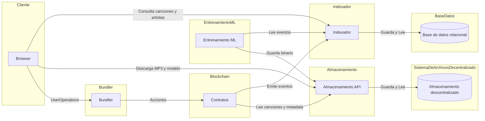

# Wave3

Plataforma de música descentralizada donde los fans pueden invertir en canciones y cobrar regalías. Construida sobre Base Sepolia con smart accounts, indexación on-chain y recomendaciones con ML.

## 📚 Documentación

- **[Propuesta](docs/Propuesta%20Wave3.md)** - Propuesta original del trabajo
- **[Arquitectura de Contratos](docs/CONTRACTS.md)** - Cómo funcionan los contratos inteligentes
- **[Integración Contracts ↔ Frontend](docs/CONTRACTS_FRONTEND_OVERVIEW.md)** - Resumen para el equipo de frontend
- **[Session Keys](docs/AA_SESSION_KEYS_DESIGN.md)** - Reproducción sin firma por play
- **[Seed](docs/SEED.md)** - Cómo cargar música de prueba (localhost y Base Sepolia)
- **[Sistema de Recomendación](docs/RECOMMENDATION_SYSTEM.md)** - Modelo híbrido: ALS + features de contenido (género, año) con FAISS
- **[Estado del Proyecto](docs/STATUS.md)** - Qué está hecho y qué falta
- **[Próximos Pasos](docs/NEXT_STEPS.md)** - Propuesta vs. realidad, prioridades y puntos a negociar
- **[Mejoras de UX/UI](docs/UX_IMPROVEMENTS.md)** - Diagnóstico visual y propuestas de mejora
- **[Errores Comunes](docs/COMMON_ERRORS.md)** - Soluciones a problemas típicos
- **[ETH en Base Sepolia](docs/BASE_SEPOLIA_ETH.md)** - Cómo obtener ETH para operar en la testnet

## 🌐 Ambiente Productivo

> [!WARNING]
> **Wave3 corre en Base Sepolia.** Para usar la app (comprar partes, reproducir canciones, hacer boost) necesitás ETH en Base Sepolia.
> 
> 👉 **[Cómo obtener ETH en Base Sepolia](docs/BASE_SEPOLIA_ETH.md)**
> 
> El **relayer** (`0x32Cae2Aaa2644c7D4e5B37FcaFe2e560551421D3`) también necesita fondos para que el playback funcione. Si la música no reproduce, probablemente se quedó sin ETH.

**Frontend:** https://wave3-s4p8.onrender.com

**APIs:**
- **Ponder GraphQL:** https://ponder-sudh.onrender.com/graphql
- **Storage:** https://storage-5gx1.onrender.com
- **ML Service:** https://ml-3l8u.onrender.com

## 🚀 Inicio Rápido - Desarrollo Local

### Prerequisitos
- Docker & Docker Compose
- Node.js 20+
- Python 3.11+
- Yarn

### 1. Iniciar servicios helper (Postgres, IPFS)

```bash
make dev
```

Esto va a:
- Levantar Postgres y IPFS en Docker
- Instalar dependencias con `yarn install`
- Mostrar las instrucciones para iniciar los servicios localmente

### 2. Iniciar servicios en terminales separadas

```bash
# Terminal 1 - Blockchain local
yarn chain

# Terminal 2 - Deploy de contratos (después que chain esté corriendo)
yarn deploy

# Terminal 3 - Frontend
make dev-nextjs

# Terminal 4 - Indexador
make dev-ponder

# Terminal 5 - Storage API
make dev-storage

# Terminal 6 - ML Service
make dev-ml
```

### URLs Locales
- **Frontend:** http://localhost:3000
- **Ponder GraphQL:** http://localhost:42069/graphql
- **Storage API:** http://localhost:3001
- **ML API:** http://localhost:8000
- **IPFS Gateway:** http://localhost:8080

### Importar Wavecoin en MetaMask
1. Abrir MetaMask y entrar a la pestaña de tokens.
2. Click en los tres puntos y elegir "Importar tokens".
3. Copiar la dirección de Wavecoin desde `packages/hardhat/deployments/localhost/Wavecoin.json`.
4. Pegarla en MetaMask y confirmar el import.

### Base Sepolia (testnet de producción)

Wave3 usa **Base Sepolia** (no Ethereum Sepolia). Ver 👉 **[Cómo obtener ETH en Base Sepolia](docs/BASE_SEPOLIA_ETH.md)**

#### Deploy manual (obligatorio si cambiás contratos)
```bash
make deploy-base-sepolia
```

El deploy genera los JSON en `packages/hardhat/deployments/baseSepolia`, que luego usan Next.js, Ponder y otros servicios.
Si no se hace el deploy, esos archivos no existen y en producción el frontend/indexador no encuentran el contrato.

#### Cuenta del Relayer (Smart Accounts)

> ⚠️ **Esta cuenta necesita Base Sepolia ETH para que los usuarios puedan reproducir canciones.**

**Dirección:** `0x32Cae2Aaa2644c7D4e5B37FcaFe2e560551421D3`

El relayer crea Smart Accounts y ejecuta transacciones de playback. Si se queda sin fondos, **nadie puede escuchar música**.

### Detener todo

```bash
make down
```

## 📦 Arquitectura

### Diagrama de Despliegue



### Servicios

- **nextjs** - Frontend con Scaffold-ETH-2
- **ponder** - Indexador de eventos blockchain (GraphQL)
- **storage** - API de gestión IPFS
- **ml** - Servicio de procesamiento (FastAPI)
- **postgres** - Base de datos (Docker local / Supabase prod)
- **ipfs** - Nodo IPFS local (Docker) / Pinata (prod)

## 🔧 Comandos Útiles

```bash
# Desarrollo local (solo helpers)
make dev

# Stack completo en Docker
make up-full

# Ver logs
make logs-ponder
make logs-storage
make logs-ml

# Detener todo
make down

# Setup base de datos local
make setup-db

# Setup base de datos Supabase (funciones necesarias para búsqueda)
make setup-db-supabase
```

### ⚠️ Importante: Supabase Schema Reset

Si cambias el `DATABASE_SCHEMA` en producción (Render) o eliminas un schema de Supabase, debes ejecutar nuevamente:

```bash
make setup-db-supabase
```

Esto restaura las funciones SQL necesarias (como `similarity`) que usa la aplicación para búsquedas.

## 📝 Notas

- En desarrollo, los servicios corren nativamente para hot-reload
- En producción, todo corre en contenedores (Render/Vercel)
- IPFS usa nodo local en dev, Pinata en producción
- Postgres usa Docker local, Supabase en producción
