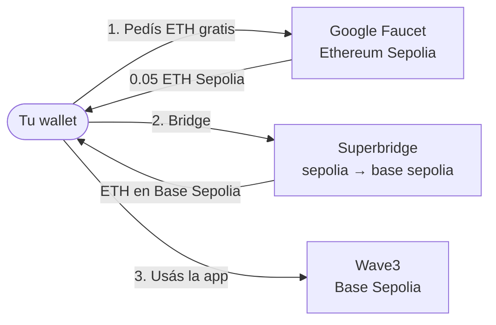
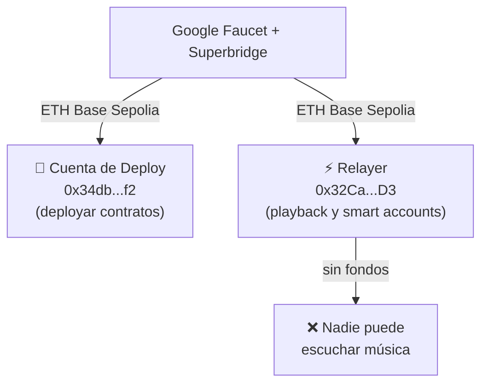

# Cómo obtener ETH en Base Sepolia

Base Sepolia es la testnet que usa Wave3 en producción. Para interactuar con la app (comprar partes, hacer boost, reproducir canciones) necesitás ETH en Base Sepolia.

> [!IMPORTANT]
> **ETH Mainnet, ETH Sepolia y ETH Base Sepolia son tres tokens distintos y no son intercambiables directamente.**
>
> - **ETH Mainnet** — la red principal de Ethereum, tiene valor real
> - **ETH Sepolia** — testnet de Ethereum, sin valor real, se consigue gratis con faucets
> - **ETH Base Sepolia** — testnet de Base (L2 sobre Ethereum), sin valor real, se obtiene haciendo bridge desde ETH Sepolia
>
> Por eso el proceso tiene dos pasos: primero conseguís ETH Sepolia gratis, y después lo "movés" a Base Sepolia con un bridge.

## Flujo general

## Agregar Base Sepolia a MetaMask

MetaMask no incluye Base Sepolia por defecto. Para agregarlo:

1. Ir a **https://sepolia.basescan.org/**
2. Bajar hasta el final de la página
3. Click en **"Add Base Sepolia Network"**
4. Confirmar en MetaMask

Con eso ya podés ver tu saldo de ETH y tokens en Base Sepolia.

## Paso a paso para obtener ETH

### 1. Obtener ETH en Ethereum Sepolia

Usá el faucet de Google:

👉 **https://cloud.google.com/application/web3/faucet/ethereum/sepolia**

- Iniciá sesión con tu cuenta de Google
- Pegá tu dirección de wallet (MetaMask, etc.)
- Pedí ETH — te da 0.05 ETH de Sepolia gratis

### 2. Hacer bridge a Base Sepolia

Con el ETH de Sepolia ya en tu wallet, usá Superbridge para pasarlo a Base Sepolia:

👉 **https://superbridge.app/base-sepolia**

- Conectá tu wallet
- Seleccioná **Ethereum Sepolia → Base Sepolia**
- Ingresá el monto a bridgear (con 0.02 ETH alcanza para operar)
- Confirmá la transacción

El bridge tarda unos minutos en acreditarse.

## Direcciones que necesitan fondos

| Cuenta | Dirección | Para qué |
|--------|-----------|----------|
| Deploy | `0x34dba5adc4bf90ff2697532b92ba427b6ef96bf2` | Deployar contratos a Base Sepolia |
| Relayer | `0x32Cae2Aaa2644c7D4e5B37FcaFe2e560551421D3` | Playback y smart accounts |

> Si el relayer se queda sin fondos, **nadie puede reproducir canciones**.
