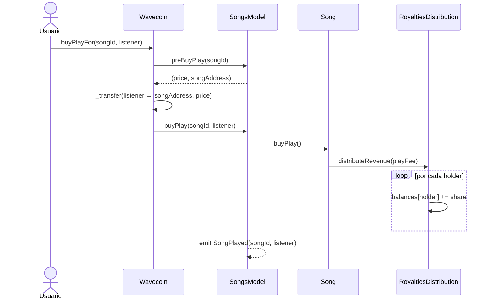

# Flujo de `buyPlay`

## Descripción paso a paso

| # | Contrato | Acción |
|---|----------|--------|
| 1 | **Wavecoin** | Recibe `buyPlay(songId)` o `buyPlayFor(songId, listener)` |
| 2 | **Wavecoin** | Consulta `preBuyPlay(songId)` a SongsModel para obtener `price` y `songAddress` |
| 3 | **Wavecoin** | Verifica que el listener tenga saldo suficiente |
| 4 | **Wavecoin** | Transfiere `price` WAVE del listener al contrato Song |
| 5 | **SongsModel** | Recibe `buyPlay(songId, listener)`, busca el contrato Song por id |
| 6 | **Song** | Recibe `buyPlay()`, delega a `RoyaltiesDistribution.distributeRevenue(playFee)` |
| 7 | **RoyaltiesDistribution** | Recorre los holders y acumula `balances[holder] += (playFee / totalParts) * parts[holder]` |
| 8 | **SongsModel** | Emite `SongPlayed(songId, listener)` → indexado por Ponder |

## Notas

- Los tokens WAVE quedan **físicamente** en el contrato `Song`. `RoyaltiesDistribution` solo lleva contabilidad en `balances`.
- El 70% del precio va a `songAddress`; el 30% va al treasury (fee de Wavecoin, cobrado en `withdrawRoyalties`).
- `SongPlayed` es el único evento on-chain que actualmente registra un play en Ponder.
