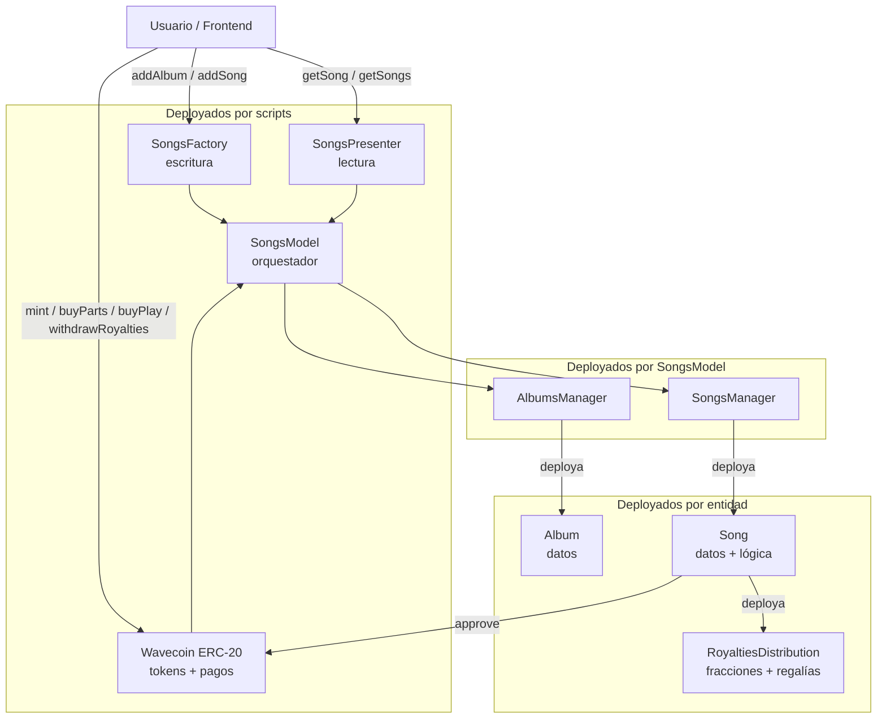
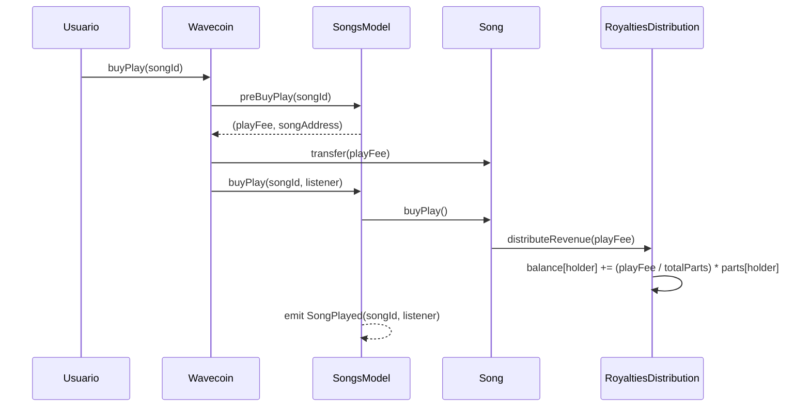
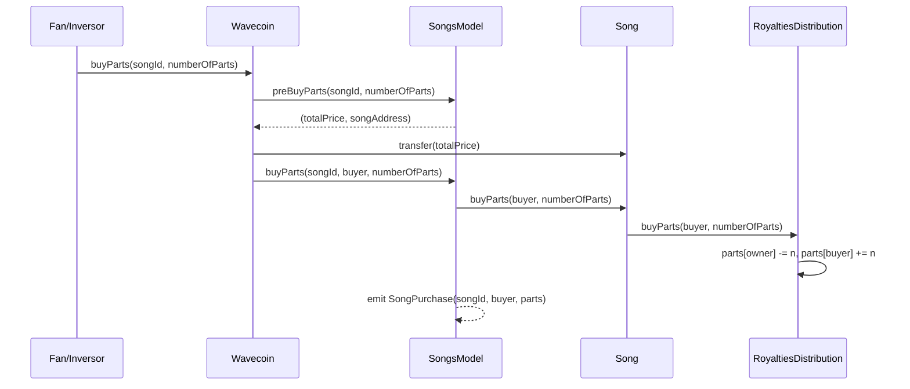
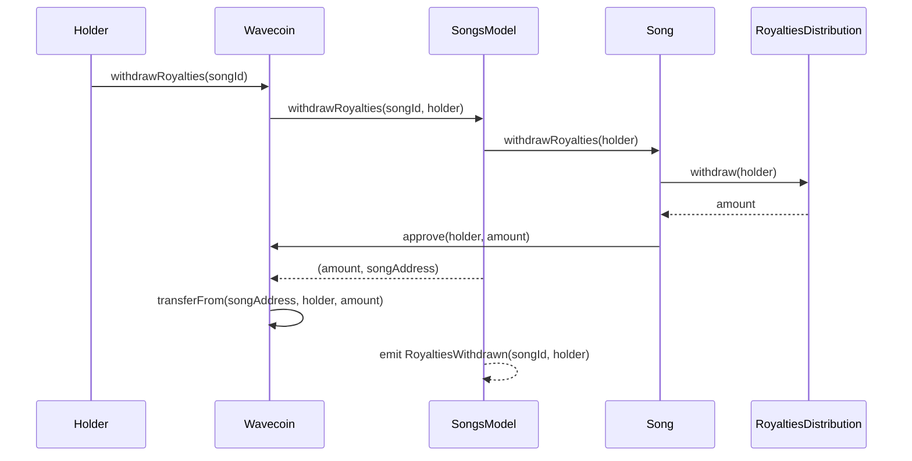

# Arquitectura de Contratos Inteligentes

## Resumen

Wave3 utiliza una arquitectura de contratos modulares donde cada entidad (álbum, canción, distribución de regalías) se despliega como un contrato independiente en runtime. Hay 4 contratos deployados estáticamente y el resto se crean dinámicamente.

### Contratos deployados (scripts)

| Contrato | Rol | Depende de |
|---|---|---|
| **SongsModel** | Orquestador central. Deploya AlbumsManager y SongsManager en su constructor | — |
| **Wavecoin** (ERC-20) | Token de pago. Expone `mint`, `buyPlay`, `buyParts`, `withdrawRoyalties` | SongsModel |
| **SongsFactory** | Punto de entrada para artistas: `addAlbum()` y `addSong()` inyectando `msg.sender` como owner | Wavecoin, SongsModel |
| **SongsPresenter** | API de lectura para el frontend: `getSong()` y `getSongs()` con structs enriquecidos | SongsModel |

### Contratos deployados en runtime (por otros contratos)

| Contrato | Creado por | Descripción |
|---|---|---|
| **AlbumsManager** | SongsModel (constructor) | Registro de álbumes, deploya un Album por cada `addAlbum()` |
| **SongsManager** | SongsModel (constructor) | Registro de canciones, deploya un Song por cada `addSong()` |
| **Album** | AlbumsManager | Objeto de datos: id, owner, name, artist, imageCID, genre, year |
| **Song** | SongsManager | Datos + lógica de canción. Deploya su propio RoyaltiesDistribution |
| **RoyaltiesDistribution** | Song (constructor) | Motor de propiedad fraccionada y distribución de regalías |

### Contratos de Smart Accounts (no deployados en scripts)

| Contrato | Descripción |
|---|---|
| **Wave3SmartAccountFactory** | Crea Smart Accounts por EOA |
| **Wave3SmartAccount** | Cuenta EIP-712 con session keys para transacciones gasless (implementado pero no integrado) |

---

## Diagrama de interacción



---

## Detalle de Contratos

### Wavecoin (ERC-20)

Token de pago. Cualquiera puede mintear (faucet). Las operaciones financieras pasan por acá.

| Función | Descripción |
|---|---|
| `mint(amount)` | Mintea tokens al caller (sin restricción) |
| `buyPlay(songId)` | Paga el playFee, transfiere tokens al contrato Song, distribuye regalías a holders |
| `buyParts(songId, numberOfParts)` | Compra fracciones de una canción, transfiere tokens al Song |
| `withdrawRoyalties(songId)` | Retira regalías acumuladas del Song al caller |

### SongsFactory (punto de entrada de escritura)

El frontend llama acá para crear contenido. Inyecta `msg.sender` como owner.

| Función | Descripción |
|---|---|
| `addAlbum(name, artist, imageCID, genre, year)` | Crea un álbum (deploya contrato Album) |
| `addSong(name, audioCID, albumId, playFee, partPrice, totalParts, nonSellableParts, wavecoin)` | Crea una canción (deploya contrato Song + RoyaltiesDistribution) |

### SongsPresenter (punto de entrada de lectura)

Arma structs enriquecidos para el frontend con datos de Song + Album + RoyaltiesDistribution.

| Función | Descripción |
|---|---|
| `getSong(id)` | Retorna `SongResponse` con metadata, álbum, y datos de regalías |
| `getSongs(ids[])` | Retorna múltiples songs en batch |

**Structs de respuesta:**
- `SongResponse`: id, name, audioCID, playFee, partPrice, album (AlbumResponse), royaltiesDistribution (RoyaltiesDistributionResponse)
- `AlbumResponse`: id, name, artist, imageCID, genre, year
- `RoyaltiesDistributionResponse`: partPrice, totalParts, availableParts

### SongsModel (orquestador)

Capa intermedia que coordina AlbumsManager y SongsManager. Emite todos los eventos que Ponder indexa.

**Eventos:**
- `AlbumAdded(id, owner, name, artist, imageCID, genre, year)`
- `SongAdded(id, owner, name, audioCID, albumId)`
- `SongPurchase(songId, buyer, parts)`
- `SongPlayed(songId, listener)`
- `RoyaltiesWithdrawn(songId, holder)`

### Song (instancia por canción)

Cada canción es un contrato independiente que contiene sus datos y deploya su propio RoyaltiesDistribution.

| Campo | Descripción |
|---|---|
| owner | Wallet del artista |
| name | Nombre de la canción |
| audioCID | CID del audio en IPFS |
| albumId | ID del álbum |
| playFee | Costo por reproducción (en WAVE) |

Expone getters de datos y delega las operaciones de fracciones/regalías a su RoyaltiesDistribution.

### RoyaltiesDistribution (instancia por canción)

Motor de propiedad fraccionada. Cada Song tiene uno.

| Función | Descripción |
|---|---|
| `buyParts(buyer, numberOfParts)` | Transfiere partes del owner al comprador. Decrementa availableParts |
| `distributeRevenue(amount)` | Distribuye tokens proporcionalmente entre holders: `balance += (amount / totalParts) * parts` |
| `withdraw(holder)` | Retira balance acumulado del holder, retorna el monto |

**Parámetros configurables por canción:**
- `totalParts` — cantidad total de fracciones
- `nonSellableParts` — fracciones reservadas (no vendibles)
- `partPrice` — precio por fracción

### Album (instancia por álbum)

Objeto de datos puro con getters: id, owner, name, artist, imageCID, genre, year.

---

## Flujo completo: reproducir una canción



## Flujo completo: comprar fracciones



## Flujo completo: retirar regalías



---

## Direcciones de Contratos

Los contratos desplegados se encuentran en:
```
packages/hardhat/deployments/localhost/
packages/hardhat/deployments/sepolia/
```
