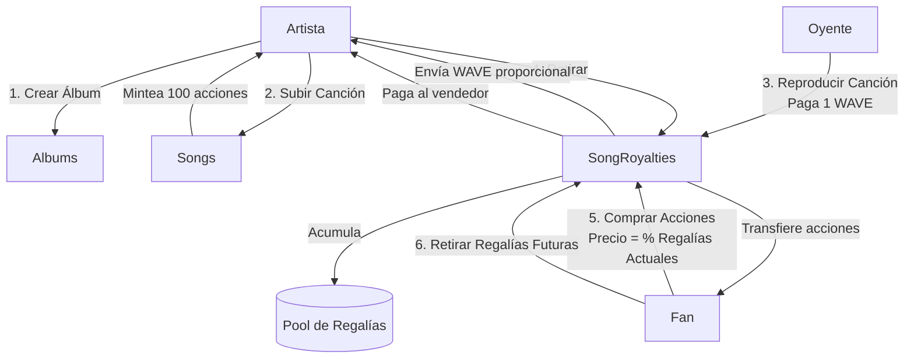
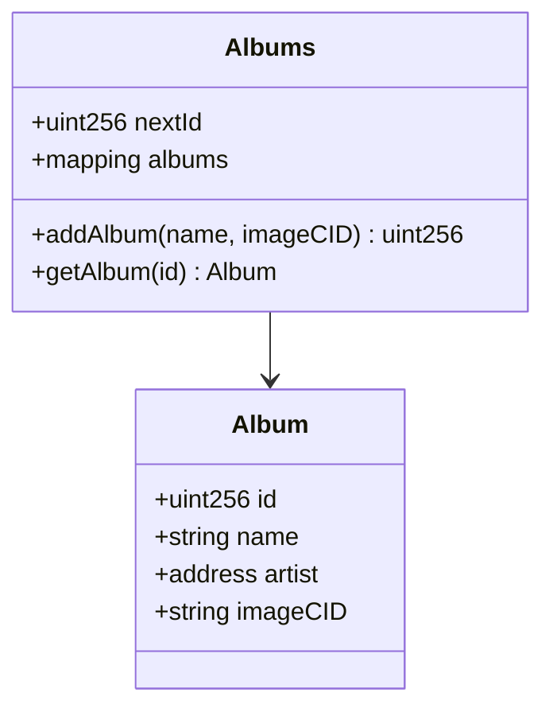
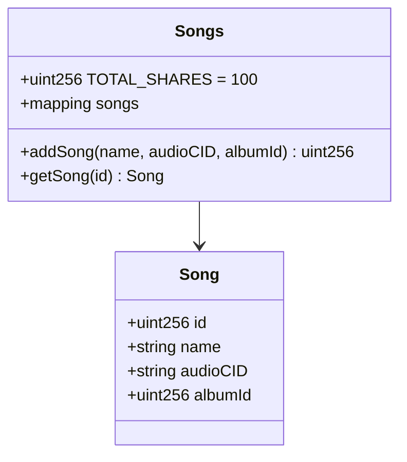
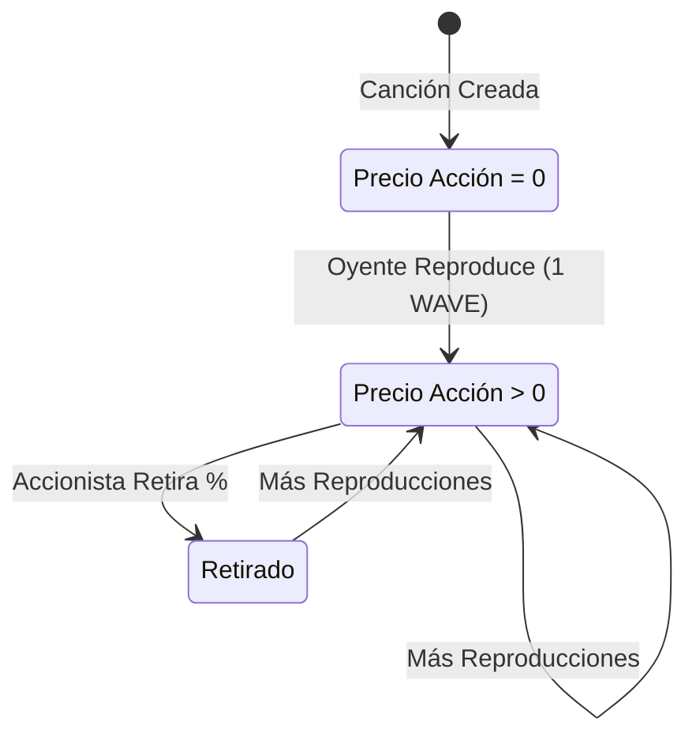
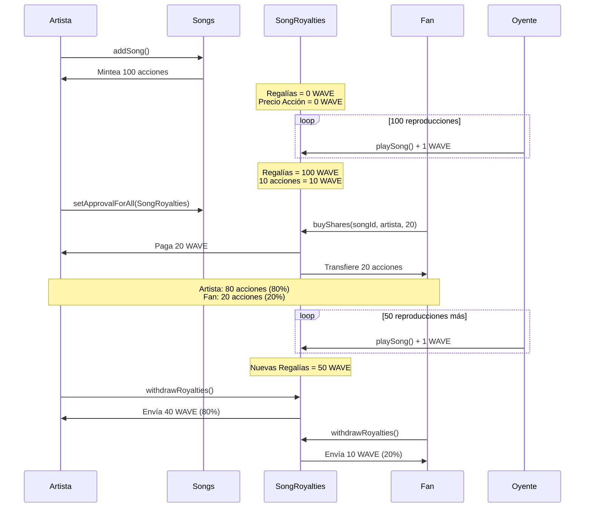

# Arquitectura de Contratos Inteligentes

## Resumen

Wave3 utiliza 4 contratos inteligentes simples para una plataforma de streaming musical con reparto de regalías:

- **Wavecoin** - Token ERC20 para pagos
- **Albums** - Registro de álbumes
- **Songs** - Token ERC1155 que representa acciones de canciones (100 acciones por canción)
- **SongRoyalties** - Gestiona las tarifas de reproducción y el comercio de acciones

## Flujo de Contratos



## Detalle de Contratos

### 1. Wavecoin (ERC20)

Token de pago simple con minteo público.

```solidity
function mint(uint256 amount) public
```

### 2. Albums

Almacena metadatos de álbumes con propiedad del artista.



### 3. Songs (ERC1155)

Cada canción es un token ERC1155 con 100 acciones totales.



**Puntos Clave:**
- El creador recibe 100 acciones (100% de propiedad)
- Acciones = porcentaje de regalías
- Las acciones son tokens ERC1155 transferibles

### 4. SongRoyalties

Gestiona el play-to-earn y el mercado de acciones.



**Funciones:**

```solidity
function playSong(uint256 songId) external
// El oyente paga 1 WAVE, se agrega al pool de regalías

function withdrawRoyalties(uint256 songId) external
// El accionista retira: (regalías * acciones) / 100

function buyShares(uint256 songId, address seller, uint256 shares) external
// Precio = (regalíasTotales * acciones) / 100
// El vendedor debe aprobar el contrato primero
```

## Economía de Acciones

### Ejemplo: Ciclo de Vida de una Canción



### Modelo de Precios

El precio de las acciones es **dinámico** basado en las regalías acumuladas:

- **Canción nueva** (0 reproducciones) → Acciones cuestan **0 WAVE** (¡gratis!)
- **100 reproducciones** (100 WAVE de regalías) → 10 acciones cuestan **10 WAVE**
- **1000 reproducciones** (1000 WAVE de regalías) → 10 acciones cuestan **100 WAVE**

**Fórmula:**
```
Precio = (Regalías Totales × Acciones) ÷ 100
```

Esto significa:
- Los primeros seguidores obtienen acciones gratis
- El valor de las acciones crece con la popularidad de la canción
- Los vendedores son compensados exactamente por lo que pierden

## Decisiones Clave de Diseño

### Simplicidad Primero

1. **Tarifa de reproducción constante**: 1 WAVE por reproducción (sin variables)
2. **Acciones fijas**: Siempre 100 acciones por canción (porcentajes fáciles)
3. **Sin sistema de listado**: Comercio basado en aprobación (ERC1155 estándar)
4. **Pool de regalías único**: Por canción, no por artista
5. **Precio basado en valor**: Precio de acción = valor de regalías (mercado justo)

### ¿Por qué 100 Acciones?

- **Matemática fácil**: 1 acción = 1%
- **Legible para humanos**: 20 acciones = 20%
- **Precio simple**: Sin decimales complejos

### ¿Por qué Precio Dinámico?

- **Justo para vendedores**: Compensados por la pérdida de regalías
- **Recompensa a fans tempranos**: Acciones gratis antes de que la canción sea popular
- **Impulsado por el mercado**: El precio refleja el valor real
- **Sin especulación**: Precio = regalías reales, no hype

## Direcciones de Contratos

Los contratos desplegados se encuentran en:
```
packages/hardhat/deployments/localhost/
packages/hardhat/deployments/sepolia/
```

## Testing

Ejecutar tests:
```bash
cd packages/hardhat
npx hardhat test
```

Casos de prueba clave:
- Reproducir canción → Acumular regalías
- Retirar → Obtener porción proporcional
- Comprar acciones → Precio basado en regalías
- El valor de las acciones aumenta con las reproducciones
