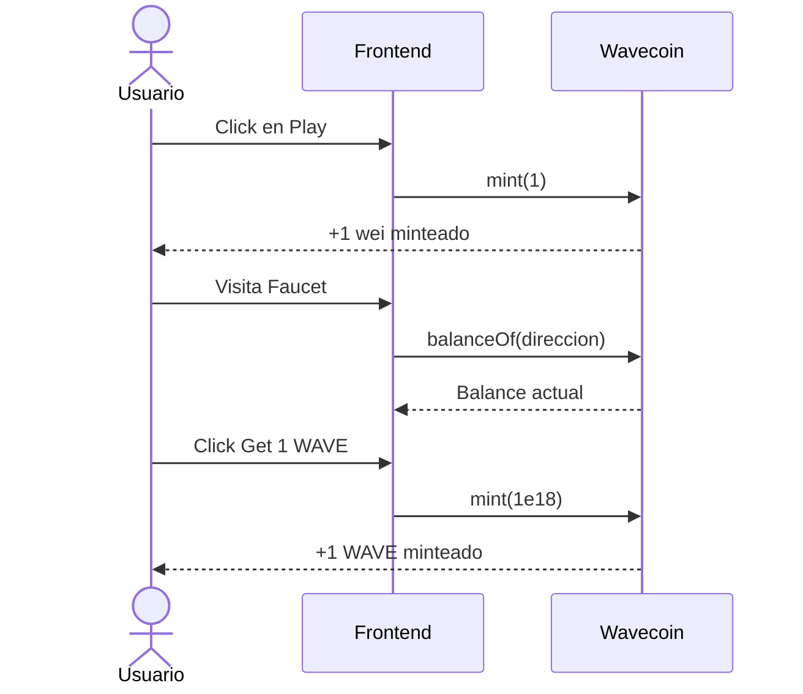
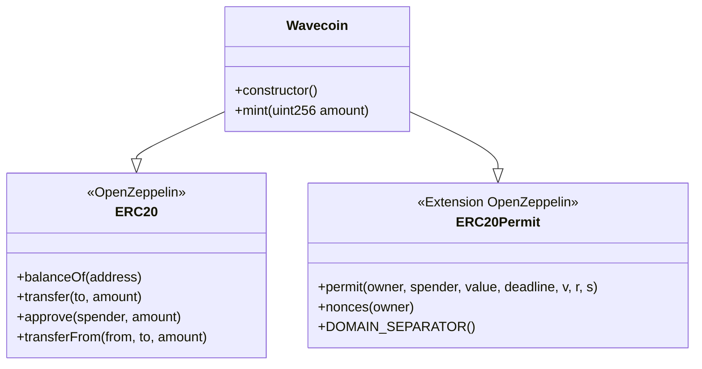
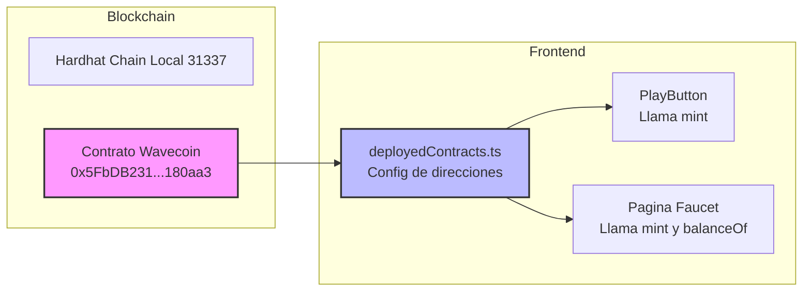

# Integración de Smart Contracts - Resumen

## Lo Que Esperan Tus Compañeros

Tu equipo de frontend ya construyó la UI esperando que exista **UN SOLO smart contract**:

### Contrato: `Wavecoin`
- **Tipo:** Token ERC-20 (con extensión ERC-20 Permit)
- **Símbolo:** `WAVE`
- **Implementación Actual:** Ya existe un stub básico en `packages/hardhat/contracts/Wavecoin.sol`

---

## Puntos de Integración con el Frontend

### 1. **Componente PlayButton**
**Archivo:** `packages/nextjs/app/home/_components/PlayButton.tsx`

```typescript
const { writeContractAsync } = useScaffoldWriteContract({ 
    contractName: "Wavecoin" 
});

// Cuando el usuario hace click en play:
await writeContractAsync({
    functionName: "mint",
    args: [1n]  // Mintea 1 wei (unidad mínima)
});
```

**Propósito:** Cada vez que alguien reproduce una canción, llama a `mint(1)` en Wavecoin.

---

### 2. **Página Faucet**
**Archivo:** `packages/nextjs/app/faucet/page.tsx`

```typescript
// Leer balance
const { data: balance } = useScaffoldReadContract({
    contractName: "Wavecoin",
    functionName: "balanceOf",
    args: [address]
});

// Mintear tokens
await writeContractAsync({
    functionName: "mint",
    args: [parseEther("1")]  // Mintea 1 WAVE (1e18 wei)
});
```

**Propósito:** El faucet le da 1 token WAVE al usuario para usar en la app.

---

## Funciones Requeridas del Contrato

Basado en el uso del frontend, el contrato DEBE tener:

| Función | Parámetros | Retorna | Uso |
|----------|-----------|---------|-------|
| `mint` | `uint256 amount` | - | Mintea tokens al caller |
| `balanceOf` | `address account` | `uint256` | Obtiene balance de tokens (estándar ERC-20) |

Más todas las funciones estándar de ERC-20 heredadas de OpenZeppelin.

---

## Diagramas de Arquitectura

### Flujo de Usuario con Smart Contract



### Herencia del Contrato



### Estado Actual del Deployment



---

## Código Actual del Contrato

**Ubicación:** `packages/hardhat/contracts/Wavecoin.sol`

```solidity
//SPDX-License-Identifier: MIT
pragma solidity >=0.8.0 <0.9.0;

import "@openzeppelin/contracts/token/ERC20/ERC20.sol";
import "@openzeppelin/contracts/token/ERC20/extensions/ERC20Permit.sol";

contract Wavecoin is ERC20, ERC20Permit {
    constructor() ERC20("Wavecoin", "WAVE") ERC20Permit("Wavecoin") {
    }

    function mint(uint256 amount) public {
        _mint(msg.sender, amount);
    }
}
```

**⚠️ Nota:** La función `mint` es pública y sin restricciones - cualquiera puede mintear tokens ilimitados. Considerá agregar control de acceso para producción.

---

## Configuración de Deployment

**Config de Red:** `packages/nextjs/scaffold.config.ts`
- **Desarrollo:** Hardhat chain local (31337)
- **Producción:** Sepolia testnet

**Dirección Deployada (Local):** `0x5FbDB2315678afecb367f032d93F642f64180aa3`

---

## Lo Que Tenés Que Hacer

1. ✅ **El Contrato Ya Existe:** `Wavecoin.sol` ya está creado
2. ⚠️ **Necesita Deployment:** Deployar a la red objetivo (probablemente ya está deployado localmente según deployedContracts.ts)
3. 🔧 **Mejoras Opcionales:**
   - Agregar control de acceso a la función `mint()`
   - Agregar límite de supply máximo
   - Agregar funcionalidad de burn
   - Agregar roles (admin, minter)
   - Agregar eventos para mejor tracking

---

## Referencia Rápida

| Item | Valor |
|------|-------|
| Nombre del Contrato | `Wavecoin` |
| Símbolo | `WAVE` |
| Decimales | 18 (estándar) |
| Dirección Local | `0x5FbDB2315678afecb367f032d93F642f64180aa3` |
| Chain ID (dev) | 31337 (Hardhat) |
| Chain ID (prod) | 11155111 (Sepolia) |

---

## Resumen

Tus compañeros construyeron el frontend esperando:
- ✅ **Un contrato:** `Wavecoin` (token ERC-20)
- ✅ **Dos funciones principales:** `mint()` y `balanceOf()`
- ✅ **Uso actual:** El botón Play mintea 1 wei por reproducción, el faucet da 1 WAVE

El contrato básico ya está implementado y deployado localmente. Solo tenés que revisarlo y potencialmente agregar features para producción como control de acceso antes de deployar a testnet/mainnet.
