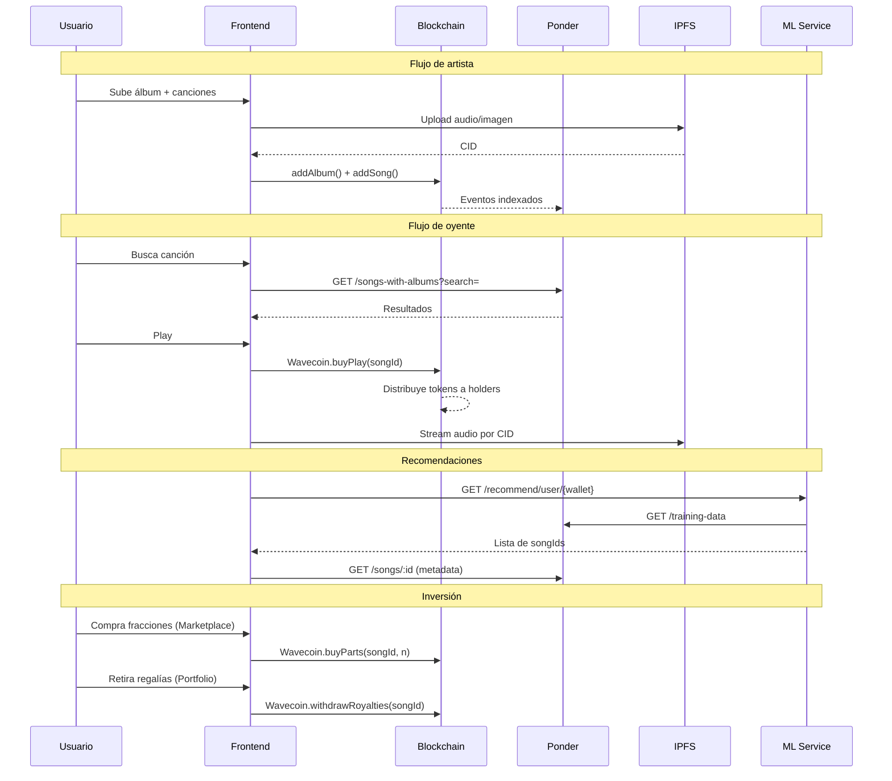
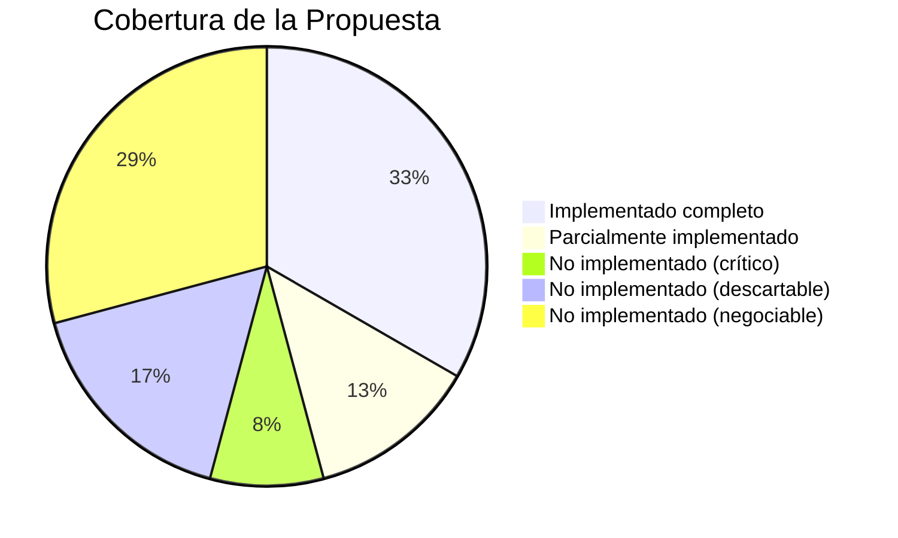

# Wave3 — Próximos pasos

> Actualizado: 2026-04-04

Análisis de lo que está implementado vs. lo que se comprometió en la propuesta, próximos pasos concretos y puntos a negociar con la comisión académica.

---

## Propuesta vs. Realidad

| Componente | Estado | Detalle |
|---|---|---|
| Smart Contracts (regalías + autoría) | ✅ Hecho | RoyaltiesDistribution, Song, Album on-chain |
| Wavecoin ERC-20 | ✅ Hecho | mint, buyPlay, buyParts, withdrawRoyalties |
| ML Recomendación | ✅ Hecho | ALS + contenido (género/año) + FAISS |
| Storage IPFS | ✅ Hecho | Audio + imágenes via Pinata |
| Auth por wallet | ✅ Hecho | wagmi, sin cuentas centralizadas |
| Frontend | ✅ Hecho | home, search, upload, portfolio, marketplace, faucet |
| Indexador Ponder | ✅ Hecho | Eventos on-chain → PostgreSQL → REST API |
| Seed FMA | ✅ Hecho | ~8000 canciones con metadata real |
| Propiedad fraccionada | ⚠️ Parcial | Funciona con contrato custom, no es ERC-721/1155 |
| Marketplace | ⚠️ Parcial | Compra de fracciones OK, sin reventa entre usuarios |
| Admin | ⚠️ Parcial | Solo debug genérico de Scaffold-ETH |
| Gobernanza DAO | ❌ Falta | No hay voting ni governance token |
| ML descentralizado (federado) | ❌ Falta | Entrenamiento centralizado en Docker |
| Pago con fiat | ❌ Falta | Sin integración Stripe/fiat |
| Trading de fracciones | ❌ Falta | Solo compra, no transferencia entre usuarios |
| Transacciones gasless | ❌ Falta | Se implementó y removió (Smart Accounts) |
| Quema de tokens | ❌ Falta | Tokens circulan, no se queman |
| Navegación a canción | ❌ Falta | SongCard tiene links a `/song/{id}` pero la página no existe (da 404) |
| Página de álbum | ❌ Falta | No hay vista de detalle de álbum ni links hacia ella |
| Página de artista | ❌ Falta | Los nombres de artista son texto plano, no llevan a ningún lado |
| Playlists | ❌ Falta | Hay tab en el menú pero la página es un stub vacío |
| Audio cifrado en IPFS | ❌ Falta | Propuesta dice "en forma cifrada", el audio se sube sin cifrar |
| Checkpoints ML en IPFS | ❌ Falta | Propuesta dice "checkpoints del modelo de ML" en IPFS, no se hace |
| Boost de recomendación por tokens | ❌ Falta | Propuesta dice "aumentar la prioridad de sugerencia" con tokens, no implementado |

---

## Lo que funciona hoy (flujo completo)

---

## Próximos pasos: qué hacer

### Prioridad Alta — necesarios para la entrega

| # | Tarea | Esfuerzo | Referencia en propuesta |
|---|---|---|---|
| 1 | **Transacciones sin popup (session keys / gasless)** | Alto | Sin esto, cada play abre MetaMask pidiendo confirmación. Inaceptable para una app de música. Se necesita session keys o similar para que el usuario apruebe una vez y después pueda escuchar sin interrupciones |
| 2 | **Navegación: página de canción, álbum y artista** | Medio | Sección 9 Clientes: "búsqueda, reproducción de canciones". Hoy la app no tiene navegación interna real — ver detalle abajo |
| 3 | **Playlists** | Medio | Hay un tab "Playlists" en el menú que lleva a un stub vacío. Es funcionalidad estándar de cualquier plataforma de streaming |
| 4 | **Documentación final** | Medio | Sección 13: "Documentación y presentación final" |

### Prioridad Media — fortalecen la demo

| # | Tarea | Esfuerzo | Referencia en propuesta |
|---|---|---|---|
| 5 | **Marketplace con filtros** | Bajo | Sección 9 Clientes: "búsqueda, reproducción de canciones y compra de créditos y derechos" |
| 6 | **Limpieza de placeholders** | Bajo | "Totally not a scam" en footer, otros textos placeholder |

---

## Puntos a negociar con la comisión académica

Hay varias cosas que la propuesta menciona pero que no son viables de implementar en el tiempo restante (o que no tienen sentido para un MVP académico). Estos son los puntos que hay que discutir:

#### 🟢 Hecho

| Punto | Propuesta dice | Realidad |
|---|---|---|
| Auth descentralizada | Wallets sin cuentas centralizadas | ✅ wagmi wallet-based auth |
| Regalías automáticas | Distribución automática por smart contracts | ✅ buyPlay → distribute → withdraw |
| Recomendación híbrida | ML colaborativo + contenido | ✅ ALS + género/año + FAISS |

#### 🔴 Crítico — hay que hacer sí o sí

| Punto | Propuesta dice | Realidad | Argumento |
|---|---|---|---|
| Gasless / session keys | Smart Accounts, UX sin popups | Se implementó y removió por complejidad | **Blocker de UX**: no se puede tener un popup de MetaMask cada vez que el usuario escucha una canción. Se necesita session keys o pre-aprobación (approve + allowance) |
| Navegación (canción/álbum/artista) | "búsqueda, reproducción de canciones" | No hay páginas de detalle | La app no tiene navegación interna. `SongCard` linkea a `/song/{id}` pero da 404. No existe página de álbum ni de artista (los nombres son texto plano). Para que funcione como plataforma de streaming se necesitan las 3 páginas de detalle y que estén interconectadas entre sí (canción → álbum → artista y viceversa) |

#### 🟡 Negociar — se puede simplificar o argumentar

| Punto | Propuesta dice | Realidad | Argumento |
|---|---|---|---|
| NFTs estándar | ERC-721/1155 | Fracciones funcionan con contrato custom | Cumple la función (comprar partes, cobrar regalías) sin el estándar. Más eficiente para el caso de uso |
| Trading de fracciones | "inversión directa" | Solo compra, no reventa | Se puede agregar un `transfer()` básico si la comisión lo pide |
| Playlists | Implícito en UX de streaming | Stub vacío | Se puede implementar básico (songIds en localStorage) o argumentar que no estaba explícito en la propuesta |
| Audio cifrado | "se sube en forma cifrada" | Audio sin cifrar en IPFS | El CID ya provee integridad. Cifrado simétrico agrega complejidad sin beneficio real en un MVP |
| Boost recomendación por tokens | "aumentar la prioridad de sugerencia" | No implementado | Se puede agregar un peso extra en el scoring del ML. Esfuerzo bajo |
| Quema de tokens | "compra y quema de tokens" | Tokens circulan, no se queman | Se puede agregar un `burn()` en el contrato si la comisión lo pide. Esfuerzo bajo |

#### 🔴 Descartar — no viable para MVP académico

| Punto | Propuesta dice | Realidad | Argumento |
|---|---|---|---|
| Gobernanza DAO | "gobernanza delegada mediante contratos DAO" | No hay voting ni governance token | Es un feature de producción, no de MVP. El foco es streaming + regalías + ML |
| ML descentralizado | "Hivemind, Horovod, BlueFog" | ALS+FAISS en Docker centralizado | Federated learning es otro TP completo. El modelo híbrido cumple con "recomendación basada en ML" |
| Pago con fiat | "adquieren tokens con moneda fiat" | Sin integración Stripe/fiat | Requiere KYC y compliance legal. La propuesta misma dice: "no contamos con experiencia legal" |
| Checkpoints ML en IPFS | "checkpoints del modelo de ML" en IPFS | Solo en Docker local | No tiene sentido para un modelo centralizado. Solo aplicaría si se hiciera ML federado |

---

## Resumen de cobertura vs. propuesta

De los **24 items** que se pueden extraer de la propuesta:
- **8** están completamente implementados (contratos, tokens, ML, IPFS, auth, frontend, indexador, seed)
- **3** están parcialmente implementados (fracciones, marketplace, admin)
- **2** son críticos y hay que hacer sí o sí (gasless, navegación canción/álbum/artista)
- **4** no son viables y hay que negociar descarte (DAO, ML federado, fiat, checkpoints ML en IPFS)
- **7** son negociables/simplificables (NFT estándar, trading, playlists, audio cifrado, boost recomendación, quema de tokens, playlists)
