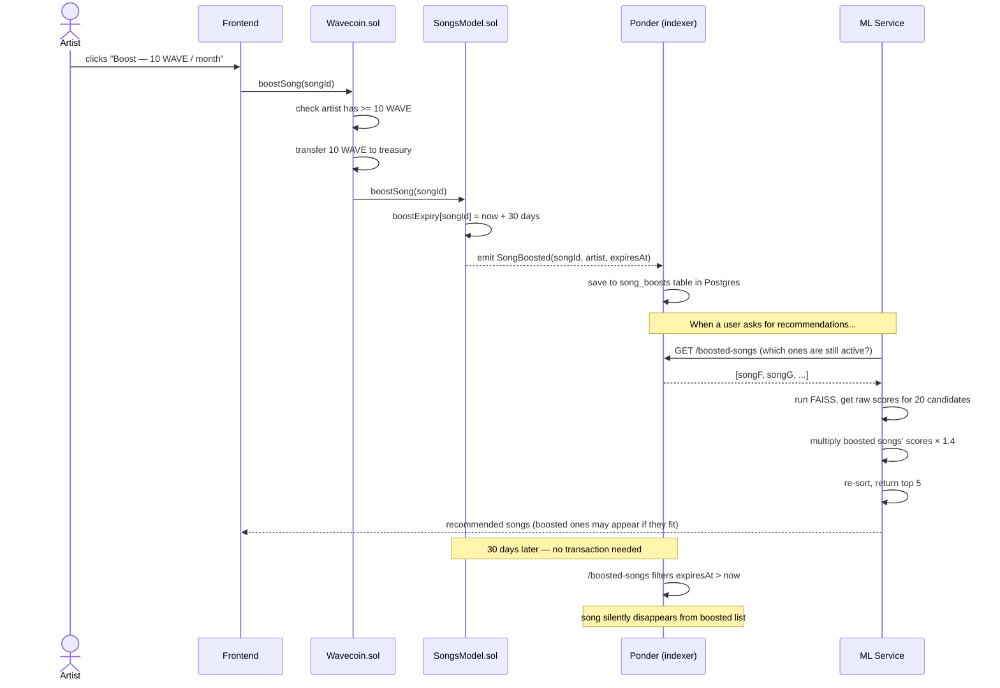

# Recommendation Booster — Plain English Explainer

> This is a simpler companion to `RECOMMENDATION_BOOSTER.md`.
> Read this first if the design doc is confusing.

---

## What is this feature?

An artist pays 10 WAVE tokens and their song gets pushed up in other people's recommendation feeds for 30 days. After 30 days, it goes back to normal automatically — no one has to do anything.

That's it. That's the whole feature.

---

## Why not just inject the song into every feed?

Because then users would notice. If you play exclusively jazz and suddenly a pop song appears every time, you stop trusting the app. Advertising disguised as a recommendation is the oldest dark pattern in the book. Users hate it.

The goal is: **the boost helps good matches rise, not bad ones appear**.

---

## How does it actually work then?

### Step 1 — FAISS gives you scores

Our ML model (FAISS + ALS) already gives every song a "how relevant is this to this user" score from 0 to 1. Right now we just take the top 5 and return them.

Example for a given user:

| Song | Raw score |
|------|-----------|
| Song A | 0.82 |
| Song B | 0.74 |
| Song C | 0.61 |
| Song D | 0.55 |
| Song E | 0.48 |
| Song F | 0.31 |
| ... | ... |

We return A, B, C, D, E.

### Step 2 — Artist boosts Song F

Song F has a raw score of 0.31 for this user. The model thinks it's not super relevant. Without boosting, it never shows up.

With boosting, we multiply its score by **1.4**:

`0.31 × 1.4 = 0.434`

Still below Song E (0.48). Song F still doesn't show up for this user. **Boosting didn't help here** because the song genuinely isn't a good fit.

### Step 3 — Same boost, different user

For a different user who actually listens to similar stuff, Song F scores 0.52.

`0.52 × 1.4 = 0.728`

Now it beats Song C (0.61), Song D (0.55), and Song E (0.48). It enters the top 5.

**The boost worked here** because the song was already a decent match — it just needed a nudge.

### The key insight

The artist paid to make the algorithm *try harder* to find people who'd like their song — not to shove it into everyone's feed. A song you'd hate still won't appear. A song you might like gets a fair shot.

---

## The full flow, start to finish



---

## Where does the money go?

The 10 WAVE are transferred to the company treasury wallet. Not burned, not sent to the song owner — straight to us. The plan is to eventually set up proper token economics around this, but for now: treasury.

---

## Rules

| Question | Answer |
|----------|--------|
| Who can boost a song? | Only the song's owner |
| How much does it cost? | 10 WAVE |
| How long does it last? | 30 days |
| What if you pay again before it expires? | Expiry extends: `max(current expiry, now + 30 days)` |
| Does it guarantee your song shows up? | No — it multiplies your score. Bad matches still don't show up |
| Where does the WAVE go? | Company treasury |

---

## What we need to build

### 1. Smart contracts

`SongsModel.sol` gets:
- A mapping `boostExpiry[songId]` — stores when the boost expires (0 = not boosted)
- A `boostSong(songId)` function — owner-only, sets expiry, emits event
- A `SongBoosted(songId, payer, expiresAt)` event — so Ponder can index it

`Wavecoin.sol` gets:
- A `boostSong(songId)` wrapper — checks balance, sends 10 WAVE to treasury, calls SongsModel

### 2. Ponder (the indexer)

- New `song_boosts` table in Postgres
- Handler that listens for `SongBoosted` events and writes to that table
- New `/boosted-songs` endpoint that returns songs with `expiresAt > now`

### 3. ML service

Two files change. Everything else stays untouched.

**`services/recommender.py` — new function + updated method:**

```python
BOOST_MULTIPLIER = 1.4  # tune this up or down


def fetch_boosted_songs(song_ids: list[str]) -> set[str]:
    """Given a list of candidate song IDs, returns which ones are currently boosted."""
    ponder_url = os.getenv("PONDER_URL", "http://localhost:42069")
    r = requests.get(f"{ponder_url}/boosted-songs", params={"ids": ",".join(song_ids)}, timeout=10)
    r.raise_for_status()
    return {item["songId"] for item in r.json()["items"]}


# inside RecommendationModel:

def recommend_songs_to_user(self, user_id: str, topn: int = 5) -> list[str]:
    user_id_lower = user_id.lower()
    try:
        user_idx = self.users.index(user_id_lower)
    except ValueError:
        return []

    user_factor = normalize(self.user_factors[user_idx:user_idx+1].astype(np.float32), norm='l2')

    # ask for a bigger pool so boosted songs have real candidates to compete against
    pool_size = min(topn * 4, len(self.songs))
    distances, indices = self.song_index.search(user_factor, pool_size)

    # collect the candidate song IDs from the pool
    candidates = [(float(dist), self.songs[int(i)]) for dist, i in zip(distances[0], indices[0]) if 0 <= int(i) < len(self.songs)]

    # ask Ponder which of these candidates are boosted — targeted query, not the whole catalog
    boosted_ids = fetch_boosted_songs([song_id for _, song_id in candidates])

    scored = [(score * (BOOST_MULTIPLIER if song_id in boosted_ids else 1.0), song_id) for score, song_id in candidates]
    scored.sort(reverse=True)
    return [song_id for _, song_id in scored[:topn]]
```

**`server.py` — no changes needed, endpoint stays exactly as-is:**

```python
@app.get("/recommend/user/{user_id}")
def recommend_by_user(user_id: str, topn: int = 5):
    if recommendation_model is None:
        raise HTTPException(status_code=404, detail="Model not trained yet")
    topn = min(topn, MAX_RECOMMENDATIONS)

    recommendations = recommendation_model.recommend_songs_to_user(user_id, topn)

    if not recommendations and user_id.lower() not in recommendation_model.users:
        raise HTTPException(status_code=404, detail=f"User {user_id} not found")

    return {"user": user_id, "recommendations": recommendations}
```

`train()`, `build_content_features()`, `recommend_similar_songs()`, and the FAISS index are all untouched.

### 4. Frontend

- A `BoostButton` component on the song detail page / artist portfolio
- Shows "Boost — 10 WAVE / month", calls `Wavecoin.boostSong(songId)` on click
- On success, shows "Boosted until [date]"

---

## One thing to watch out for

`TREASURY_ADDRESS` is hardcoded in the contract at deploy time. If you put in the wrong address the WAVE are gone forever — contracts can't be changed after deploy. Double-check before deploying to mainnet.
