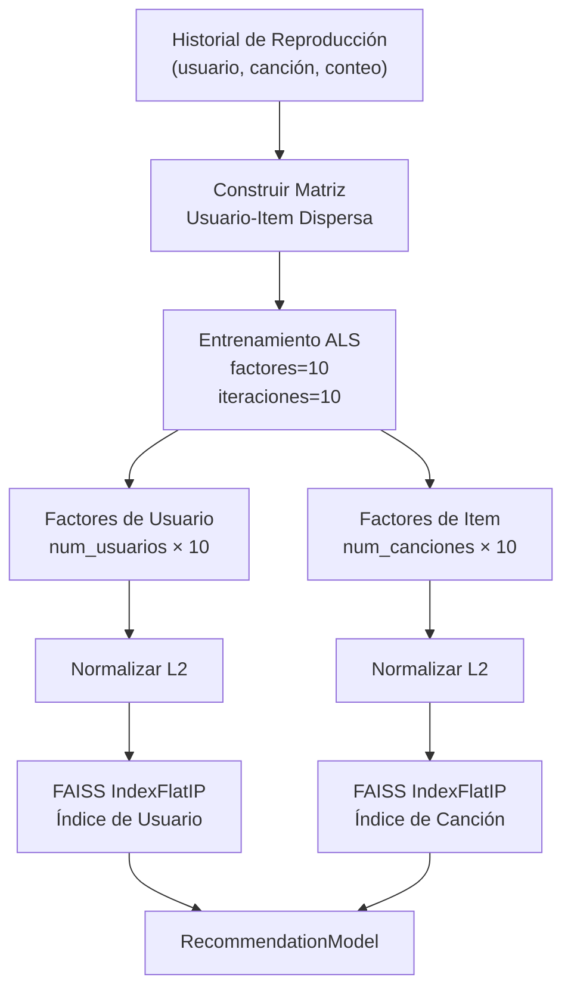
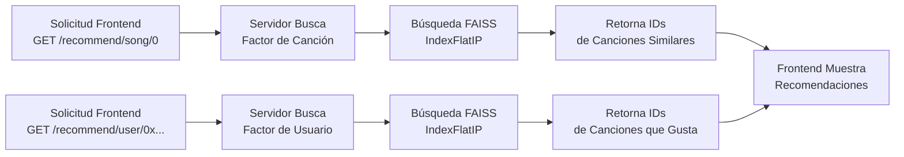

# Sistema de Recomendación

## Descripción General

El sistema de recomendación utiliza filtrado colaborativo (ALS) con indexación de vectores FAISS para proporcionar recomendaciones de canciones rápidas y precisas basadas en el historial de reproducciones del usuario.

**Flujo:**
1. Blockchain emite eventos `SongPlayed`
2. Ponder indexa eventos en PostgreSQL
3. El servicio ML entrena modelo ALS en historial de reproducciones
4. Los índices FAISS habilitan búsqueda de similitud O(k)
5. Frontend consulta endpoints `/recommend/*` para recomendaciones


## Librerías

### ML/Entrenamiento
- **implicit** - Filtrado colaborativo con Mínimos Cuadrados Alternados (ALS)
- **scipy.sparse** - Manejo de matrices dispersas para interacciones usuario-canción
- **scikit-learn** - Normalización L2 de vectores de factores
- **numpy** - Operaciones numéricas

### Búsqueda de Vectores
- **faiss** - Búsqueda rápida de vecinos más cercanos aproximados
  - IndexFlatIP: Índice de producto interior (similitud coseno en vectores normalizados)
  - Complejidad O(k) en lugar de O(n·d) para k recomendaciones de n items

### Backend
- **FastAPI** - Servidor REST API
- **requests** - Llamadas HTTP al indexador Ponder
- **uvicorn** - Servidor ASGI

## Arquitectura

### Clase RecommendationModel
Envuelve factores ALS entrenados e índices FAISS:

```python
model = RecommendationModel(model_data)
model.recommend_songs_to_user(user_id, topn=5)      # Recomendaciones basadas en usuario
model.recommend_similar_songs(song_id, topn=5)      # Búsqueda de similitud de canciones
```

**Formato de datos:**
- `user_factors`: matriz (num_usuarios, 10) de embeddings de usuario aprendidos
- `item_factors`: matriz (num_canciones, 10) de embeddings de canción aprendidos
- `users`: lista de direcciones de usuario
- `songs`: lista de IDs de canción

### Índices FAISS
Al inicializar, FAISS construye dos índices `IndexFlatIP` a partir de factores normalizados L2:
- `song_index`: Embeddings de canción buscables
- `user_index`: Embeddings de usuario buscables

Producto interior en vectores normalizados L2 = similitud coseno.



## Endpoints

Todos los endpoints requieren que el modelo sea entrenado primero a través de `POST /train`.

### Entrenamiento
```
POST /train
```
Obtiene eventos de reproducción de Ponder, entrena modelo ALS, construye índices FAISS.

### Recomendaciones por Usuario
```
GET /recommend/user/{user_id}?topn=5
```
Devuelve las N canciones principales recomendadas para un usuario basado en su historial de reproducciones.

**Respuesta:**
```json
{
  "user": "0x...",
  "recommendations": ["0", "2", "5"]
}
```

### Recomendaciones por Canción
```
GET /recommend/song/{song_id}?topn=5
```
Devuelve las N canciones más similares a la canción dada.

**Respuesta:**
```json
{
  "song": "0",
  "recommendations": ["1", "3", "7"]
}
```

### Debug: Listar Canciones
```
GET /debug/songs
```
Devuelve todas las canciones en el modelo entrenado.

### Debug: Listar Usuarios
```
GET /debug/users
```
Devuelve todos los usuarios en el modelo entrenado.

## IDs de Datos

- **IDs de Canción**: Strings numéricos ("0", "1", "2", ...) coincidiendo con la creación secuencial
- **IDs de Usuario**: Direcciones de wallet en minúsculas de eventos de reproducción

## Pipeline de Entrenamiento

1. **Obtener reproducciones** - HTTP GET a Ponder `/song-plays`
2. **Construir conteos** - Agregar (usuario, canción) → conteo de reproducciones
3. **Matriz dispersa** - Crear matriz CSR usuario-item de reproducciones
4. **Ajuste ALS** - La librería Implicit entrena factores=10, iteraciones=10
5. **Normalizar** - Normalizar L2 los factores de usuario e item resultantes
6. **Índice FAISS** - Construir IndexFlatIP para ambas matrices de factores
7. **Almacenar** - Instancia de RecommendationModel mantenida en memoria del servidor

## Configuración

**Variables de ambiente:**
- `PONDER_URL` - Endpoint del indexador Ponder (default: `http://localhost:42069`)
- `PORT` - Puerto del servicio ML (default: `8000`)

**Hiperparámetros de ALS** (hardcodeados en `train()`):
- `factors`: 10 - Dimensión del embedding
- `iterations`: 10 - Iteraciones de entrenamiento

## Uso

### Iniciar el servicio
```bash
cd packages/ml
python server.py
```

### Entrenar el modelo
```bash
curl -X POST http://localhost:8000/train
```

### Obtener recomendaciones
```bash
# Canciones similares a ID de canción "0"
curl "http://localhost:8000/recommend/song/0?topn=5"

# Canciones recomendadas para usuario
curl "http://localhost:8000/recommend/user/0x123...?topn=5"

# Inspeccionar contenido del modelo
curl http://localhost:8000/debug/songs
curl http://localhost:8000/debug/users
```

### Integración Frontend
El cliente llama endpoints a través del servicio TypeScript en `packages/nextjs/services/recommendations/recommendationService.ts`:
```typescript
getRecommendationsForSong(songId, topN)
getRecommendationsForUser(userId, topN)
```



## Notas de Rendimiento

- **Velocidad de búsqueda**: O(k) vía FAISS en lugar de fuerza bruta O(n·d)
- **Tamaño de índice**: ~2KB por vector de factor (10 dimensiones × 4 bytes float32)
- **Tiempo de entrenamiento**: ~5 segundos para dataset típico (10 canciones, 15 usuarios, 75 reproducciones)
- **Modelos en memoria**: Instancia global única por servidor
