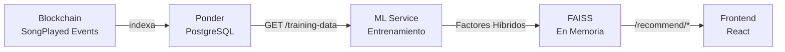
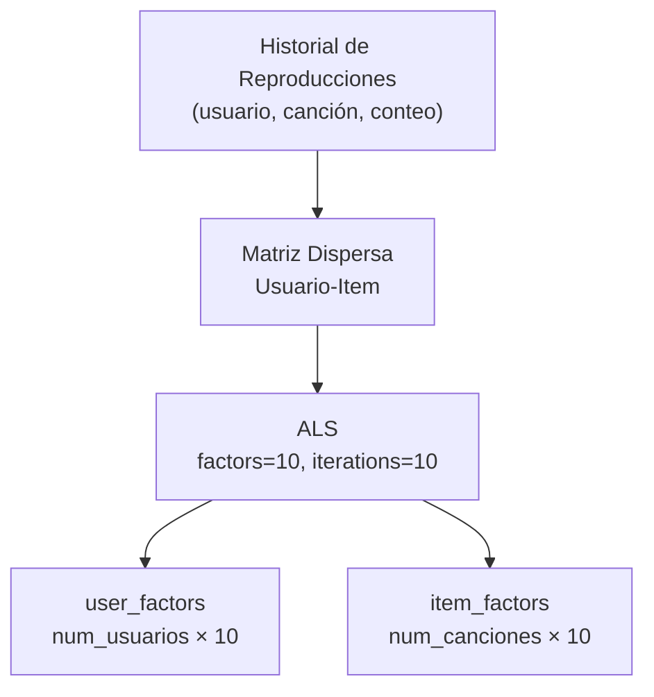
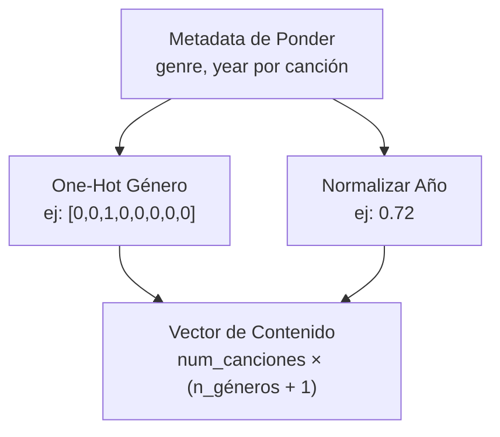
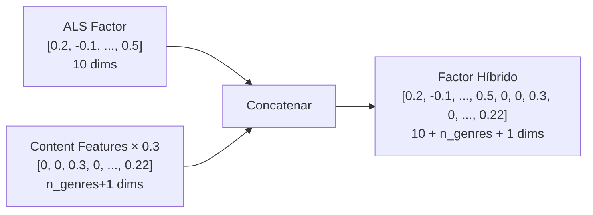
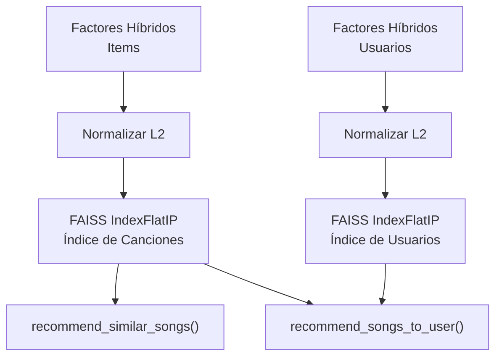
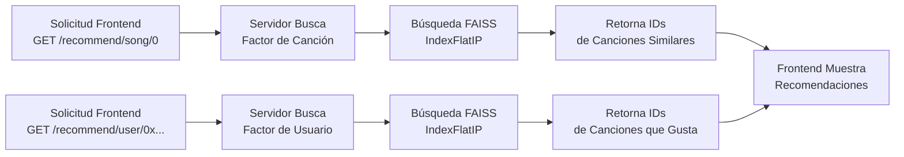

# Sistema de Recomendación

## Descripción General

El sistema de recomendación usa un enfoque **híbrido**: combina filtrado colaborativo (ALS) con features de contenido (género y año) para recomendar canciones. La idea es que no solo importa *quién escuchó qué* sino también *qué tipo de música es*.

### En una oración

> ALS aprende patrones de escucha, genre y year le dan contexto musical, FAISS busca vecinos cercanos en el espacio combinado.

## Flujo General



1. La blockchain emite eventos `SongPlayed` cada vez que alguien reproduce una canción
2. Ponder los indexa en PostgreSQL, junto con los álbumes (que tienen género y año)
3. El servicio ML pide todo en **una sola llamada** (`GET /training-data`) que devuelve cada play con el género y año del álbum ya joineado
4. Se entrena el modelo y se construyen índices FAISS con factores híbridos
5. El frontend consulta `/recommend/song/{id}` o `/recommend/user/{wallet}`

## Cómo Funciona el Modelo Híbrido

El modelo tiene dos partes que se combinan:

### Parte 1: Filtrado Colaborativo (ALS)

ALS (Alternating Least Squares) aprende embeddings mirando el historial de reproducciones. Si el usuario A y el usuario B escuchan canciones parecidas, sus vectores van a ser similares. Lo mismo para canciones: si dos canciones son escuchadas por los mismos usuarios, sus vectores se acercan.



**Resultado**: Cada canción y cada usuario tienen un vector de 10 dimensiones.

### Parte 2: Features de Contenido (Género + Año)

Independientemente del ALS, se construye un vector de contenido para cada canción a partir de los datos del álbum:

- **Género**: One-hot encoding. Si hay 8 géneros distintos, son 8 columnas (todo 0 excepto un 1 en el género de esa canción)
- **Año**: Normalizado entre 0 y 1 usando min-max del dataset. Una columna.



**Resultado**: Cada canción tiene un vector de `n_géneros + 1` dimensiones.

### Combinación: Factor Híbrido

Los dos vectores se concatenan. El vector de contenido se escala por `CONTENT_WEIGHT = 0.3` para que no domine sobre el ALS.



Para los **usuarios** se hace lo mismo: su vector de contenido es el promedio ponderado (por cantidad de plays) de los vectores de contenido de las canciones que escucharon.

**Ejemplo**: Si un usuario escuchó 80% Rock y 20% Jazz, su vector de contenido va a tener ~0.8 en la columna de Rock y ~0.2 en la columna de Jazz.

### Búsqueda con FAISS

Los factores híbridos se normalizan (L2) y se cargan en índices FAISS tipo `IndexFlatIP` (producto interior = similitud coseno en vectores normalizados).



Cuando pedís "canciones similares a X":
1. Toma el factor híbrido de X
2. Busca los K vectores más cercanos en el índice de canciones
3. Devuelve esos song IDs

Cuando pedís "recomendaciones para usuario Y":
1. Toma el factor híbrido del usuario Y
2. Busca los K vectores más cercanos en el índice de **canciones** (no usuarios)
3. Devuelve esos song IDs

## CONTENT_WEIGHT

`CONTENT_WEIGHT = 0.3` controla cuánto pesan genre y year vs el filtrado colaborativo.

- **0.0** = puro ALS, genre y year no importan
- **1.0** = genre y year pesan igual que los 10 factores ALS
- **0.3** = genre y year influyen pero ALS domina

Si tenés pocos datos de reproducciones, subir el weight ayuda porque el contenido compensa la falta de señal colaborativa. Con muchos datos de plays, ALS es más potente y el weight puede ser menor.

## Datos de Entrada

Todo viene de **una sola llamada** a Ponder:

```
GET /training-data
```

```json
{
  "items": [
    { "songId": "0", "listener": "0xabc...", "genre": "Rock", "year": 2015 },
    { "songId": "1", "listener": "0xdef...", "genre": "Electronic", "year": 2020 }
  ]
}
```

Ponder joinea `songPlays → songs → albums` y devuelve todo junto.

## Endpoints del Servicio ML

Todos requieren que el modelo esté entrenado (`POST /train`).

| Método | Ruta | Descripción |
|--------|------|-------------|
| POST | `/train` | Entrena el modelo con datos de Ponder |
| GET | `/recommend/song/{id}?topn=5` | Canciones similares (max 50) |
| GET | `/recommend/user/{wallet}?topn=5` | Recomendaciones personalizadas (max 50) |
| GET | `/debug/songs` | Lista canciones del modelo |
| GET | `/debug/users` | Lista usuarios del modelo |

### Ejemplo de uso

```bash
# Entrenar
curl -X POST http://localhost:8000/train

# Canciones similares a la canción 0
curl "http://localhost:8000/recommend/song/0?topn=5"

# Recomendaciones para un usuario
curl "http://localhost:8000/recommend/user/0xabc...?topn=5"
```

## Configuración

| Variable | Default | Descripción |
|----------|---------|-------------|
| `PONDER_URL` | `http://localhost:42069` | URL del indexador Ponder |
| `PORT` | `8000` | Puerto del servicio ML |

| Hiperparámetro | Valor | Descripción |
|-----------------|-------|-------------|
| `factors` | 10 | Dimensión del embedding ALS |
| `iterations` | 10 | Iteraciones de entrenamiento ALS |
| `CONTENT_WEIGHT` | 0.3 | Peso de features de contenido |
| `MAX_RECOMMENDATIONS` | 50 | Tope máximo de recomendaciones |

## Librerías

| Librería | Para qué |
|----------|----------|
| `implicit` | ALS (filtrado colaborativo) |
| `faiss-cpu` | Búsqueda rápida de vecinos cercanos |
| `scipy` | Matrices dispersas |
| `scikit-learn` | Normalización L2 |
| `numpy` | Operaciones numéricas |
| `FastAPI` | API REST |
| `requests` | Llamadas HTTP a Ponder |

### Integración Frontend
El cliente llama endpoints a través del servicio TypeScript en `packages/nextjs/services/recommendations/recommendationService.ts`:
```typescript
getRecommendationsForSong(songId, topN)
getRecommendationsForUser(userId, topN)
```



## Notas de Rendimiento

- **Velocidad de búsqueda**: O(k) vía FAISS en lugar de fuerza bruta O(n·d)
- **Tamaño de índice**: ~2KB por vector de factor (10 dimensiones × 4 bytes float32)
- **Tiempo de entrenamiento**: ~5 segundos para dataset típico (10 canciones, 15 usuarios, 75 reproducciones)
- **Modelos en memoria**: Instancia global única por servidor
