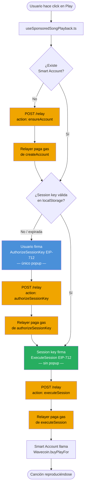
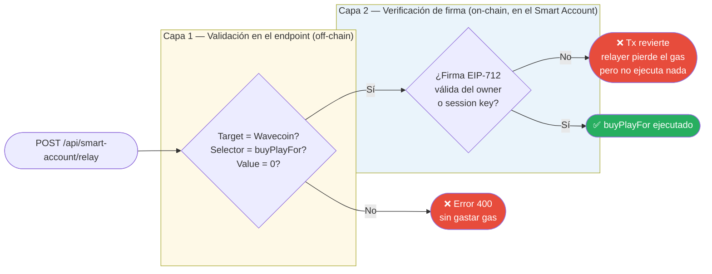

# Relayer propio de Wave3

## ¿Qué es un relayer?

Un relayer es un intermediario que paga el gas de una transacción en nombre del usuario. El usuario firma la intención (un mensaje EIP-712), pero quien efectivamente manda la tx a la red —y paga el ETH de gas— es el relayer.

Esto se llama **meta-transacción** o transacción patrocinada (gasless). El usuario no necesita tener ETH; solo necesita tener los tokens correctos (en este caso, Wavecoin).

### Qué paga quién

```mermaid
flowchart LR
    U([Usuario]) -- "paga Wavecoin<br/>(playFee del contrato)" --> SC[Smart Account]
    R([Relayer<br/>cuenta Wave3]) -- "paga ETH<br/>(gas de la tx)" --> Chain[(Blockchain)]
    SC --> Chain
```

> "Gasless" significa solo que el usuario no necesita ETH. El Wavecoin **sí se descuenta** igual. El relayer cubre el costo de infraestructura de la red, no el costo del servicio.

---

## La implementación de Wave3

El relayer está en `packages/nextjs/app/api/smart-account/relay/route.ts`. Es un endpoint Next.js (`POST /api/smart-account/relay`) que corre en el servidor de la app.

Tiene una cuenta propia (el "relayer account") configurada con la variable de entorno `SMART_ACCOUNT_RELAYER_PRIVATE_KEY`. Esa cuenta tiene ETH en la red target y es quien firma y envía las txs reales a la blockchain.

### Cuatro acciones soportadas

| Acción | Qué hace |
|---|---|
| `ensureAccount` | Crea la Smart Account del usuario si no existe todavía (llama a `Wave3SmartAccountFactory.createAccount`). |
| `authorizeSessionKey` | Registra una session key temporaria en el Smart Account del usuario, con límite de tiempo y de cantidad de llamadas. |
| `execute` | Ejecuta una tx desde el Smart Account del usuario. Requiere firma EIP-712 del owner. |
| `executeSession` | Ejecuta una tx usando la session key (sin molestar al usuario con otro popup de firma). |

### El flujo completo de reproducción

> Las cajas naranjas son operaciones que paga el relayer. El usuario solo firma **una vez** (caja azul) para autorizar la session key. Las reproducciones siguientes (hasta 100 en 24 horas por defecto) usan la session key — sin popups, sin gas.

### Restricciones de seguridad del endpoint

El relayer no ejecuta cualquier cosa. La protección es en **dos capas independientes**:

- **Capa 1 (endpoint):** si el target no es `Wavecoin`, el selector no es `buyPlayFor`, o el value no es 0 → se rechaza antes de mandar nada a la red. Sin gasto de gas.
- **Capa 2 (contrato):** aunque alguien pase la capa 1, el `Wave3SmartAccount` verifica on-chain la firma EIP-712. Sin firma válida del owner (o de su session key autorizada), la tx revierte. El ETH del relayer **no puede ser robado** — a lo sumo se pierde el gas de una tx fallida.

**Vector de abuso real:** la acción `ensureAccount` no requiere firma — cualquiera puede llamarla con una address random y el relayer pagaría el gas de `createAccount()`. Eso es un vector de DoS/drenado de la cuenta. En el contexto del demo no es un problema; en producción requeriría rate limiting o autenticación de sesión web.

---

## Alternativas de pago: Gelato, Alchemy, Biconomy, etc.

Los relayers de pago ("relay-as-a-service") son servicios externos que hacen lo mismo pero como infraestructura gestionada.

### Comparación

| | **Relayer propio (Wave3)** | **Gelato / Alchemy AA / Biconomy** |
|---|---|---|
| **Costo** | Solo el ETH de gas que gasta la cuenta del relayer | Costo de gas + fee del servicio (% o suscripción) |
| **Setup** | Una env var y una cuenta con ETH | API key, SDK externo, modificar código |
| **Dependencia** | Solo la propia app Next.js | Proveedor externo con SLA propio |
| **Personalización** | Total — podés validar lo que quieras | Limitado por lo que el proveedor permite |
| **Uptime** | Mismo que la app Next.js | 99.9%+ con soporte, pero si cae es su problema |
| **Escalabilidad** | Manual — hay que gestionar el balance de la cuenta relayer | Automática, el proveedor la gestiona |
| **Nonce / concurrencia** | No hay manejo de nonce concurrente (problema a escala) | El proveedor lo maneja |
| **Monitorizacion** | Logs propios (`[Wave3][relay]` en consola) | Dashboard, alertas, analytics incluidos |
| **Compliance / KYC** | Sin restricciones | Algunos proveedores tienen ToS o restricciones geográficas |

### Ventajas de Gelato/Alchemy

- No hay que gestionar el balance de la cuenta relayer (no se queda sin ETH inesperadamente en producción).
- Soporte nativo de ERC-4337 (Account Abstraction estándar), paymaster, bundler — todo out of the box.
- Dashboard con métricas, alertas y reintentos automáticos.
- Escalable sin cambios de código.

### Desventajas de Gelato/Alchemy

- Costo: a escala, el fee del servicio puede ser significativo.
- Dependencia de tercero: si cae Gelato, cae la funcionalidad gasless.
- Menos control: la lógica de validación (solo permitir `buyPlayFor`) hay que expresarla en términos del SDK del proveedor, no en código propio.
- Más complejidad de integración inicial y posible vendor lock-in.

### Por qué tiene sentido el relayer propio para Wave3

- Es un MVP académico con tráfico controlado → no hay problema de escala.
- La lógica es simple y acotada (solo una función de un solo contrato).
- La integración vive en el mismo repo, es fácil de entender y debuggear.
- No depende de nada externo en runtime.
- El pattern EIP-712 + Smart Account Custom es pedagógicamente interesante para el informe.

La contra real es operacional: la cuenta relayer se puede quedar sin ETH y hay que recargarla manualmente. En producción real eso sería un problema serio.
