# Smart Contracts — Cómo funcionan

> Referencia técnica con diagramas de flujo y estado para todos los contratos del sistema Wave3.

---

## 1. Arquitectura general

Wave3 usa una arquitectura de contratos modulares. Cuatro contratos se despliegan una sola vez (vía scripts), y el resto se crean dinámicamente en runtime.

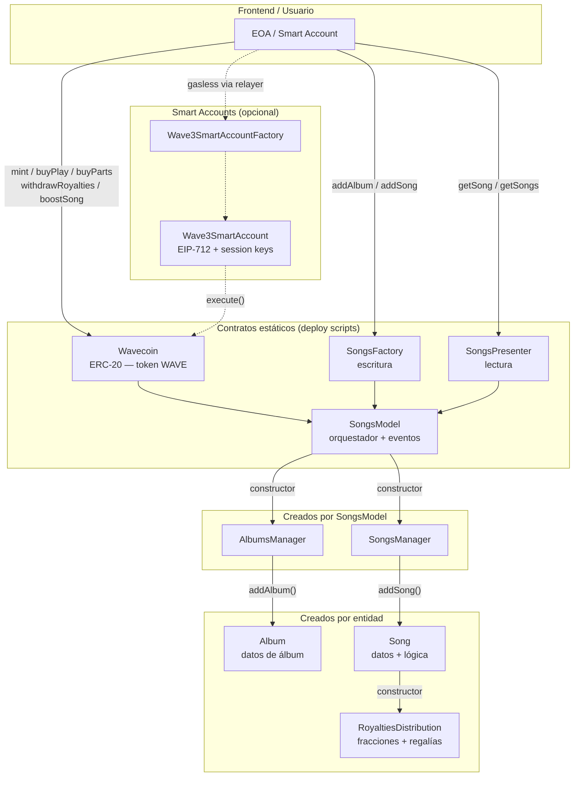

---

## 2. Despliegue de contratos

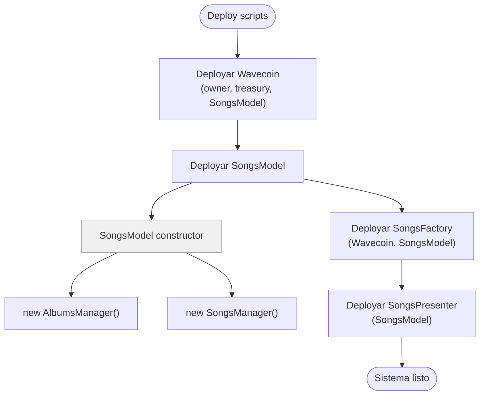

---

## 3. Flujo: crear un álbum

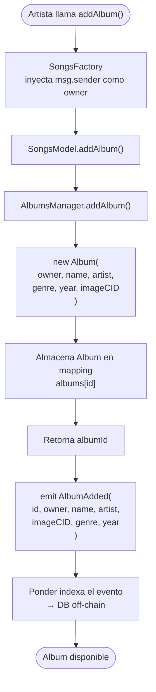

---

## 4. Flujo: publicar una canción

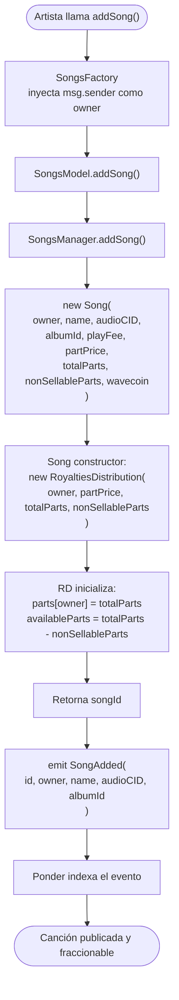

---

## 5. Flujo: reproducir una canción (`buyPlay`)

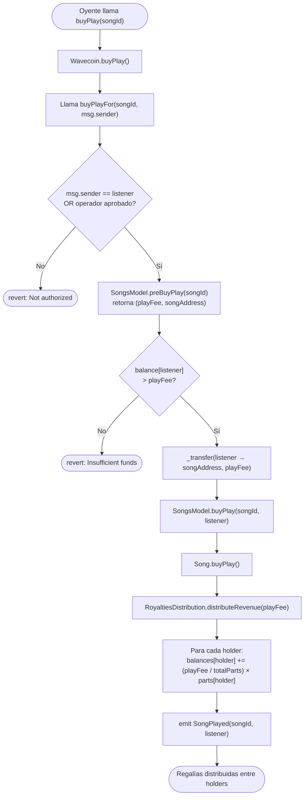

---

## 6. Flujo: comprar fracciones (`buyParts`)

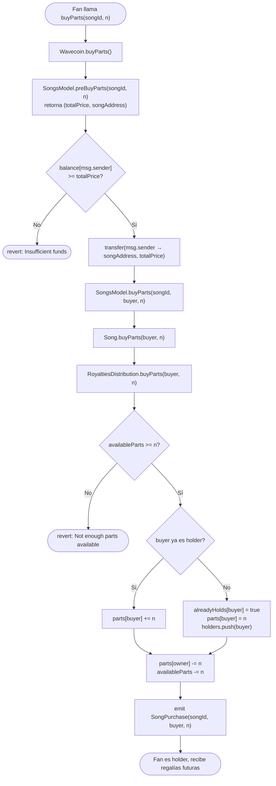

---

## 7. Flujo: retirar regalías (`withdrawRoyalties`)

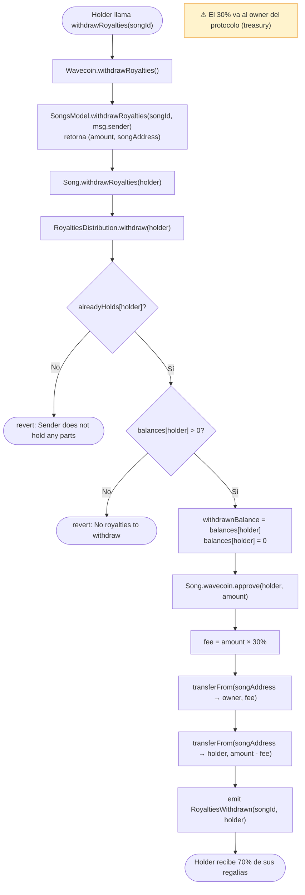

---

## 8. Flujo: boost de canción (`boostSong`)

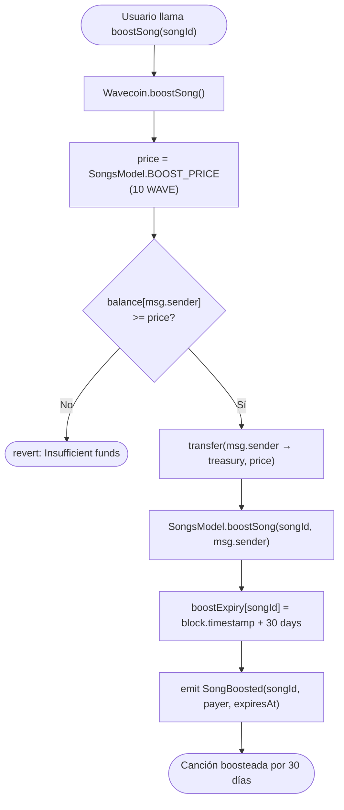

---

## 9. Flujo: gasless con Smart Account y session key

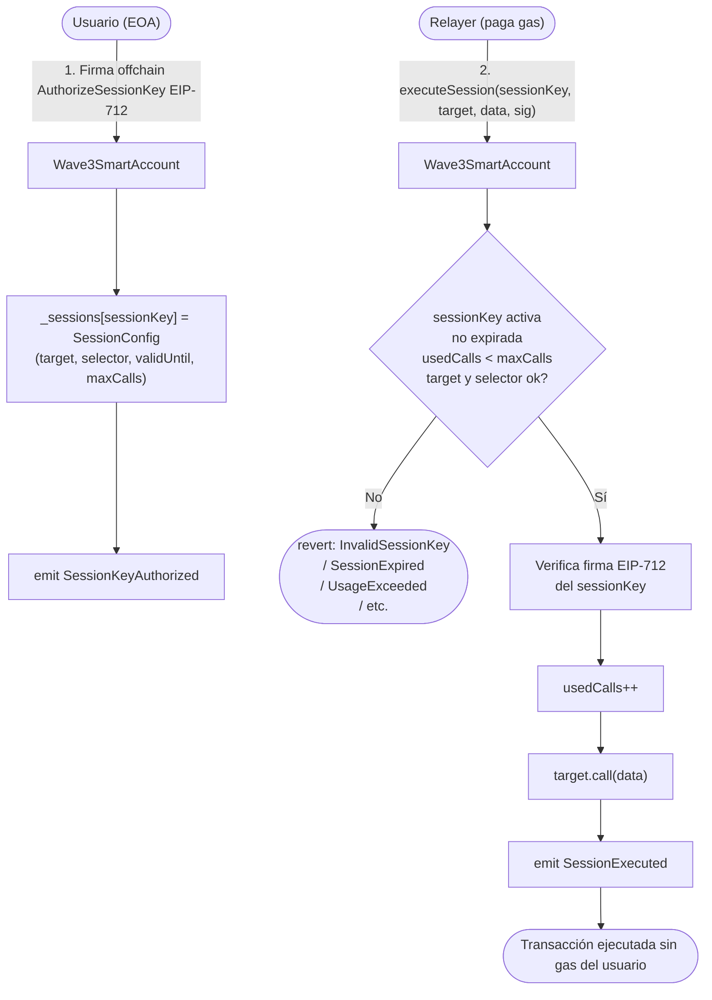

---

## 10. Diagramas de estado

### 10.1 Estado de una canción

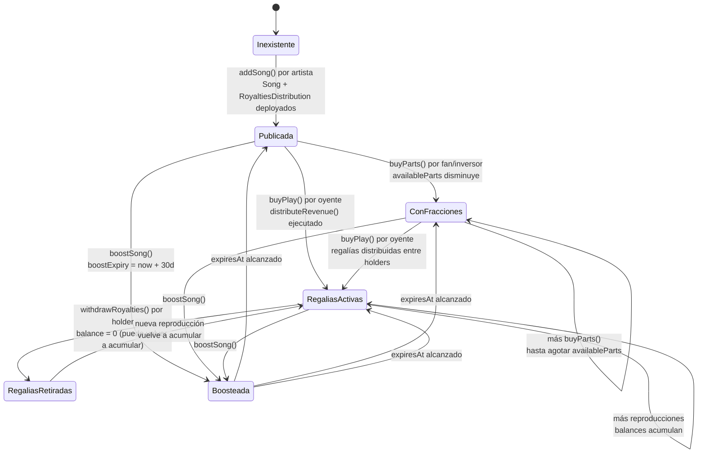

### 10.2 Estado de RoyaltiesDistribution

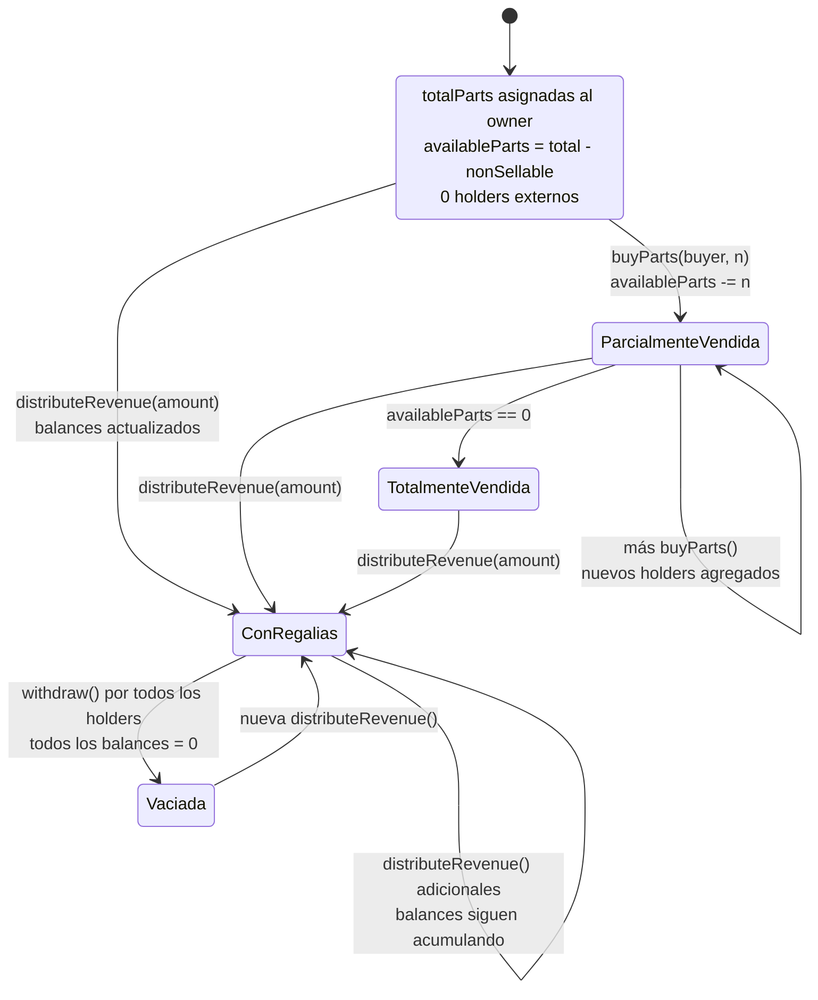

### 10.3 Estado de Session Key (Smart Account)

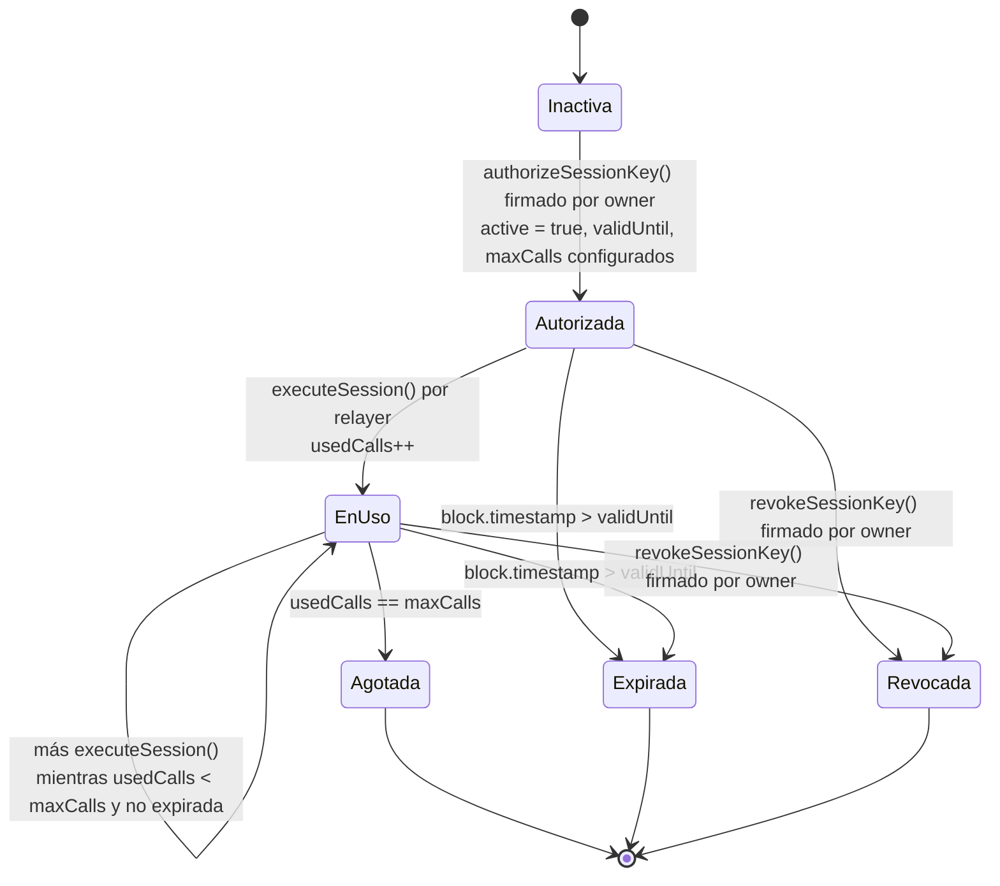

---

## 11. Flujo de tokens WAVE (resumen financiero)

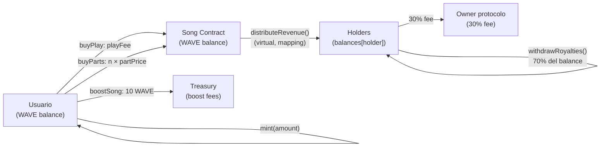

---

## 12. Eventos emitidos por SongsModel (indexados por Ponder)

| Evento | Cuándo se emite | Campos indexados |
|---|---|---|
| `AlbumAdded` | `addAlbum()` exitoso | `id`, `owner` |
| `SongAdded` | `addSong()` exitoso | `id`, `owner`, `albumId` |
| `SongPurchase` | `buyParts()` exitoso | `songId`, `buyer` |
| `SongPlayed` | `buyPlay()` exitoso | `songId`, `listener` |
| `RoyaltiesWithdrawn` | `withdrawRoyalties()` exitoso | `songId`, `holder` |
| `SongBoosted` | `boostSong()` exitoso | `songId`, `payer` |

Ponder escucha estos eventos y actualiza la base de datos off-chain para que el frontend pueda consultar sin leer directamente la blockchain.
