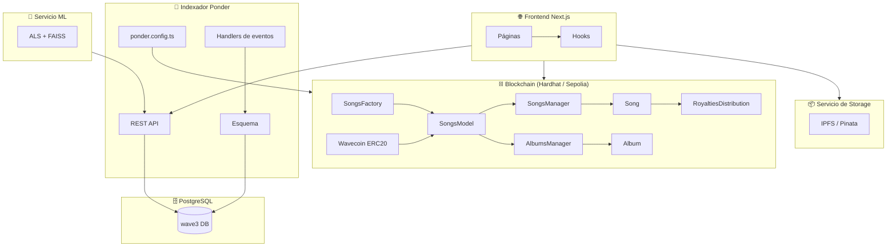
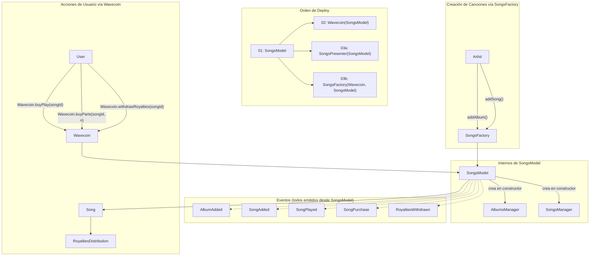
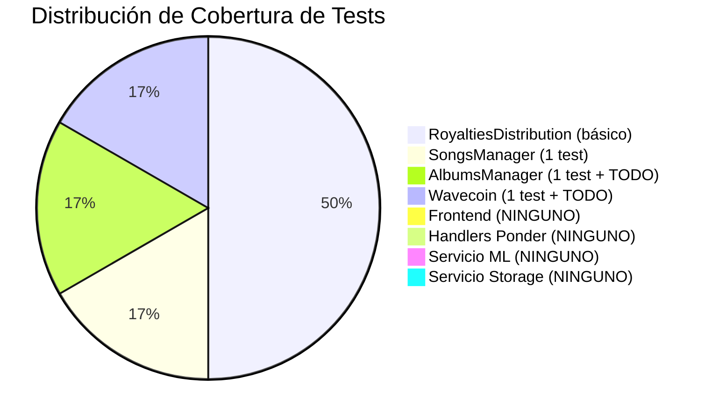
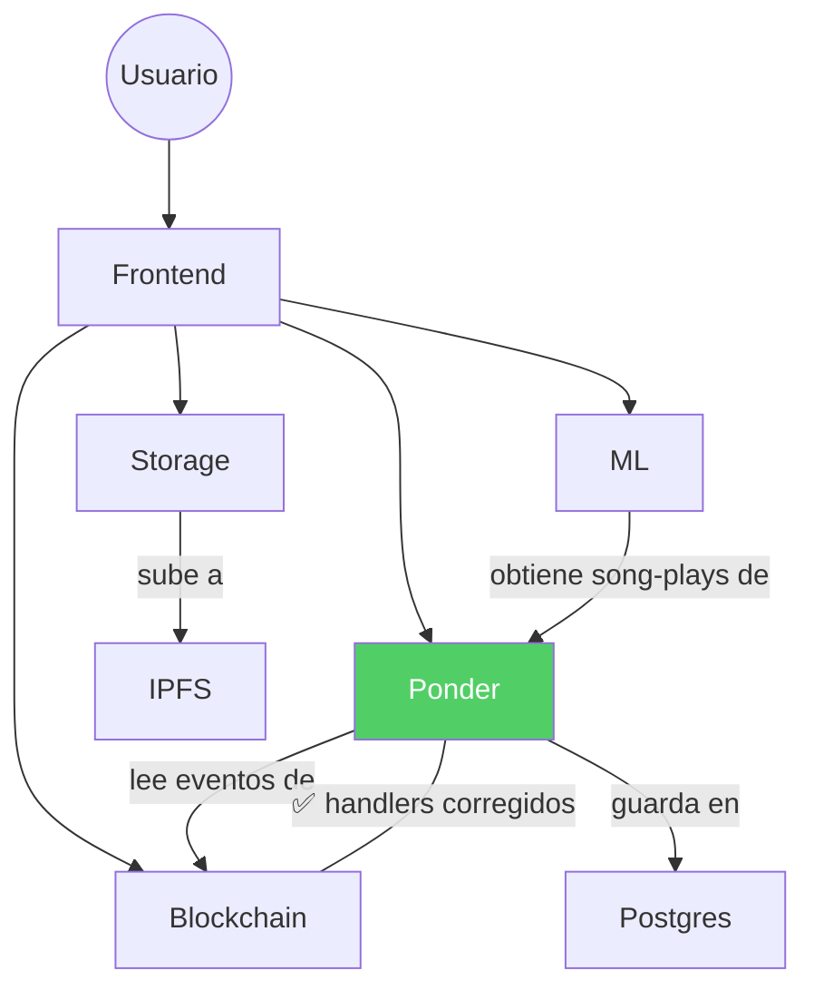

# Wave3 — Estado del Proyecto

> Actualizado: 2026-04-04

---

## Arquitectura General

---

## Estado de los Componentes

| Componente | Estado | Notas |
|-----------|--------|-------|
| Smart Contracts (Solidity) | ✅ OK | Compila, eventos re-emitidos desde SongsModel |
| Wavecoin | ✅ OK | ERC20 con mint/buyParts/buyPlay/withdrawRoyalties |
| Indexador Ponder | ✅ **Corregido** | Los 4 handlers apuntan a eventos `SongsModel:*` |
| Ponder REST API | ✅ OK | `/songs-with-albums`, `/song-purchases`, `/song-plays`, `/songs/:id` |
| Páginas del Frontend | ⚠️ Parcial | 8 páginas; búsqueda usa ponder |
| Código de Smart Accounts | ✅ **Eliminado** | Deploy script, servicio, hook, relay route, env vars borrados |
| Cobertura de Tests | ⚠️ Mínima | Contratos: básicos, muchos `TODO: FINISH TESTS`; Frontend: 0 archivos de test |
| Recomendaciones ML | ✅ OK | Funciona ahora que ponder indexa eventos |
| Storage / IPFS | ✅ OK | Proxy de upload a IPFS/Pinata |
| Seed de datos | ✅ OK | Script async con FMA dataset (localhost + Sepolia) |
| Docker Compose | ✅ OK | Todos los servicios conectados correctamente |

---

## Qué cambió (rama: `feature/purchase_events`)

### Contratos
- **`SongsModel.sol`**: Se agregaron eventos `AlbumAdded`, `SongAdded`, `SongPurchase` que se re-emiten desde funciones pass-through para que ponder pueda indexarlos desde la dirección deployada de `SongsModel`. Se renombró `PartsPurchased` → `SongPurchase`.

### Ponder (todo corregido)
- **`Songs.ts`**: `Songs:AddedSong` → `SongsModel:SongAdded`
- **`Albums.ts`**: `Albums:AddedAlbum` → `SongsModel:AlbumAdded`, `event.args.artist` → `event.args.owner`
- **`SongRoyalties.ts`**: `SongRoyalties:SongPlayed` → `SongsModel:SongPlayed`, se agregó handler `SongsModel:SongPurchase`
- **`ponder.schema.ts`**: Se agregó tabla `songPurchases` con índices y relaciones
- **`api/index.ts`**: Se agregó endpoint `GET /song-purchases?buyer=&limit=`

### Eliminación de Smart Accounts
| Archivo | Acción |
|------|--------|
| `deploy/04_deploy_wave3_smart_account_factory.ts` | Eliminado |
| `services/web3/smartAccount.ts` | Eliminado |
| `services/songs/playSongService.ts` | Eliminado |
| `hooks/scaffold-eth/useSmartAccount.ts` | Eliminado |
| `app/api/smart-account/relay/route.ts` + test | Eliminado |
| `hooks/scaffold-eth/useScaffoldWriteContract.ts` | Se removieron imports, branch y walletClient de SA |
| `hooks/scaffold-eth/useSponsoredSongPlayback.ts` | Reescrito: llama a `Wavecoin.buyPlay(songId)` directamente |
| `app/faucet/page.tsx` | Usa `useAccount()` directo, se removió bloque UI de SA |
| `app/upload/_components/AddSongsForm.tsx` | Usa `useAccount()` directo |
| `.env.example` | Se removieron 18 líneas de env vars de SA |
| `Dockerfile` | Se removieron build args/envs de SA |

### Fix en Frontend
- **`CreateAlbumForm.tsx`**: Se corrigió la decodificación de eventos — usa `SongsModel.abi` + evento `AlbumAdded` (antes usaba `SongsFactory.abi` + `AddedAlbum`)

### Otros
- **`deployedContracts.ts`**: `Wave3SmartAccountFactory` removido de localhost; aún presente en Sepolia (pendiente redeploy)
- **`storage/tsconfig.json`**: `moduleResolution` cambiado de `node` → `node16`

---

## Arquitectura de Contratos

---

## Endpoints de la API Ponder

| Método | Ruta | Query Params | Descripción |
|--------|------|-------------|-------------|
| GET | `/songs-with-albums` | `name`, `limit` | Todas las canciones con metadata del álbum; búsqueda fuzzy por nombre |
| GET | `/songs/:songId` | — | Canción individual con álbum |
| GET | `/song-plays` | `listener`, `limit` | Eventos de reproducción |
| GET | `/song-purchases` | `buyer`, `limit` | Eventos de compra (nuevo) |
| GET | `/ping` | — | Health check |
| POST | `/graphql` | — | API GraphQL completa (auto-generada) |

---

## Cobertura de Tests

### Tests de Hardhat

| Archivo | Tests | Estado |
|------|-------|--------|
| `RoyaltiesDistribution.ts` | ~3 tests (cálculo de partes, compra, distribución) | ⚠️ Básico |
| `SongsManager.ts` | 1 test (crear canción) | ⚠️ Mínimo |
| `AlbumsManager.ts` | 1 test + `TODO: FINISH TESTS` | ⚠️ Stub |
| `Wavecoin.ts` | 1 test (mint) + `TODO: FINISH TESTS` | ⚠️ Stub |
| `Wave3SmartAccount.ts` | 4 tests | ⚠️ Existe pero el contrato ya no se deploya |

---

## Dependencias entre Servicios

---

## Backlog del Equipo (según `Relevamiento.csv`)

### Ignacio Vetrano (`ivetrano@fi.uba.ar`)

| Requerimiento | Estado | Depende de | Prioridad |
|--------------|--------|-----------|-----------|
| Modificar frontend: Creación de canciones (un solo botón, todo junto) | ⬜ Pendiente | — | — |
| Marketplace: Buscador de acciones de canciones (filtradas por acciones disponibles, más vendidas/escuchadas) | ⬜ Pendiente | ✅ Eventos de compra de partes (ya en ponder) | — |
| Frontend - PreSistema de Recomendación: Agregar género y año al álbum/canción | ⬜ Pendiente | Blockchain: agregar género/año | — |
| Portfolio: Usar datos reales de blockchain en vez de mock | ⬜ Pendiente | ✅ Eventos de compra de partes (ya en ponder) | — |

### Maxi Williner (`mwilliner@fi.uba.ar`)

| Requerimiento | Estado | Depende de | Prioridad |
|--------------|--------|-----------|-----------|
| Agregar en SongsFactory método de album + canciones juntos | ⬜ Pendiente | — | — |
| Blockchain - PreSistema de Recomendación: Agregar género y año al álbum/canción | ⬜ Pendiente | — | — |
| Marketplace: Buscador avanzado (popularidad, género, artista) | ⬜ Pendiente | — | Baja |
| Marketplace: Cart con info de la canción | ⬜ Pendiente (algo avanzado) | — | — |

### Victor Bravo Arroyo

| Requerimiento | Estado | Depende de | Prioridad |
|--------------|--------|-----------|-----------|
| Agregar a la DB los eventos de compra de partes | ✅ **Hecho** | — | Alta |
| Modificar sistema de recomendación (devolver array de ids) | ⬜ Pendiente | — | — |
| Eliminar endpoint en Render (`wave3-s4p8.onrender.com/recommendations`) | ⬜ Pendiente | — | — |
| Seed de canciones (script hardhat con metadata) | ✅ **Hecho** | — | — |
| Seed de recomendaciones iniciales (entrenar tras seed) | ⬜ Pendiente | ✅ Seed de canciones | — |
| Tope máximo al sistema de recomendaciones (valor N por defecto) | ⬜ Pendiente | — | — |
| Paginado del sistema de recomendaciones | ⬜ Pendiente | — | Baja |
| ML - PreSistema de Recomendación: Agregar género y año | ⬜ Pendiente | Blockchain: agregar género/año | — |

### Sin asignar

| Requerimiento | Estado | Prioridad |
|--------------|--------|-----------|
| Modificar faucet: Usar botón de scaffold (prod = Wave3, dev = hardhat) | ⬜ Pendiente | Baja |
| Estandarizar diseño: Ruedas de carga / loading | ⬜ Pendiente | Baja |
| No usar camelCase (problemas de comunicación entre sistemas) | ⬜ Pendiente | Baja |

---

## Deuda Técnica

1. **`deployedContracts.ts`** — Remover `Wave3SmartAccountFactory` de Sepolia (requiere redeploy)
2. **Ponder 500 en `/songs-with-albums`** — Investigar: posible problema con `pg_trgm` o DB vacía tras cambio de esquema
3. Completar tests de Wavecoin (`buyParts`, `buyPlay`, `withdrawRoyalties`)
4. Completar tests de AlbumsManager (múltiples álbumes, casos borde)
5. Considerar eliminar contratos `Wave3SmartAccount.sol` / `Wave3SmartAccountFactory.sol`
6. Limpiar `docs/AA_SESSION_KEYS_DESIGN.md` (documenta feature eliminado)
