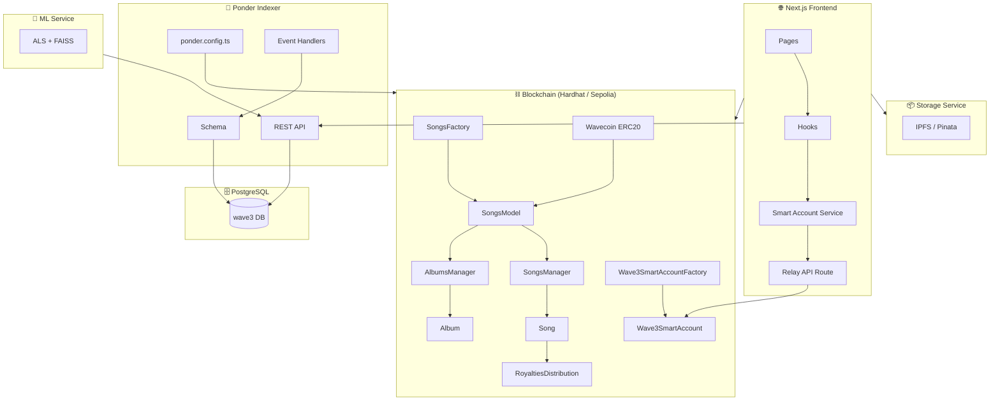
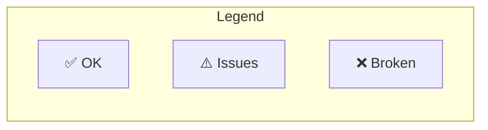
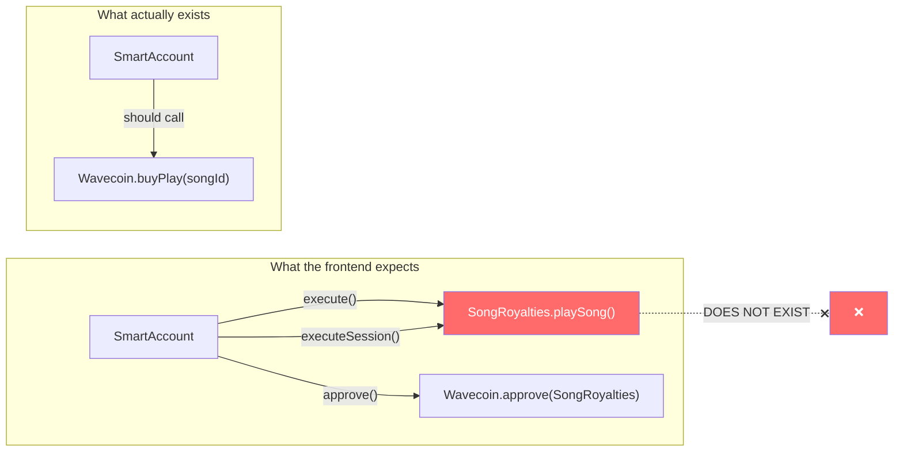
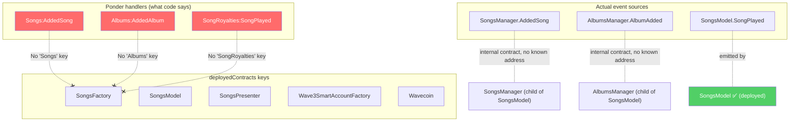
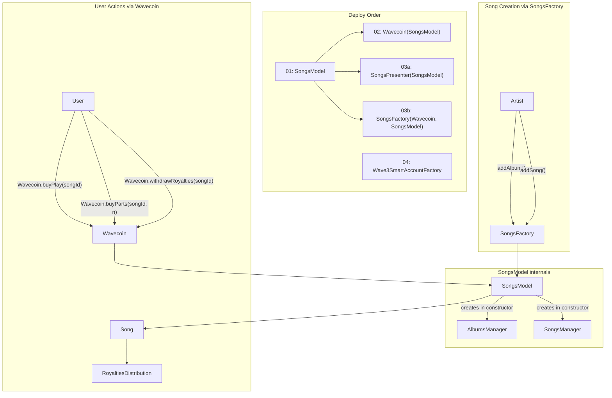
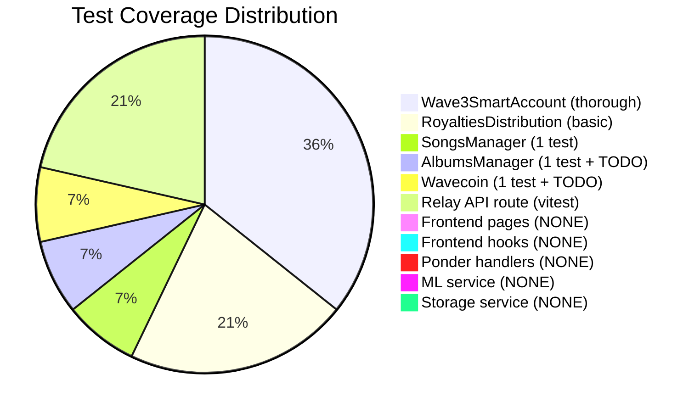
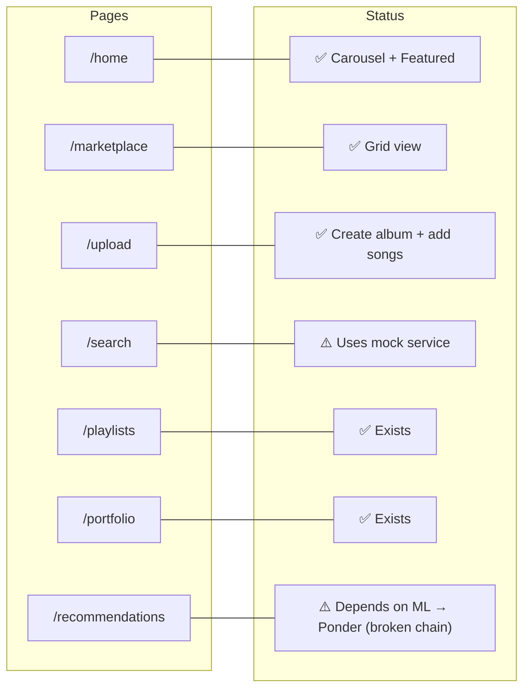
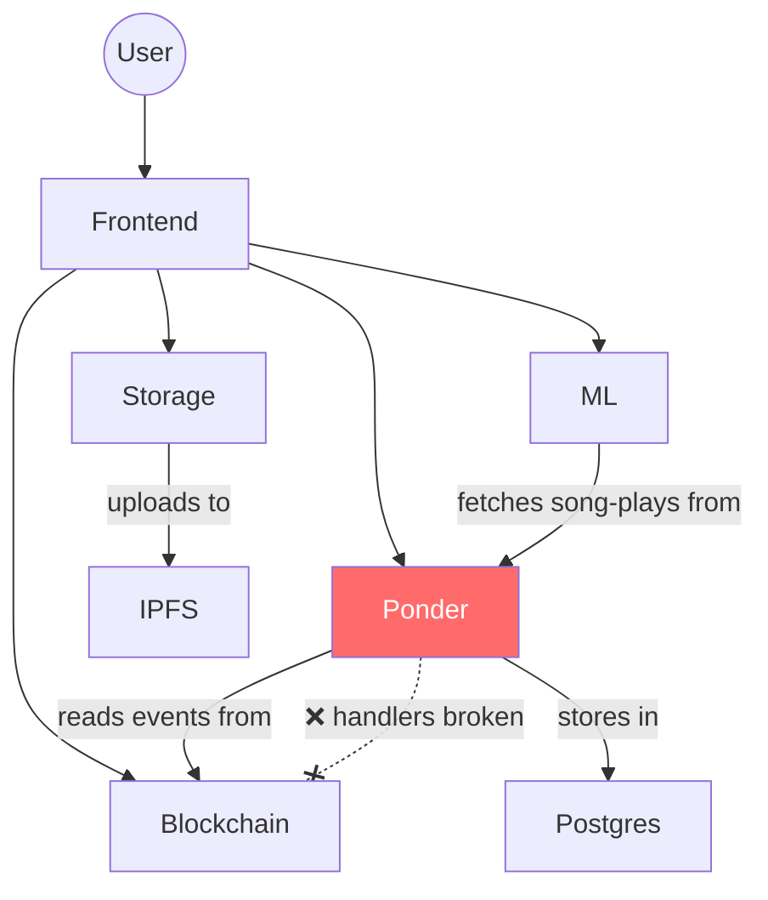

# Wave3 — Project Status Audit

> Auto-generated: 2026-04-03

---

## Architecture Overview

---

## Component Health

| Component | Status | Notes |
|-----------|--------|-------|
| Smart Contracts (Solidity) | ✅ OK | Compiles, logic is sound |
| Smart Account Contracts | ✅ OK | EIP-712, session keys, relayer pattern |
| Wavecoin | ✅ OK | ERC20 with mint/buyParts/buyPlay |
| Smart Account Frontend Integration | ❌ **Broken** | Targets non-existent `SongRoyalties` contract |
| Ponder Indexer | ❌ **Broken** | Handlers reference contracts that don't exist in deployedContracts |
| Frontend Pages | ⚠️ Partial | 8 pages exist, search uses mock service |
| Test Coverage | ⚠️ Minimal | Contracts: basic, many `TODO: FINISH TESTS`; Frontend: 1 test file |
| ML Recommendation | ⚠️ OK-ish | Works if ponder provides data; depends on broken indexer |
| Storage / IPFS | ✅ OK | Simple upload proxy to IPFS/Pinata |
| Docker Compose | ✅ OK | All services wired correctly |

---

## Critical Issue #1: Smart Account → Ghost Contract

The frontend smart account integration calls a **`SongRoyalties` contract that was never built**. The actual contract architecture doesn't match what the frontend expects.

### Affected files
- `packages/nextjs/services/songs/playSongService.ts` — calls `playSong()` on `royaltiesAddress`
- `packages/nextjs/hooks/scaffold-eth/useSponsoredSongPlayback.ts` — session key for `playSong` selector
- `packages/nextjs/app/api/smart-account/relay/route.ts` — relays to wrong targets
- `docs/AA_SESSION_KEYS_DESIGN.md` — references `SongRoyalties`

### What needs to change
- `playSong(songId)` on SongRoyalties → `buyPlay(songId)` on **Wavecoin**
- No `approve()` needed — `Wavecoin.buyPlay()` uses `transfer()` from `msg.sender`
- Session key target should be **Wavecoin** address, selector `buyPlay(uint256)`

---

## Critical Issue #2: Ponder Indexer — Wrong Contract Names

### The problem
- `SongsManager` and `AlbumsManager` are created internally by `SongsModel`'s constructor — their addresses are not in `deployedContracts`
- Ponder config dynamically reads `deployedContracts` keys → no `Songs`, `Albums`, or `SongRoyalties` keys exist
- **`SongPlayed` and `PartsPurchased` events ARE on `SongsModel`** (which IS deployed), so those can be indexed
- `AddedSong` event is on `SongsManager` and `AlbumAdded` is on `AlbumsManager` — these child contracts need their addresses exposed or the events need to be moved to `SongsModel`

### Missing event: `PartsPurchased`
`SongsModel` emits `PartsPurchased(songId, buyer, parts)` but ponder has **no handler and no table** for it.

---

## Contract Architecture (Actual)

---

## Test Coverage

### Hardhat tests

| File | Tests | Status |
|------|-------|--------|
| `Wave3SmartAccount.ts` | 4 tests (execute, invalid sig, session keys, gasless) | ✅ Thorough |
| `RoyaltiesDistribution.ts` | ~3 tests (parts calc, buy, distribute) | ⚠️ Basic |
| `SongsManager.ts` | 1 test (create song) | ⚠️ Minimal |
| `AlbumsManager.ts` | 1 test + `TODO: FINISH TESTS` | ⚠️ Stub |
| `Wavecoin.ts` | 1 test (mint) + `TODO: FINISH TESTS` | ⚠️ Stub |

### Frontend tests

| File | Tests | Status |
|------|-------|--------|
| `relay/route.test.ts` | Relay API (create, execute, rate limit) | ✅ OK |
| Everything else | — | ❌ None |

---

## Frontend Pages

---

## Service Dependencies

If Ponder can't index events → the REST API returns no data → ML can't train → Recommendations are empty → Search (if moved off mock) has nothing.

---

## Summary of Required Fixes (Priority Order)

### P0 — Blocking everything

1. **Fix Ponder event handlers** — Either:
   - Move `AddedSong`/`AlbumAdded` events to `SongsModel` (so they emit from a deployed contract), OR
   - Expose `SongsManager`/`AlbumsManager` addresses from `SongsModel` and add them to deploy scripts
   - Fix handler names: `SongRoyalties:SongPlayed` → `SongsModel:SongPlayed`
2. **Add `PartsPurchased` handler** to Ponder (event already exists on `SongsModel`)

### P1 — Smart Account integration

3. **Fix `playSongService.ts`** — Target `Wavecoin.buyPlay(songId)` instead of non-existent `SongRoyalties.playSong(songId)`
4. **Fix session key config** — Target = Wavecoin address, selector = `buyPlay(uint256)`
5. **Remove unnecessary `approve()` call** — `buyPlay` uses `transfer()`, not `transferFrom()`

### P2 — Tests & polish

6. **Finish contract tests** — Wavecoin (`buyParts`, `buyPlay`, `withdrawRoyalties`), AlbumsManager (multiple albums)
7. **Replace search mock** with real Ponder query
8. **Add frontend tests** — at minimum for `playSongService`, `smartAccount` service
