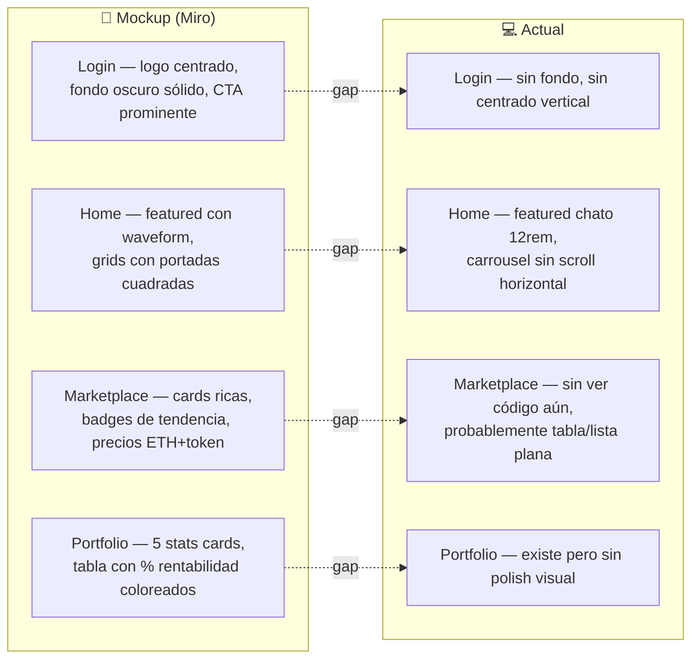

# UI — Brecha entre mockups y estado actual

Damián mencionó que la interfaz visual necesita mejorar. Este doc compara los mockups de Miro contra cómo se ve hoy, e identifica las mejoras concretas para cerrar esa brecha.

---

## Mapa de páginas: mockup vs realidad



---

## Brecha 1 — Login page

### Mockup
- Fondo oscuro que ocupa toda la pantalla (`h-screen`)
- Logo wave3 centrado vertical y horizontalmente
- Subtítulo grande en bold ("La nueva era de la música es tuya")
- Descripción pequeña debajo
- Botón CTA verde ("Conectar Billetera") centrado con buen padding

### Actual
- `greetings-container` no tiene `min-h-screen`
- El contenido queda pegado arriba, no centrado verticalmente
- El botón usa `.primary-button` con estilos en CSS custom, no DaisyUI

### Fix propuesto

```tsx
// page.tsx — Login
<div className="flex min-h-screen flex-col items-center justify-center bg-base-200 gap-6 px-4 text-center">
  <Logo />
  <h1 className="text-4xl font-bold text-base-content">The new era of music is yours</h1>
  <p className="max-w-sm text-base-content/60 text-sm">
    Listen without limits, invest in your favorite artists, and earn royalties. All on the blockchain.
  </p>
  <Link href="/home" className="btn btn-primary btn-lg">Connect Wallet</Link>
</div>
```

**Esfuerzo: Muy bajo | Impacto: Alto**

---

## Brecha 2 — Home: Featured section

### Mockup
- Banner full-width con fondo degradado oscuro y una visualización de waveform
- Portada del álbum superpuesta a la izquierda
- Nombre de la canción y artista con tipografía grande
- Botón de play prominente

### Actual
- Imagen de 12rem de alto, pegada arriba
- Descripción en `featured-description` con `background: var(--color-secondary)`
- No hay degradado ni sensación de "hero"

### Fix propuesto

Reemplazar el diseño actual del `Featured` por un hero banner:

```tsx
// Featured.tsx
<div className="relative w-full rounded-xl overflow-hidden aspect-[21/6] bg-base-300">
  {/* imagen de fondo con blur */}
  <Image src={coverUrl} fill className="object-cover blur-sm scale-110 opacity-40" alt="" />
  {/* contenido encima */}
  <div className="absolute inset-0 flex items-center gap-6 px-8">
    <Image src={coverUrl} width={120} height={120} className="rounded-lg shadow-lg" alt={name} />
    <div className="flex flex-col gap-2">
      <span className="text-xs text-base-content/60 uppercase tracking-widest">Featured Release</span>
      <h2 className="text-2xl font-bold text-base-content">{name}</h2>
      <span className="text-sm text-base-content/70">by {artist}</span>
      <PlayButton songMetadata={songMetadata} />
    </div>
  </div>
</div>
```

**Esfuerzo: Bajo | Impacto: Alto**

---

## Brecha 3 — Home: Carrousel (scroll horizontal)

### Mockup
- Las grillas de canciones muestran 4 cards por fila, compactas y bien alineadas

### Actual
- `.carrousel` usa `flex-wrap` — las cards bajan a la siguiente fila en vez de scrollear
- No hay scroll horizontal, las cards tienen `width: 18rem` (demasiado anchas)

### Fix propuesto

```tsx
// Carrousel.tsx — reemplazar div del carrousel
<div className="flex gap-3 overflow-x-auto pb-2 scrollbar-thin">
  {/* cards */}
</div>
```

```css
/* home-page.css */
.carrousel-song-container {
  width: 10rem;   /* era 18rem */
  flex-shrink: 0;
}
```

**Esfuerzo: Muy bajo | Impacto: Medio**

---

## Brecha 4 — Marketplace: cards enriquecidas

### Mockup
- Cards con portada cuadrada, nombre, artista, badges ("En Tendencia")
- Precio en **tokens** y en **ETH** (dos líneas)
- Botón "Ver Detalles" full-width abajo

### Actual
- Sin ver el código del Marketplace, pero probablemente no tiene estos badges ni el dual-price

### Fix propuesto

Agregar al `SongCard` en el contexto de Marketplace:

```tsx
// slot `actions` del SongCard en Marketplace
<>
  {isTrending && (
    <span className="badge badge-primary badge-sm">Trending</span>
  )}
  <div className="text-sm font-bold text-primary">{tokens} TOKENS</div>
  <div className="text-xs text-base-content/50">{ethPrice} ETH</div>
  <button className="btn btn-primary btn-sm w-full mt-1">View Details</button>
</>
```

**Esfuerzo: Bajo | Impacto: Alto**

---

## Brecha 5 — Marketplace: modal de detalle

### Mockup
- Modal con portada grande a la izquierda
- Distribución de regalías con gráfico de torta (donut chart)
- Detalles del NFT (artista, álbum, producción, sello, porcentaje disponible)
- Precio/fracción en verde grande
- Botones: "Comprar Participación", "Compartir", "Ver en Blockchain"

### Actual
- Probablemente no existe o está incompleto

### Fix propuesto (librería)

Usar `recharts` (ya es una dep común en Next.js) para el donut:

```tsx
import { PieChart, Pie, Cell } from "recharts";

const data = [
  { name: "Artist", value: 70 },
  { name: "Investors", value: 30 },
];
<PieChart width={100} height={100}>
  <Pie data={data} innerRadius={30} outerRadius={45} dataKey="value">
    <Cell fill="#2dd4a0" />
    <Cell fill="#1c322f" />
  </Pie>
</PieChart>
```

**Esfuerzo: Medio | Impacto: Alto**

---

## Brecha 6 — Portfolio: stats cards

### Mockup
- 5 cards en fila: Valor total, Rendimiento acumulado, Canciones invertidas, Regalías cobradas, Balance disponible
- Rendimiento con color verde/rojo según si es positivo/negativo

### Actual
- Existe `PortfolioStats.tsx`, probablemente ya tiene algo pero sin color condicional en el rendimiento

### Fix propuesto

```tsx
// PortfolioStats — rendimiento
<span className={performance >= 0 ? "text-success" : "text-error"}>
  {performance >= 0 ? "+" : ""}{performance}%
</span>
```

**Esfuerzo: Muy bajo | Impacto: Medio**

---

## Brecha 7 — Portfolio: tabla de participaciones

### Mockup
- Columnas: Canción, Participación %, Rentabilidad (badge verde/rojo), Acciones
- Badge de rentabilidad con color semántico

### Actual
- `SongParticipationTable.tsx` existe pero probablemente tiene texto plano sin badges de color

### Fix propuesto

```tsx
// SongParticipationTable — columna rentabilidad
<span className={`badge ${profit >= 0 ? "badge-success" : "badge-error"} badge-sm`}>
  {profit >= 0 ? "+" : ""}{profit}%
</span>
```

**Esfuerzo: Muy bajo | Impacto: Medio**

---

## Resumen de trabajo pendiente

| # | Mejora | Esfuerzo | Impacto | Archivo(s) |
|---|---|---|---|---|
| 1 | Login: centrado vertical + `min-h-screen` | Muy bajo | Alto | `app/page.tsx`, `login-page.css` |
| 2 | Home Featured: hero banner con blur + overlay | Bajo | Alto | `app/home/_components/Featured.tsx` |
| 3 | Home Carrousel: scroll horizontal | Muy bajo | Medio | `Carrousel.tsx`, `home-page.css` |
| 4 | Marketplace cards: badges + dual-price | Bajo | Alto | `app/marketplace/` |
| 5 | Marketplace modal: donut chart regalías | Medio | Alto | `app/marketplace/_components/` |
| 6 | Portfolio stats: color condicional | Muy bajo | Medio | `PortfolioStats.tsx` |
| 7 | Portfolio tabla: badges de rentabilidad | Muy bajo | Medio | `SongParticipationTable.tsx` |

> Ver también [UX_IMPROVEMENTS.md](./UX_IMPROVEMENTS.md) para el historial de mejoras ya completadas.
