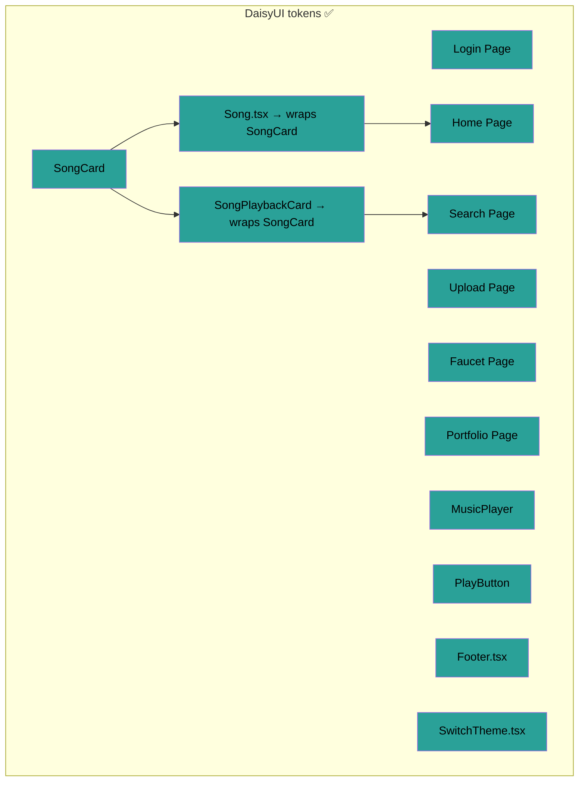

# Mejoras de UX / UI

## Resumen

Este documento registra la refactorización de UX/UI del frontend de Wave3. El objetivo fue unificar el sistema de estilos, arreglar el dark mode, estandarizar componentes y asegurar una interfaz consistente en inglés en todas las páginas.

---

## Diagnóstico inicial

La app tenía **3 sistemas de estilos compitiendo entre sí**, generando una experiencia visual inconsistente:

| Sistema | Dónde se usaba | Problema |
|---|---|---|
| Clases custom CSS (`globals.css`) | Login, Home, Upload, Marketplace | Tokens de tema definidos pero no usados en todos lados |
| Tailwind utilities hardcodeadas | Recommendations, Search, SongPlaybackCard | Colores fijos (`bg-slate-950`, `bg-white`) que ignoran el tema |
| Inline styles (`style={{}}`) | MusicPlayer, Upload | Colores hardcodeados (`#1a1a1a`, `#4f46e5`), imposibles de tematizar |

### Problemas principales identificados

1. **Dark mode roto** — `SongPlaybackCard` usaba `bg-white`/`text-slate-900`, `MusicPlayer` tenía colores inline fijos
2. **Página de Recommendations desacoplada** — Esquema de colores propio (`bg-slate-950`, `bg-blue-600`) sin relación con el resto
3. **Idioma mezclado** — Algunas páginas en español, otras en inglés, textos de botones inconsistentes
4. **Inputs inconsistentes** — Home usaba Tailwind (`border-gray-300 rounded-lg`), Upload usaba la clase custom `.input`
5. **Múltiples componentes de card** — `Song.tsx`, `SongPlaybackCard.tsx` y cards inline en Marketplace, todos con estilos distintos
6. **Reproductor sin progreso** — Sin barra de seek, sin display de tiempo, sin indicador de canción actual

---

## Mejoras completadas

### 1. Sistema de estilos unificado — DaisyUI ✅

Se migraron todos los componentes de estilos mixtos (CSS/Tailwind/inline) a tokens semánticos de DaisyUI.

**Archivos migrados:**
- `components/MusicPlayer.tsx` — reemplazados todos los inline styles por clases DaisyUI (`bg-base-300`, `text-base-content`, etc.)
- `components/SongPlaybackCard.tsx` — reemplazados `bg-white`, `text-slate-900`, `bg-indigo-600` por tokens DaisyUI
- `components/Song.tsx` — ahora envuelve el componente unificado `SongCard`
- `components/PlayButton.tsx` — reemplazado `.primary-button` por `btn btn-primary btn-sm w-full`
- `app/home/page.tsx` — search input migrado a DaisyUI
- `app/search/_components/SearchContent.tsx` — migrado a tokens DaisyUI
- `app/upload/_components/CreateAlbumForm.tsx` — migrado a componentes de formulario DaisyUI
- `app/upload/_components/AddSongsForm.tsx` — migrado a componentes de formulario DaisyUI
- `app/faucet/page.tsx` — reemplazado `.primary-button` por `btn btn-primary`

### 2. Dark mode arreglado — tema verde oscuro custom ✅

Se reemplazó el tema oscuro azul roto por una paleta verde oscura custom en `styles/globals.css`:

| Token | Valor dark | Valor light |
|---|---|---|
| `base-100` | `#1a2e28` | `#ffffff` |
| `base-200` | `#0f1f1a` | `#f4f8ff` |
| `base-300` | `#142420` | `#dae8ff` |
| `primary` | `#2dd4a0` | `#93bbfb` |
| `base-content` | `#e8f5e9` | `#1f2937` |

Todos los componentes responden correctamente al cambio de tema ya que usan tokens semánticos.

### 3. Interfaz solo en inglés ✅

Se tradujo todo el texto en español a inglés en:
- `app/home/page.tsx` — títulos de sección, labels de botones
- `app/search/_components/SearchContent.tsx` — texto de la UI de búsqueda
- `app/upload/_components/CreateAlbumForm.tsx` — labels de formulario y mensajes
- `app/upload/_components/AddSongsForm.tsx` — labels de formulario y mensajes
- `app/portfolio/page.tsx` — "Mi Portfolio" → "My Portfolio"
- `app/portfolio/_components/PortfolioStats.tsx` — las 5 labels de las cards de estadísticas
- `app/portfolio/_components/SongParticipationTable.tsx` — encabezados de tabla y texto de botones
- `app/portfolio/_components/SongDetailModal.tsx` — todos los labels, botones, encabezados de sección

### 4. Componente SongCard unificado ✅

Se creó un único `components/SongCard.tsx` usado tanto por `Song.tsx` (home) como por `SongPlaybackCard.tsx` (search).

**Props:**
```tsx
interface SongCardProps {
  songId: string | number;
  name: string;
  artist: string;
  imageUrl: string;
  action: React.ReactNode;
  className?: string;
}
```

**Características:**
- Layout compacto: `px-2 pb-2 pt-1` con texto `leading-tight`
- Título/artista truncados con `text-sm`/`text-xs`
- Imagen de portada con aspect-ratio cuadrado
- Slot `action` flexible para botones de play u otros controles
- **Indicador de reproducción**: borde verde + barras de ecualizador animadas cuando la canción está activa

### 5. Tamaño de cards consistente ✅

- Home: `.song-container` con ancho fijo de `10rem`
- Search: `flex flex-wrap` con contenedores `w-40` (mismo tamaño que home)
- Todas las cards usan imágenes `aspect-square` y `overflow: hidden` con truncado de texto

### 6. Rediseño de barra de búsqueda ✅

Se reemplazó la búsqueda de dos elementos (input + botón separado) por un único input con ícono de lupa integrado. Aplicado en:
- `app/home/page.tsx` — incluye soporte de tecla Enter para navegar
- `app/search/_components/SearchContent.tsx`

### 7. Mejoras del reproductor de música ✅

`components/MusicPlayer.tsx` ahora incluye:
- **Barra de progreso clickeable** — barra fina `h-1` en la parte superior del player, click para buscar posición
- **Display de tiempo** — posición actual y duración (`0:32 / 3:45`)
- **Hook `useCurrentSongId()`** — transmite el ID de la canción en reproducción mediante un patrón de listeners, consumido por `SongCard` para el indicador de reproducción
- **Tracking de seek basado en RAF** — loop de `requestAnimationFrame` iniciado en el evento `on("play")` de Howl para timing preciso

### 8. Dirección de wallet removida del display ✅

- Los resultados de búsqueda ahora muestran el nombre del álbum en vez de la dirección de wallet (`song.album?.name` en vez de `song.album?.artist`)
- Se removió el display de wallet de la página de recomendaciones
- Se eliminó la página de test de recomendaciones (`app/recommendations/`) por completo

### 9. Tokens de la página Portfolio unificados ✅

Todas las instancias de `text-neutral` en componentes de portfolio se reemplazaron por `text-base-content/60` para consistencia con el resto de la app.

### 10. Jerarquía de títulos de sección ✅

`.subtitle` en `globals.css` ahora tiene `font-size: 1.25rem` y `padding: 0.5rem 0` explícitos.

---

## Arquitectura: Mapa actual de componentes



---

## Propuesta: Rediseño de la página de Upload

### Problema

Dos formularios largos apilados verticalmente. El usuario no sabe por dónde empezar y tiene que scrollear mucho. Después de crear un álbum, tiene que buscarlo manualmente en el dropdown de abajo.

### Propuesta

Reemplazar por una pantalla inicial con dos opciones:

- **Crear álbum nuevo + canciones** → wizard de 2 pasos (álbum → canciones), el álbum creado se pasa automático al paso 2
- **Agregar canciones a álbum existente** → va directo al formulario de canciones con dropdown

Implementación: un estado `mode` (`"choose" | "new-album" | "existing-album"`) en `upload/page.tsx`. Los formularios internos quedan iguales.

**Esfuerzo: Bajo | Impacto: Alto**

---

## Estado general / Trabajo pendiente

| # | Propuesta | Esfuerzo | Impacto | Estado |
|---|---|---|---|---|
| 1 | Estilos unificados (DaisyUI) | Medio | Alto | **Hecho** ✅ |
| 2 | Dark mode (tema verde) | Bajo | Alto | **Hecho** ✅ |
| 3 | Interfaz solo en inglés | Bajo | Medio | **Hecho** ✅ |
| 4 | Componente SongCard unificado | Bajo | Medio | **Hecho** ✅ |
| 5 | Rediseño barra de búsqueda | Bajo | Medio | **Hecho** ✅ |
| 6 | Reproductor (progreso, seek, tiempo) | Medio | Alto | **Hecho** ✅ |
| 7 | Indicador de reproducción en cards | Bajo | Medio | **Hecho** ✅ |
| 8 | Tamaño de cards consistente | Bajo | Medio | **Hecho** ✅ |
| 9 | Limpieza página Portfolio | Bajo | Medio | **Hecho** ✅ |
| 10 | Layout responsivo | Medio | Alto | Pendiente |
| 11 | Navegación: resaltar página activa | Bajo | Bajo | Pendiente |
| 12 | Skeletons de carga / estados de feedback | Medio | Medio | Pendiente |
| 13 | Grid de Marketplace (usar SongCard) | Bajo | Medio | Pendiente |
| 14 | Limpieza de contenido placeholder | Bajo | Bajo | Pendiente |
| 15 | Rediseño Upload: elección + wizard | Bajo | Alto | Pendiente |
