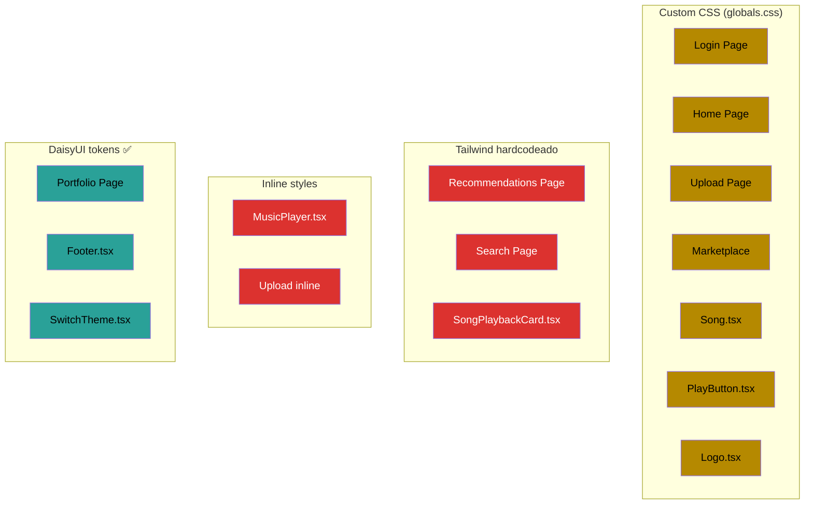
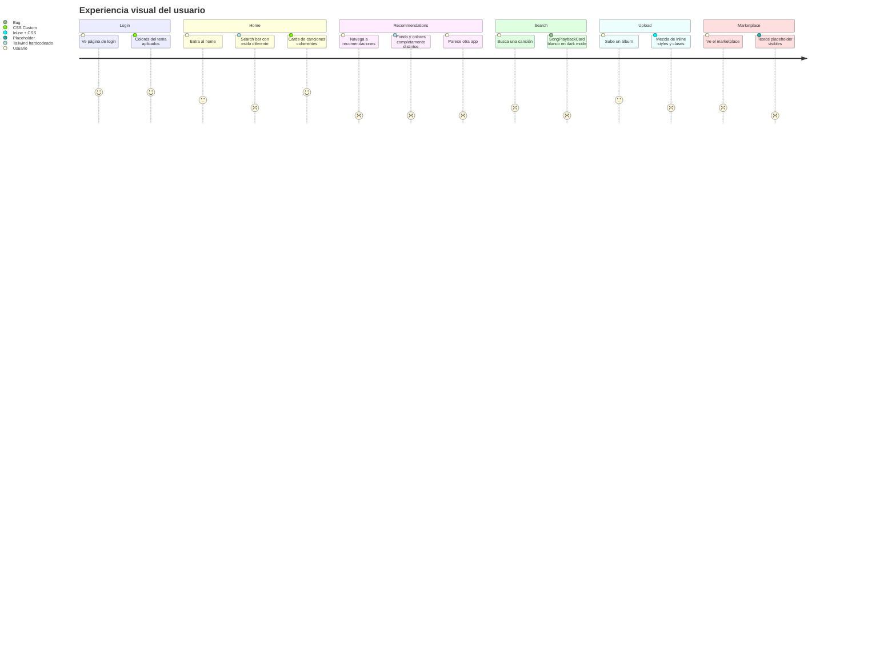

# Mejoras de UX / UI

## Estado actual: Diagnóstico

La app tiene **3 sistemas de estilos compitiendo entre sí**, lo que genera una experiencia visual inconsistente:

| Sistema | Dónde se usa | Problema |
|---|---|---|
| Clases custom CSS (`globals.css`) | Login, Home, Upload, Marketplace | Definen tokens de tema, pero no se usan en todos lados |
| Tailwind utilities hardcodeadas | Recommendations, Search, SongPlaybackCard | Colores fijos (`bg-slate-950`, `bg-white`) que ignoran el tema |
| Inline styles (`style={{}}`) | MusicPlayer, Upload | Colores hardcodeados (`#1a1a1a`, `#4f46e5`), imposibles de tematizar |

### Mapa de estilos por componente



### Problemas principales

1. **Dark mode roto**: `SongPlaybackCard` usa `bg-white` y `text-slate-900` → en dark mode queda un rectángulo blanco suelto. `MusicPlayer` tiene colores fijos que no responden al tema.
2. **Página de Recommendations desacoplada**: Tiene su propio esquema de colores (`bg-slate-950`, `bg-blue-600`) que no tiene nada que ver con el resto de la app.
3. **Layout rígido**: `width: 55%` fijo en header y contenido. No hay breakpoints responsivos. No hay menú hamburguesa en mobile.
4. **Idioma mezclado**: Algunas páginas en español, otras en inglés, textos de botones inconsistentes.
5. **Contenido placeholder**: "PROGRESS BAR", "SOLD OUT", "Totally not a scam" en el footer, página Playlists es un `<div>PLAYLIST</div>`.
6. **Inputs inconsistentes**: Home usa Tailwind (`border-gray-300 rounded-lg`), Upload usa la clase `.input` de globals.

### Flujo visual del usuario (y dónde se rompe la consistencia)



---

## Propuestas de mejora

Cada propuesta tiene un **esfuerzo estimado** (Bajo/Medio/Alto) y un **impacto visual** (Bajo/Medio/Alto). Todas son realizables por estudiantes de ingeniería informática sin conocimiento de diseño.

---

### 1. Unificar sistema de estilos → una sola fuente de verdad

**Esfuerzo: Medio | Impacto: Alto**

Elegir **uno** de estos caminos y migrar todo:

- **Opción A**: Usar solo DaisyUI tokens semánticos (`bg-base-100`, `text-primary`, `btn btn-primary`, etc.) — ya se usan en Portfolio, que es la página más prolija.
- **Opción B**: Usar solo las clases custom de `globals.css` (`.primary-button`, `.input`, `.title`).

**Recomendación**: Opción A (DaisyUI). Ya viene con el proyecto, tiene temas light/dark gratis, y los componentes (`btn`, `card`, `input`, `navbar`) resuelven el 80% de lo que necesitamos.

**Cambios concretos**:
- Reemplazar todos los `bg-white`, `bg-slate-*`, `text-slate-*` por tokens DaisyUI (`bg-base-100`, `bg-base-200`, `text-base-content`).
- Reemplazar inline styles del `MusicPlayer` por clases DaisyUI.
- Reemplazar la clase `.input` custom por `input input-bordered` de DaisyUI.
- Reemplazar `.primary-button` por `btn btn-primary`.

---

### 2. Arreglar dark mode

**Esfuerzo: Bajo | Impacto: Alto**

Actualmente el toggle de dark mode existe pero rompe varias páginas. Hay dos opciones:

- **Opción A**: Arreglar dark mode migrando colores hardcodeados a tokens semánticos (va de la mano con la propuesta 1).
- **Opción B**: Sacar dark mode y dejar solo un tema. Menos trabajo, resultado más consistente.

**Componentes que rompen dark mode**:
- `SongPlaybackCard.tsx` — colores `bg-white`, `text-slate-900`, `bg-indigo-600`
- `MusicPlayer.tsx` — inline `background: "#1a1a1a"`, `background: "#4f46e5"`
- `recommendations/page.tsx` — fondo `bg-slate-950` hardcodeado
- `home/page.tsx` — search input con `border-gray-300`

---

### 3. Layout responsivo

**Esfuerzo: Medio | Impacto: Alto**

El content container tiene `width: 55%` fijo. En una pantalla chica se corta todo, en una grande se desperdicia espacio.

**Cambios**:
- Reemplazar `width: 55%` por un max-width con padding: `max-w-5xl mx-auto px-4` (Tailwind) o similar.
- Agregar hamburger menu en el Header para mobile (el TODO ya está en el código).
- Usar breakpoints de Tailwind (`sm:`, `md:`, `lg:`) en los grids de Marketplace y Home.

---

### 4. Paleta de colores consistente

**Esfuerzo: Bajo | Impacto: Medio**

Definir 4-5 colores y usarlos en todos lados. No hace falta inventar nada — DaisyUI ya tiene temas predefinidos.

**Opción rápida**: Elegir un tema DaisyUI que se vea bien para una app de música:
- `night` — oscuro, moderno, tipo Spotify
- `dracula` — oscuro, colores suaves
- `winter` — claro, limpio, minimalista
- `nord` — claro/oscuro, low contrast, elegante

Se configura en una línea en `globals.css` y todos los componentes DaisyUI lo heredan.

**Opción manual**: Ajustar los valores de `--color-primary`, `--color-secondary`, etc. en el bloque `@plugin "daisyui"` del `globals.css`. Hay herramientas como [daisyUI Theme Generator](https://daisyui.com/theme-generator/) que generan la config.

---

### 5. Tipografía y espaciado

**Esfuerzo: Bajo | Impacto: Medio**

Problemas actuales:
- Tamaños de fuente arbitrarios (`.title` es `2rem`, otros usan Tailwind `text-lg`, `text-xl`, `text-3xl`).
- Spacing inconsistente entre secciones.

**Cambios**:
- Definir una escala tipográfica fija: `text-sm`, `text-base`, `text-lg`, `text-xl`, `text-2xl`. No usar más de 5 tamaños.
- Usar la escala de spacing de Tailwind consistentemente: `gap-4`, `p-4`, `mb-6`, etc. Evitar valores custom como `margin: 15px`.
- Para títulos de página usar siempre `text-2xl font-bold` (o la clase DaisyUI equivalente).

---

### 6. Cards uniformes

**Esfuerzo: Bajo | Impacto: Medio**

Ahora hay 3 componentes de "tarjeta de canción" con estilos distintos: `Song.tsx`, `SongPlaybackCard.tsx`, y los cards inline en Marketplace.

**Cambio**: Unificar en un solo componente `SongCard` que use `card` de DaisyUI:
```tsx
<div className="card bg-base-200 shadow-sm">
  <figure></figure>
  <div className="card-body">
    <h3 className="card-title">{title}</h3>
    <p>{artist}</p>
  </div>
</div>
```

Un solo componente, un solo estilo, se usa en Home, Search, Recommendations y Marketplace.

---

### 7. Limpiar contenido placeholder

**Esfuerzo: Bajo | Impacto: Bajo**

- Sacar "PROGRESS BAR" y "SOLD OUT" del Marketplace o reemplazarlos por estados reales.
- Cambiar "Totally not a scam" del footer por algo neutro.
- Si Playlists no está implementado, sacarlo del header o poner una página "Próximamente".
- Unificar idioma (todo en español dado que los textos de usuario ya son en español).

---

### 8. MusicPlayer como componente de primera clase

**Esfuerzo: Medio | Impacto: Medio**

El player fijo en la parte inferior tiene 100% inline styles. Es el componente más visible de la app siendo de música.

**Cambios**:
- Migrar a clases Tailwind/DaisyUI.
- Usar tokens de tema para que se adapte a light/dark.
- Darle un `bg-base-300` con `border-t border-base-content/10` en vez de `#1a1a1a` hardcodeado.
- Los botones de play/pause/volumen usar `btn btn-ghost btn-circle`.

---

### 9. Feedback visual (estados de carga y errores)

**Esfuerzo: Medio | Impacto: Medio**

Actualmente no hay feedback visual cuando:
- Se carga contenido (no hay skeletons ni spinners consistentes).
- Una transacción blockchain está pendiente.
- Hay un error.

**Cambios**:
- Usar `loading loading-spinner` de DaisyUI en botones durante transacciones.
- Agregar `skeleton` de DaisyUI para cards mientras cargan.
- Usar `alert` de DaisyUI para mensajes de éxito/error en vez de `console.log`.

---

### 10. Navegación: resaltar página activa

**Esfuerzo: Bajo | Impacto: Bajo**

El Header no indica en qué página estás. Agregar un estilo activo al link de navegación actual:

```tsx
className={`navbar-link ${pathname === href ? "btn-active" : ""}`}
```

Esto ya viene gratis con DaisyUI si se usa `btn btn-ghost`.

---

## Resumen: Prioridades sugeridas

| # | Propuesta | Esfuerzo | Impacto | Prioridad |
|---|---|---|---|---|
| 1 | Unificar estilos (DaisyUI) | Medio | Alto | **P0** |
| 2 | Arreglar/sacar dark mode | Bajo | Alto | **P0** |
| 4 | Paleta de colores consistente | Bajo | Medio | **P1** |
| 3 | Layout responsivo | Medio | Alto | **P1** |
| 6 | Cards uniformes | Bajo | Medio | **P1** |
| 7 | Limpiar placeholders | Bajo | Bajo | **P1** |
| 5 | Tipografía y spacing | Bajo | Medio | **P2** |
| 8 | MusicPlayer refactor | Medio | Medio | **P2** |
| 9 | Feedback visual | Medio | Medio | **P2** |
| 10 | Nav activa | Bajo | Bajo | **P2** |

**Sugerencia de ejecución**: Hacer la 1 y la 2 juntas (unificar en DaisyUI arregla dark mode de paso). Después la 4 (elegir tema) que es cambiar una línea. Con eso ya se ve 80% mejor sin tocar la lógica de la app.
