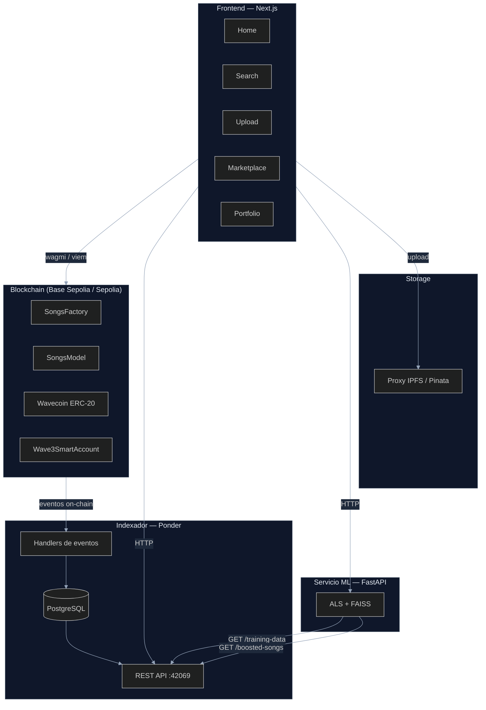
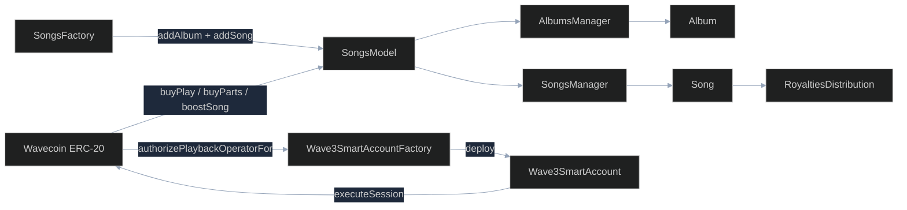
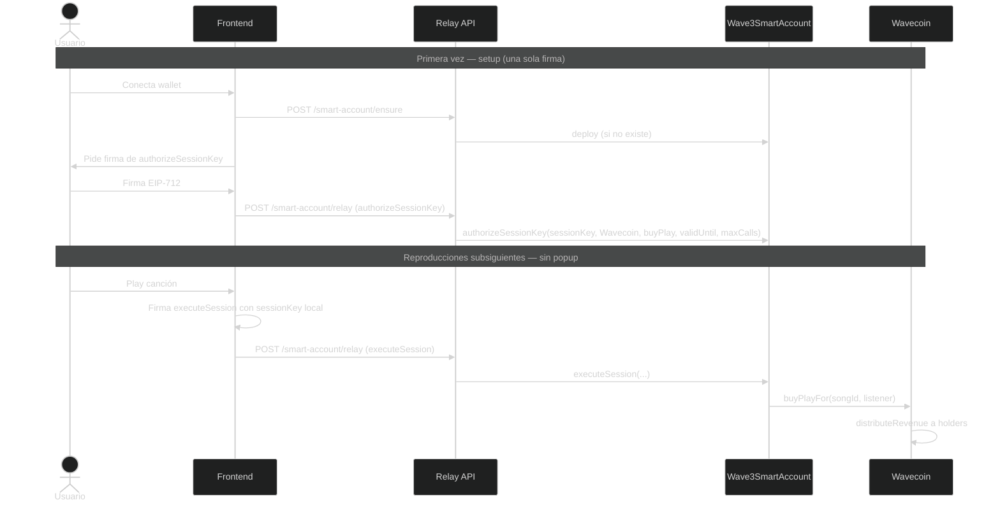
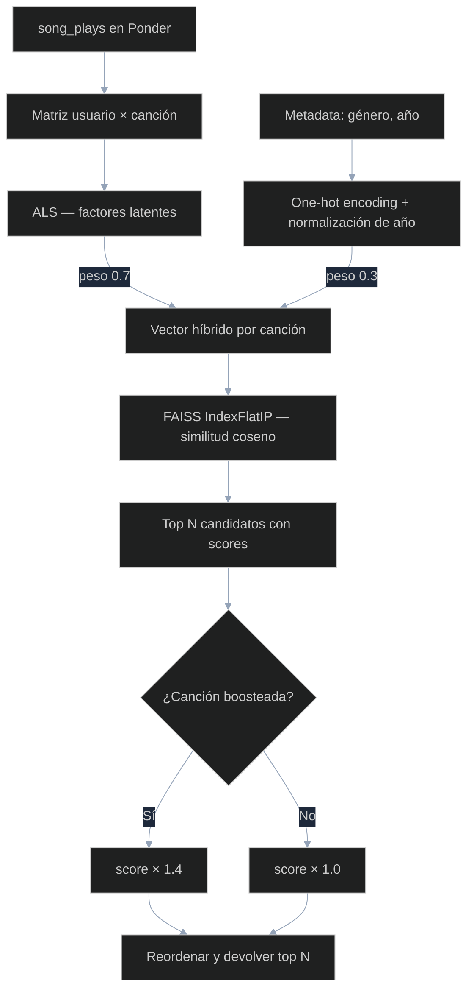
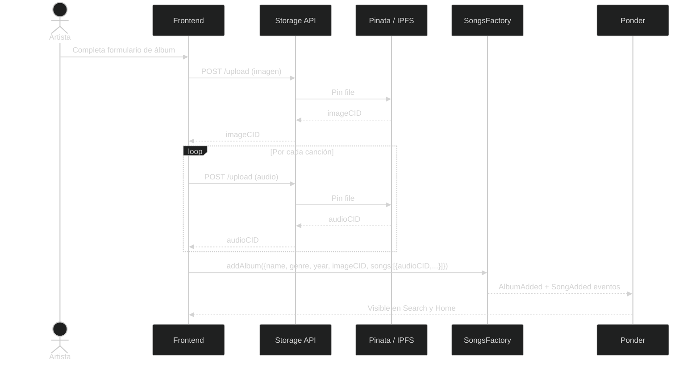
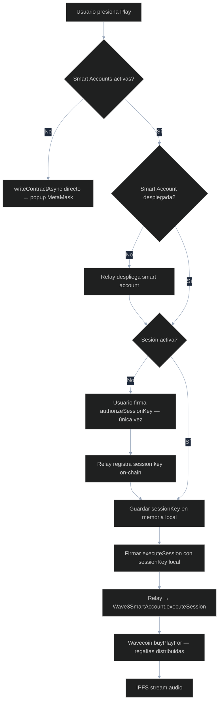
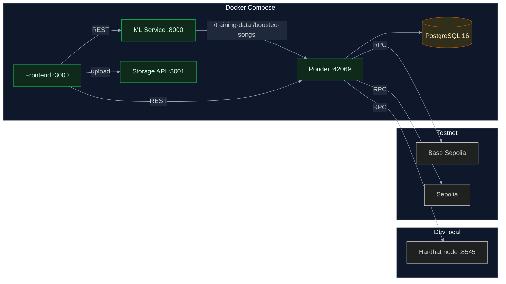
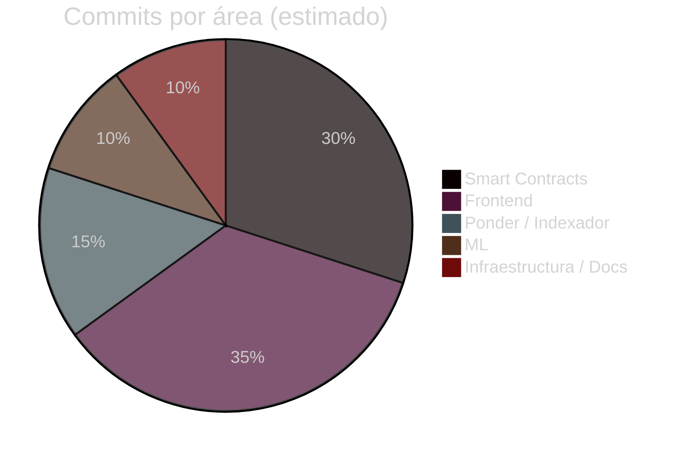
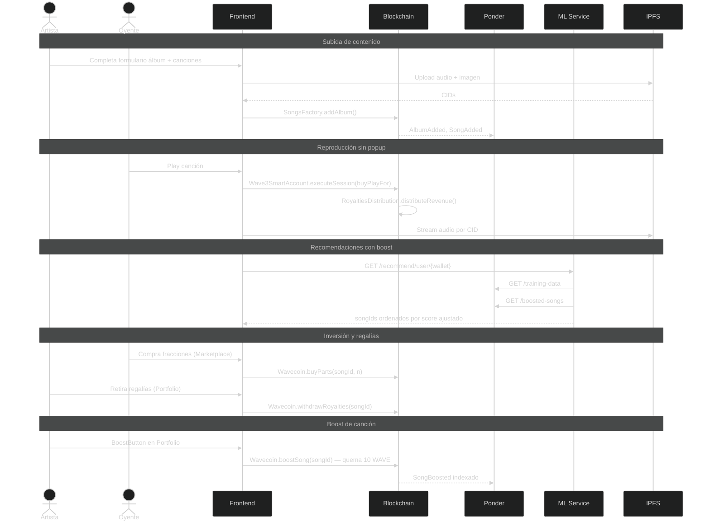

# Wave3 — Informe Final del Trabajo Profesional

> Versión: 2026-05-21 — generada a partir del estado del repositorio.
> Las secciones marcadas con `[COMPLETAR]` requieren información que no puede obtenerse del código.

---

## Carátula

**Título del proyecto:** Wave3 — Plataforma de streaming musical descentralizada con distribución automática de regalías y recomendación personalizada mediante machine learning.

**Carrera:** Ingeniería en Informática — FIUBA

| Alumno | Padrón | Email |
|---|---|---|
| Bogovic, Federico Ezequiel | 96722 | fbogovic@fi.uba.ar |
| Bravo Arroyo, Víctor Manuel | 98882 | vbravo@fi.uba.ar |
| Vetrano, Ignacio Ezequiel | 106129 | ivetrano@fi.uba.ar |
| Williner, Mariano | 83469 | mwilliner@fi.uba.ar |

**Tutor:** Damian Martinelli

**Fecha:** 2026

---

## Aval del director

`[COMPLETAR — ver formato en la plantilla]`

---

## Resumen

Este trabajo presenta el diseño e implementación de Wave3, una plataforma de streaming musical descentralizada que redefine la distribución y monetización del contenido digital. El sistema combina algoritmos de recomendación personalizados basados en aprendizaje automático con un modelo económico sustentado en tokens (Wavecoin, ERC-20), los cuales se utilizan para reproducir canciones y se distribuyen automáticamente entre artistas e inversores mediante contratos inteligentes. Se implementó almacenamiento descentralizado vía IPFS para los archivos de audio, un indexador on-chain (Ponder) que sirve de capa de consulta REST, y un mecanismo de cuentas inteligentes (smart accounts con session keys) que elimina la necesidad de confirmar cada transacción individualmente. La propuesta garantiza transparencia, trazabilidad y una distribución justa de regalías en la industria musical.

---

## Palabras clave

Blockchain, streaming musical, tokens ERC-20, contratos inteligentes, distribución de regalías, recomendación personalizada, machine learning, IPFS, smart accounts, session keys, propiedad fraccionada.

---

## Abstract

This work presents the design and implementation of Wave3, a decentralized music streaming platform that redefines the distribution and monetization of digital content. The system combines personalized recommendation algorithms based on machine learning with a token-driven economy (Wavecoin, ERC-20), where tokens are used to play songs and are automatically distributed among artists and investors through smart contracts. Decentralized storage via IPFS is used for audio files. An on-chain indexer (Ponder) provides a REST query layer, and a smart account mechanism with session keys removes the need to confirm every individual transaction. The solution ensures transparency, traceability, and fair royalty distribution across the music industry.

---

## Keywords

Blockchain, music streaming, ERC-20 tokens, smart contracts, royalty distribution, personalized recommendation, machine learning, IPFS, smart accounts, session keys, fractional ownership.

---

## Agradecimientos

`[COMPLETAR — sección opcional]`

---

## 1. Introducción

En un panorama donde la industria musical continúa centralizada en pocas plataformas y los artistas reciben una mínima parte de las ganancias, Wave3 propone una alternativa que combina streaming musical, blockchain e inteligencia artificial para transformar la forma en que se consume y se remunera la música.

Wave3 ofrece una experiencia de escucha personalizada mientras garantiza transparencia en la distribución de regalías. Mediante contratos inteligentes, los pagos se reparten automáticamente entre artistas e inversores cada vez que una canción es reproducida. La propiedad de las canciones se representa mediante fracciones en el contrato `RoyaltiesDistribution`, habilitando a fans e inversores a participar directamente del éxito de una obra.

Los usuarios adquieren Wavecoin (WAVE) para reproducir canciones, comprar fracciones de obras o impulsar canciones en el sistema de recomendación. Un modelo de recomendación híbrido (filtrado colaborativo + características de contenido) analiza gustos y patrones de escucha para ofrecer sugerencias personalizadas.

---

## 2. Estado del Arte

Las plataformas dominantes (Spotify, Apple Music, YouTube Music) operan con contratos confidenciales que dificultan el control para los artistas, generando tarifas difíciles de auditar, demoras en pagos y fricción por derechos fragmentados.

En el ecosistema Web3 musical (Audius, Catalog, Royal) se exploran blockchain, tokens y contratos inteligentes para una economía transparente para el creador. Sin embargo, la adopción es baja por el costo y latencia de transacciones, la desconfianza en criptomonedas y la complejidad de la experiencia de usuario.

Los sistemas de recomendación más usados se basan en filtros colaborativos (usuario–ítem), contenido (género, artista, metadata) o híbridos. Spotify, YouTube y Apple Music utilizan modelos híbridos centralizados sobre PyTorch/TensorFlow con pipelines en Kafka/Spark. Plataformas indie como SoundCloud y Bandcamp prefieren modelos más ligeros con vector search.

La investigación sobre propiedad fraccionada mediante tokens en la música es reciente y ofrece nuevas oportunidades de financiamiento y participación de fans, permitiendo adquirir fracciones de derechos o ingresos futuros de una obra.

---

## 3. Problema detectado

1. **Distribución de regalías poco transparente**: Los modelos actuales concentran ingresos en pocas plataformas y sellos. Los procesos de cálculo son opacos y dependen de intermediarios.

2. **Escasa participación de fans en los ingresos de artistas**: Los oyentes no tienen mecanismos para apoyar directamente a creadores ni participar del éxito económico de una canción.

3. **Falta de economía interna integrada**: No existen sistemas que conecten fluida y verificablemente la reproducción de música, la inversión en artistas y la circulación de valor dentro de la plataforma.

4. **Entrenamiento centralizado de modelos de recomendación**: Los sistemas tradicionales centralizan grandes volúmenes de datos de usuarios, con riesgos de privacidad y costos de infraestructura elevados.

---

## 4. Solución implementada

Wave3 es una plataforma de streaming musical descentralizada compuesta por cinco servicios interconectados: contratos inteligentes en Ethereum/Base, un frontend web, un indexador on-chain, un servicio de almacenamiento y un servicio de recomendación por machine learning.

### 4.1 Arquitectura general



### 4.2 Smart Contracts

Implementados en Solidity `>=0.8.0` sobre Hardhat, desplegados en Base Sepolia y Sepolia. Usan OpenZeppelin `~5.0.2`.

#### Relaciones entre contratos



#### Contratos principales

| Contrato | Descripción |
|---|---|
| `Wavecoin` | Token ERC-20 nativo de la plataforma. Implementa `buyPlay`, `buyParts`, `withdrawRoyalties` y `boostSong` (quema tokens). Controla operadores de reproducción aprobados para gasless play |
| `SongsModel` | Orquestador central. Gestiona el registro de álbumes y canciones, emite los eventos que indexa Ponder, almacena `boostExpiry` por canción |
| `SongsManager` | Gestiona el ciclo de vida de canciones. Cada canción es un contrato `Song` |
| `AlbumsManager` | Gestiona álbumes. Cada álbum es un contrato `Album` |
| `Song` | Encapsula metadata y delega en `RoyaltiesDistribution` |
| `RoyaltiesDistribution` | Implementa propiedad fraccionada: `totalParts`, `availableParts`, `buyParts`, `distributeRevenue`, `withdraw`. Reparte automáticamente los ingresos proporcional a las partes de cada holder |
| `SongsFactory` | Punto de entrada único para artistas: crea álbum + canciones en una sola transacción |
| `Wave3SmartAccount` | Smart account con EIP-712. Permite ejecución delegada firmada y session keys con restricción de target+selector+maxCalls+validUntil |
| `Wave3SmartAccountFactory` | Factory de smart accounts. Deterministic deployment por wallet owner |

#### Eventos on-chain indexados

| Evento | Emitido en |
|---|---|
| `AlbumAdded` | `SongsModel.addAlbum()` |
| `SongAdded` | `SongsModel.addSong()` |
| `SongPlayed` | `SongsModel.buyPlay()` |
| `SongPurchase` | `SongsModel.buyParts()` |
| `RoyaltiesWithdrawn` | `SongsModel.withdrawRoyalties()` |
| `SongBoosted` | `SongsModel.boostSong()` |

#### Constantes económicas

| Parámetro | Valor |
|---|---|
| `FEE_PERCENTAGE` (retiro de regalías) | 30% |
| `BOOST_PRICE` | 10 WAVE |
| `BOOST_DURATION` | 30 días |
| `DEFAULT_PLAY_FEE` (frontend) | 1 WAVE |
| `DEFAULT_PART_PRICE` (frontend) | 10 WAVE |
| `DEFAULT_TOTAL_PARTS` (frontend) | 100 |
| `DEFAULT_NON_SELLABLE_PARTS` (frontend) | 30 (reservadas al artista) |

#### Session keys (Wave3SmartAccount)

El contrato implementa tres operaciones firmadas con EIP-712:

- `authorizeSessionKey(sessionKey, target, selector, validUntil, maxCalls, deadline, signature)` — el owner autoriza una clave efímera con restricciones estrictas.
- `executeSession(sessionKey, target, value, data, deadline, sessionSignature)` — ejecuta en nombre del owner sin exponer la wallet.
- `revokeSessionKey(sessionKey, deadline, signature)` — revoca la sesión.

Restricciones: `value` forzado a 0, `maxCalls` decremental, nonce separado por `sessionKey`.



### 4.3 Indexador Ponder

Ponder escucha los eventos del contrato `SongsModel` y los persiste en PostgreSQL. Expone una REST API en el puerto 42069.

#### Esquema de base de datos

| Tabla | Campos clave |
|---|---|
| `albums` | `albumId`, `name`, `artistName`, `artist` (address), `imageCID`, `genre`, `year`, `blockTimestamp` |
| `songs` | `songId`, `albumId`, `name`, `audioCID`, `blockTimestamp` |
| `song_plays` | `songId`, `listener`, `blockTimestamp` |
| `song_purchases` | `songId`, `buyer`, `parts`, `blockTimestamp` |
| `song_boosts` | `songId`, `payer`, `expiresAt`, `blockTimestamp` |

Todos los campos de ID tienen índices. Los campos de búsqueda frecuente (`listener`, `buyer`, `artist`, `name`) tienen índices secundarios.

#### Endpoints REST

| Método | Ruta | Descripción |
|---|---|---|
| `GET` | `/songs-with-albums` | Lista canciones con su álbum. Soporta `?q=`, `?by=SONG\|ALBUM\|ARTIST\|GENRE`, `?orderBy=plays\|purchases\|recent` |
| `GET` | `/songs/:id` | Detalle de una canción |
| `GET` | `/song-plays` | Historial de reproducciones |
| `GET` | `/song-purchases` | Historial de compras de fracciones |
| `GET` | `/training-data` | Eventos de reproducción con metadata para el ML |
| `GET` | `/boosted-songs` | Devuelve qué canciones (de una lista dada) tienen boost activo |

### 4.4 Servicio de Machine Learning

Implementado en Python con FastAPI. Expone una API REST en el puerto 8000.

#### Algoritmo

El sistema de recomendación es **híbrido**: combina filtrado colaborativo con características de contenido.

1. **Filtrado colaborativo** — Alternating Least Squares (ALS) con la librería `implicit`. Factoriza la matriz usuario×canción construida a partir del historial de reproducciones (`song_plays`).

2. **Características de contenido** — One-hot encoding de géneros + año normalizado a [0, 1]. Se combinan con los factores de ALS con peso `CONTENT_WEIGHT = 0.3`.

3. **Búsqueda de vecinos** — FAISS `IndexFlatIP` sobre vectores L2-normalizados. Búsqueda por producto interno equivale a similitud coseno.

4. **Boost de recomendación** — Antes de devolver resultados, el modelo consulta `/boosted-songs` en Ponder. Las canciones boosteadas reciben un multiplicador de score `BOOST_MULTIPLIER = 1.4`. Esto permite que canciones con buena afinidad pero score medio ganen visibilidad, sin forzar canciones irrelevantes en ningún feed.



#### Endpoints

| Método | Ruta | Descripción |
|---|---|---|
| `POST` | `/train` | Entrena el modelo con el historial actual de Ponder |
| `GET` | `/recommend/user/{wallet}` | Recomendaciones personalizadas (ALS + boost) |
| `GET` | `/recommend/song/{songId}` | Canciones similares (FAISS content-based) |
| `GET` | `/debug/songs` | Lista de canciones conocidas por el modelo |
| `GET` | `/debug/users` | Lista de wallets con historial de reproducción |

### 4.5 Servicio de Storage

Proxy Node.js que recibe archivos del frontend y los sube a IPFS vía Pinata. Devuelve el CID que se registra on-chain en el contrato `Song`.



### 4.6 Frontend

Next.js 14 (App Router), TypeScript, wagmi v2 / viem, RainbowKit, DaisyUI 5, TanStack Query.

#### Páginas implementadas

| Página | Descripción |
|---|---|
| `/home` | Canción destacada (ML), nuevos lanzamientos, trending. El featured usa ML para el usuario conectado con fallback a la canción más reciente |
| `/search` | Búsqueda por nombre, artista, álbum o género. Parámetros en URL para navegación directa (`?q=&by=`) |
| `/upload` | Formulario de creación de álbum con canciones. Sube archivos a IPFS y llama a `SongsFactory.addAlbum()` |
| `/marketplace` | Grid de canciones con `SongSearchBar`. Compra de fracciones con `BuyPartsModal` |
| `/portfolio` | Estadísticas del inversor: tokens invertidos, partes, plays de canciones propias. Retiro de regalías y boost por canción |
| `/faucet` | Mint de Wavecoin para testing |
| `/debug` | Contratos desplegados (Scaffold-ETH) |
| `/blockexplorer` | Explorador de transacciones local |

#### Componentes clave

| Componente | Descripción |
|---|---|
| `SongCard` | Card reutilizable con links clickeables: nombre → `search?q={nombre}&by=SONG`, artista → `search?q={artista}&by=ARTIST` |
| `MusicPlayer` | Player persistente en el footer. Barra de seek, tiempo, indicador de canción actual. Estado global compartido |
| `PlayButton` | Dispara `useSponsoredSongPlayback`. Muestra estado de la sesión en curso |
| `BoostButton` | Lee `SongsModel.boostExpiry()` y llama `Wavecoin.boostSong()`. Muestra fecha de expiración si está activo |
| `SongSearchBar` | Barra con toggles: SONG, ALBUM, ARTIST, GENRE. Construye `SongSearchSpec` |

#### Hook useSponsoredSongPlayback

Hook central del flujo de reproducción sin popup de wallet:

1. Si no hay smart account desplegada → el relay la despliega (patrocinado).
2. Si no hay sesión activa → el usuario firma una autorización de session key (una sola vez).
3. Cada `playSong` usa la clave efímera local para firmar. El relay ejecuta `executeSession` on-chain.
4. Fallback: si smart accounts están desactivadas (`NEXT_PUBLIC_ENABLE_SMART_ACCOUNTS=false`), usa `writeContractAsync` directo.



Variables de entorno:
- `NEXT_PUBLIC_ENABLE_SMART_ACCOUNTS` — activa el flujo de smart accounts.
- `NEXT_PUBLIC_ENABLE_PLAYBACK_SESSIONS` — activa session keys dentro del smart account.

### 4.7 Infraestructura y despliegue



Redes de blockchain soportadas:
- `localhost` (hardhat node, para desarrollo)
- `sepolia` (Ethereum testnet)
- `baseSepolia` (Base L2 testnet)

---

## 5. Metodología aplicada

### Proceso de desarrollo

El proyecto siguió un modelo de **desarrollo incremental por iteraciones semanales**, con reuniones de seguimiento periódicas entre los integrantes y el tutor Damian Martinelli.

Cada iteración produjo entregables funcionales integrados al sistema. Las prácticas de seguimiento incluyeron:
- Reuniones semanales de sincronización con documentos de estado (ver `docs/status/`).
- Documentos de diseño previo para features complejas (session keys: `docs/AA_SESSION_KEYS_DESIGN.md`; boost: `docs/RECOMMENDATION_BOOSTER_EXPLAINER.md`).
- Revisión de propuesta vs. realidad en cada iteración (`docs/NEXT_STEPS.md`).

### Versionado

Git con repositorio centralizado. El código fuente está organizado como monorepo con workspaces de Yarn:

```
packages/
  hardhat/    # Contratos y scripts de deploy
  nextjs/     # Frontend
  ponder/     # Indexador
  ml/         # Servicio de ML
  storage/    # Proxy de storage
```

#### Distribución de commits por área `[COMPLETAR con datos reales de git log]`



### Gestión de tareas

`[COMPLETAR — herramienta de tickets/issues utilizada]`

### Criterios de aceptación

Cada feature se consideró completo cuando:
1. El contrato compilaba y los tests pasaban en hardhat local.
2. El frontend podía ejecutar el flujo end-to-end contra la red local.
3. Los eventos aparecían indexados en Ponder y la API devolvía datos correctos.

### Automatización

- `Makefile` en la raíz con targets para arrancar servicios.
- `compose.yml` para orquestar todos los servicios en Docker.
- Script `scripts/createMockData.ts` para poblar datos de prueba automáticamente.
- Script `seed/seed_database.py` para importar el dataset FMA (~8000 canciones).

---

## 6. Herramientas externas utilizadas

### Lenguajes

| Lenguaje | Versión | Uso |
|---|---|---|
| Solidity | `>=0.8.0 <0.9.0` | Smart contracts |
| TypeScript | `~5.x` | Frontend, Ponder, Hardhat scripts |
| Python | `3.x` | Servicio de ML |

### Frameworks y librerías — Contratos

| Herramienta | Versión | Por qué |
|---|---|---|
| Hardhat | última | Entorno de desarrollo y testing para Solidity. Elegido por su ecosistema TypeScript y plugins activos |
| OpenZeppelin Contracts | `~5.0.2` | Implementaciones auditadas de ERC-20, EIP-712, ECDSA. Reduce riesgo de vulnerabilidades en contratos propios |
| hardhat-deploy | última | Despliegue reproducible con registro de contratos por red |
| ethers.js | `~6.x` | Interacción con la blockchain desde scripts y tests |

### Frameworks y librerías — Frontend

| Herramienta | Versión | Por qué |
|---|---|---|
| Next.js | `14.x` (App Router) | Framework React con SSR/SSG. Elegido por el App Router y soporte nativo de TypeScript |
| wagmi / viem | `2.x` | Hooks React para wallets Ethereum. Viem como capa de bajo nivel tipada; wagmi como capa de estado |
| RainbowKit | `2.x` | Componente de conexión de wallet. Soporte multi-wallet sin código custom |
| DaisyUI | `5.0.9` | Sistema de componentes sobre Tailwind. Tokens semánticos que permiten theming consistente |
| TanStack Query | `~5.x` | Cache y sincronización de estado asíncrono |
| Scaffold-ETH 2 | última | Scaffolding inicial de monorepo. Aporta hooks de contratos (`useScaffoldReadContract`, `useScaffoldWriteContract`) |

### Frameworks y librerías — ML

| Herramienta | Versión | Por qué |
|---|---|---|
| FastAPI | `0.115.6` | Framework async para APIs Python. Más rápido y con tipado automático que Flask |
| uvicorn | `0.34.0` | Servidor ASGI para FastAPI |
| implicit | `0.7.2` | Implementación de ALS para filtrado colaborativo implícito. Eficiente en CPU con sparse matrices |
| faiss-cpu | `1.8.0` | Búsqueda de vecinos aproximados de Meta AI. Elegido por velocidad y soporte de índices coseno |
| scikit-learn | `1.3.2` | Normalización y one-hot encoding de features de contenido |
| numpy / scipy | `1.24.3 / 1.11.4` | Álgebra lineal y matrices sparse para ALS |

### Frameworks y librerías — Indexador

| Herramienta | Versión | Por qué |
|---|---|---|
| Ponder | última | Indexador on-chain TypeScript. Alternativa a The Graph con API REST nativa y soporte PostgreSQL directo |
| PostgreSQL | `16-alpine` | Base de datos relacional para el indexador. Soporte nativo de índices y queries complejas |
| Hono | última | Router HTTP ligero para la API REST de Ponder |

### Infraestructura

| Herramienta | Uso |
|---|---|
| Docker / Docker Compose | Orquestación de todos los servicios |
| IPFS / Pinata | Almacenamiento descentralizado de audio e imágenes |
| Base Sepolia / Sepolia | Redes de prueba para despliegue de contratos |
| Vercel | Despliegue del frontend |

### Herramientas de inteligencia artificial generativa

`[COMPLETAR — declarar si se usaron herramientas como GitHub Copilot, ChatGPT u otras, y en qué partes del código]`

> Nota para los integrantes: cada uno debe apropiarse del código generado por IA, conocerlo en profundidad y poder defenderlo en la defensa oral.

---

## 7. Experimentación y validación

### Flujo completo de la plataforma



### Tests de contratos (Hardhat + Chai + Mocha)

Los tests se ejecutan con `yarn test` en `packages/hardhat`. Se usa `REPORT_GAS=true` para medir costo de gas de cada función.

| Suite de tests | Qué valida |
|---|---|
| `SongsManager.ts` | Creación de canción, precio de partes, decremento de partes disponibles tras compra |
| `Wavecoin.ts` | Mint de tokens |
| `AlbumsManager.ts` | Creación de álbumes |
| `RoyaltiesDistribution.ts` | Distribución proporcional de regalías, retiro, partes disponibles |
| `Wave3SmartAccount.ts` | Firma EIP-712, ejecución delegada, autorización y ejecución de session keys |
| `Boost.ts` | `boostSong()` quema tokens, registra expiración, eventos `SongBoosted` |

### Tests de frontend

El frontend tiene `vitest` configurado en `vitest.config.ts`. A la fecha, no hay archivos de test implementados.

### Validación funcional

Flujos validados manualmente end-to-end sobre red local (hardhat node) y Base Sepolia:

| Flujo | Pasos |
|---|---|
| Subida de álbum | Artista sube imagen + audios → proxy a IPFS → `SongsFactory.addAlbum()` → evento indexado por Ponder → visible en Search |
| Reproducción con session key | Usuario conecta wallet → relay despliega smart account → firma authorización de sesión → plays subsiguientes sin popup |
| Compra de fracciones | Usuario selecciona canción en Marketplace → `BuyPartsModal` → `Wavecoin.buyParts()` → aparece en Portfolio |
| Retiro de regalías | Artista ve regalías acumuladas en Portfolio → `Wavecoin.withdrawRoyalties()` → balance actualizado |
| Boost de canción | Artista en Portfolio → detalle de canción → `BoostButton` → `Wavecoin.boostSong()` quema 10 WAVE → canción boosteada en ML por 30 días |
| Recomendaciones | ML entrenado con historial de Ponder → `GET /recommend/user/{wallet}` → score multiplicado ×1.4 para boosted songs |

---

## 8. Cronograma de actividades realizadas

`[COMPLETAR — incluir el cronograma real de actividades, comparado con el planificado en la propuesta]`

---

## 9. Riesgos materializados y lecciones aprendidas

### Smart Accounts / Session Keys

**Riesgo materializado:** El feature de smart accounts fue implementado, eliminado y reimplementado. La primera iteración fue removida por bloqueo del integrante responsable. Se rediseñó completamente con un enfoque más modular (hook `useSponsoredSongPlayback` + relay API + contratos EIP-712). **Lección:** los features con más dependencias externas (relay, contratos adicionales, UX compleja) necesitan diseño documentado antes de implementar, para que otro integrante pueda retomarlo.

### Propiedad fraccionada sin ERC-721/1155

**Riesgo materializado:** La propuesta mencionaba ERC-721/ERC-1155 para los NFTs de fracciones. Se implementó con contratos propios (`RoyaltiesDistribution`) que ofrecen la semántica requerida pero no son estándar. **Argumento:** el estándar ERC-1155 agrega complejidad (marketplace externo, royalty info) que excede el alcance del MVP. El contrato propio permite distribución proporcional automática que ERC-1155 no provee nativamente.

### Gobernanza DAO / ML federado / Compra con fiat / Audio cifrado

Funcionalidades comprometidas en la propuesta que no se implementaron por restricciones de tiempo y complejidad. Se reclasificaron como trabajos futuros con argumentos técnicos documentados.

### Seed y dataset

El seed con el dataset Free Music Archive (~8000 canciones con metadata real) funcionó como pivote para hacer el sistema de recomendación funcional desde el inicio, sin depender de datos reales de usuarios.

---

## 10. Impactos económicos, sociales y ambientales

### Impacto económico

- **Redistribución de ingresos**: La distribución automática de regalías mediante `RoyaltiesDistribution` elimina intermediarios. Cada reproducción transfiere tokens proporcionales a todos los holders de fracciones de la canción en el mismo bloque.
- **Inversión accesible**: La propiedad fraccionada (partes de canciones desde 10 WAVE) permite que pequeños inversores participen en la economía de artistas emergentes sin necesidad de capital significativo.
- **Boost de visibilidad**: Artistas pueden invertir tokens para aumentar su exposición en el sistema de recomendación, creando un mercado de atención dentro de la plataforma.

### Impacto social

- **Empoderamiento de artistas independientes**: Los artistas publican directamente en la blockchain sin depender de discográficas. La autoría queda registrada on-chain con timestamp inmutable.
- **Transparencia verificable**: Cualquier persona puede auditar la distribución de regalías directamente en la blockchain. No hay contratos opacos.
- **Participación de comunidades**: El modelo de fracciones convierte a los oyentes en co-propietarios, creando alineación de incentivos entre artista y audiencia.

### Impacto ambiental

Wave3 opera sobre Base Sepolia (L2 Ethereum basada en Optimism). Las L2 de tipo optimistic rollup reducen el costo computacional respecto a la L1 de Ethereum mainnet. La autenticación basada en wallets elimina la necesidad de infraestructura de cuentas centralizadas.

---

## 11. Trabajos futuros

| Feature | Descripción |
|---|---|
| **Página de detalle de canción** | Ruta `/song/:id` con player, metadata completa, historial de reproducciones y compra de fracciones |
| **Playlists** | Guardar y reproducir listas de canciones. La tab existe en el menú pero no tiene implementación |
| **Gobernanza DAO** | Voting on-chain para decisiones de la plataforma (fees, parámetros de boost) con un governance token |
| **ML federado** | Migrar el entrenamiento del modelo de un servidor centralizado a un esquema federado donde múltiples nodos contribuyen deltas sin compartir datos raw |
| **Compra de tokens con fiat** | Integración con Stripe o similar para adquirir WAVE con tarjeta. Requiere KYC |
| **Audio cifrado en IPFS** | Cifrar los archivos de audio antes de subir a IPFS. El CID ya garantiza autenticidad; el cifrado agrega confidencialidad |
| **Checkpoints del modelo en IPFS** | Persistir snapshots del modelo entrenado en IPFS para reproducibilidad |
| **Reventa de fracciones** | Mercado secundario para transferir fracciones de canciones entre usuarios |
| **Quema de tokens adicional** | Mecanismo deflacionario más allá del boost (ej: quema por volumen de reproducciones) |

---

## 12. Conclusiones

Wave3 logró implementar un MVP funcional de plataforma de streaming musical descentralizada que demuestra la viabilidad técnica de un modelo donde:

1. **La distribución de regalías es automática y verificable on-chain** — cada reproducción dispara la distribución proporcional en el mismo bloque, sin intermediarios.

2. **La propiedad fraccionada de obras es accesible** — cualquier usuario puede invertir en fracciones de canciones y retirar regalías acumuladas.

3. **La UX se acerca a la de una app centralizada** — el mecanismo de session keys elimina el popup de wallet en cada reproducción, el principal obstáculo para adopción en streaming.

4. **El sistema de recomendación es funcional e integrado con la economía** — el boost de recomendación crea un vínculo directo entre los tokens y la visibilidad, un diferenciador respecto a plataformas existentes.

5. **La arquitectura es reproducible** — Docker Compose arranca todos los servicios en un comando; el seed con FMA permite tener datos reales desde el primer inicio.

El proyecto aportó experiencia práctica en la integración de tecnologías heterogéneas (blockchain, ML, almacenamiento descentralizado, indexación on-chain) en un producto cohesivo, y dejó documentadas las decisiones de diseño y los compromisos de alcance de forma que el sistema puede evolucionar hacia producción.

---

## 13. Aportes individuales

`[COMPLETAR — tabla de horas y tareas por integrante]`

Ejemplo de estructura requerida:

|  | Federico Bogovic | Víctor Bravo Arroyo | Ignacio Vetrano | Mariano Williner |
|---|:---:|:---:|:---:|:---:|
| **Horas totales** | | | | |
| Propuesta | X | X | X | X |
| Smart Contracts | | | | |
| Wave3SmartAccount / Session Keys | | | | |
| Frontend — páginas y componentes | | | | |
| Frontend — hooks y servicios | | | | |
| Indexador Ponder | | | | |
| ML / Sistema de recomendación | | | | |
| Storage / IPFS | | | | |
| Deploy / DevOps | | | | |
| Tests | | | | |
| Seed y datos | | | | |
| Documentación | | | | |
| Elaboración del Informe Final | X | X | X | X |

---

## Referencias

`[COMPLETAR — agregar referencias bibliográficas]`

Sugeridas a partir del estado del arte:
- Hu, Y., Koren, Y., & Volinsky, C. (2008). *Collaborative Filtering for Implicit Feedback Datasets*. IEEE ICDM.
- Johnson, J., Douze, M., & Jégou, H. (2019). *Billion-scale similarity search with GPUs*. IEEE Transactions on Big Data. (FAISS)
- OpenZeppelin. *ERC-20 Token Standard*. https://docs.openzeppelin.com/contracts/5.x/erc20
- Ethereum Foundation. *EIP-712: Typed structured data hashing and signing*. https://eips.ethereum.org/EIPS/eip-712
- Ponder. *Documentation*. https://ponder.sh/docs
- Free Music Archive. *FMA: A Dataset For Music Analysis*. https://github.com/mdeff/fma

---

## Anexos

### A. Repositorio de código fuente

`[COMPLETAR — URL del repositorio. Debe permanecer accesible al menos un año después de la defensa]`

### B. Contratos desplegados

| Red | Contrato | Dirección |
|---|---|---|
| Base Sepolia | SongsModel | `[COMPLETAR]` |
| Base Sepolia | Wavecoin | `[COMPLETAR]` |
| Base Sepolia | SongsFactory | `[COMPLETAR]` |
| Base Sepolia | Wave3SmartAccountFactory | `[COMPLETAR]` |

Los ABI y direcciones por red están en `packages/nextjs/contracts/deployedContracts.ts`.

### C. Variables de entorno

#### Frontend (`packages/nextjs/.env.local`)

| Variable | Descripción |
|---|---|
| `NEXT_PUBLIC_PONDER_URL` | URL del indexador Ponder |
| `NEXT_PUBLIC_ML_URL` | URL del servicio de ML |
| `NEXT_PUBLIC_STORAGE_URL` | URL del proxy de storage |
| `NEXT_PUBLIC_ENABLE_SMART_ACCOUNTS` | Activa el flujo de smart accounts |
| `NEXT_PUBLIC_ENABLE_PLAYBACK_SESSIONS` | Activa session keys para play sin popup |

#### ML (`packages/ml/.env`)

| Variable | Descripción |
|---|---|
| `PONDER_URL` | URL del indexador Ponder (para training-data y boosted-songs) |

### D. Comandos de desarrollo

```bash
# Arrancar todos los servicios de infraestructura
docker compose up -d

# Frontend (desarrollo local)
cd packages/nextjs && yarn dev

# Compilar y deployar contratos
cd packages/hardhat && yarn deploy

# Tests de contratos
cd packages/hardhat && yarn test

# Seed de datos con FMA
python seed/seed_database.py

# Entrenar el modelo ML
curl -X POST http://localhost:8000/train
```
