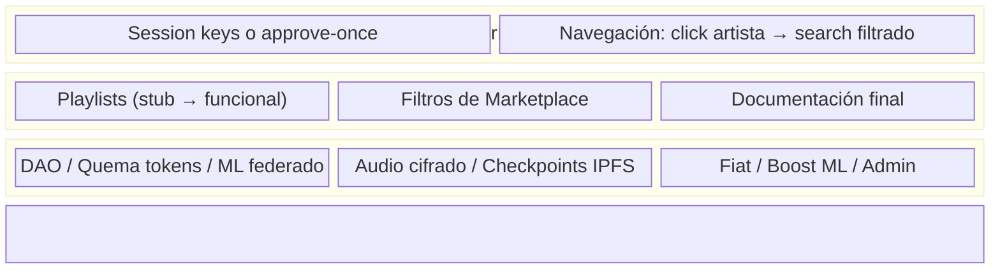

# Wave3 — Status Meeting 2026-04-12

> Fecha: 2026-04-12
> Asistentes: Víctor (yo), Mariano, Ignacio

---

## Segundo Relevamiento: Propuesta vs. Realidad

Cruce de lo comprometido en la propuesta contra lo que existe hoy, organizado por sección de la propuesta.

### Smart Contracts (Sección 9 — Smart Contracts)

| Compromiso | Estado | Nota |
|-----------|--------|------|
| Distribución automática de regalías | ✅ Hecho | `RoyaltiesDistribution.sol` funciona end-to-end |
| Propiedad fraccionada de obras | ⚠️ Parcial | Funciona con contrato custom, **no usa ERC-721/1155** como dice la propuesta |
| Registro de autoría on-chain | ✅ Hecho | Cada Song queda en blockchain con owner y timestamp |

### Tokens (Sección 9 — Tokens)

| Compromiso | Estado | Nota |
|-----------|--------|------|
| Compra de tokens con fiat o crypto | ❌ Falta | Solo hay faucet (mint gratis). Sin Stripe ni exchange |
| Tokens para reproducir canciones | ✅ Hecho | `Wavecoin.buyPlay(songId)` |
| Tokens para adquirir fracciones | ✅ Hecho | `Wavecoin.buyParts(songId, n)` |
| Tokens para boost de recomendación | ❌ Falta | La propuesta dice "aumentar prioridad de sugerencia" — no implementado |
| Recompensas a artistas/inversores por reproducciones | ✅ Hecho | Distribución automática vía `RoyaltiesDistribution` |
| Gobernanza DAO | ❌ Falta | La propuesta menciona "gobernanza parcial delegada mediante contratos DAO" |
| Quema de tokens | ❌ Falta | La propuesta dice "compra y quema de tokens" — los tokens solo circulan |

### Clientes (Sección 9 — Clientes)

| Compromiso | Estado | Nota |
|-----------|--------|------|
| Búsqueda de canciones | ✅ Hecho | Ponder + frontend |
| Reproducción de canciones | ✅ Hecho | Player con IPFS streaming |
| Compra de créditos (tokens) | ⚠️ Parcial | Solo faucet, no compra real |
| Compra de derechos de regalías | ✅ Hecho | Marketplace de fracciones |
| Artistas: subir canciones + estadísticas | ✅ Hecho | Upload + portfolio |
| Admin: supervisión y gestión | ❌ Falta | Solo debug genérico de Scaffold-ETH |
| **Navegación por artista/álbum** | ⚠️ **Parcial** | Click en artista no filtra. Propuesta de Mariano: que lleve al buscador con filtro pre-cargado (no requiere páginas nuevas) |
| **Playlists** | ❌ **Falta** | Tab en menú → stub vacío |

### Sistema de Recomendación (Sección 9 — ML)

| Compromiso | Estado | Nota |
|-----------|--------|------|
| Híbrido colaborativo + contenido | ✅ Hecho | ALS + genre/year + FAISS |
| Descentralizado / federado | ❌ Falta | Entrenamiento centralizado en Docker |
| Checkpoints en IPFS | ❌ Falta | Propuesta lo menciona explícitamente |

### Almacenamiento (Sección 9 — Storage)

| Compromiso | Estado | Nota |
|-----------|--------|------|
| Audio en IPFS | ✅ Hecho | Pinata proxy |
| Audio **cifrado** | ❌ Falta | Propuesta dice "en forma cifrada" — se sube sin cifrar |
| CID registrado on-chain | ✅ Hecho | En el contrato Song |

### UX de Transacciones

| Compromiso | Estado | Nota |
|-----------|--------|------|
| Session keys / gasless play | ❌ **Falta** | Se diseñó, se implementó parcialmente, se removió. Cada play abre MetaMask |

---

## Mapa de lo que falta — priorizado para la entrega

---

## Propuesta: qué hacemos esta semana

### Lo que propongo discutir hoy

**Pregunta central:** De todo lo que falta, ¿qué podemos cerrar esta semana para que la demo sea sólida?

### Opción A — Foco en navegación + UX (pragmático)

| Quién | Tarea | Por qué |
|-------|-------|---------|
| Víctor | Click en artista → search pre-filtrado (idea de Mariano) | No requiere páginas nuevas, solo que los textos sean clickeables y lleven al buscador |
| Mariano | Filtros de marketplace (género, artista) + mejoras de contratos | Ya conoce los contratos, puede agregar queries a Ponder |
| Ignacio | Playlists funcionales + limpieza de placeholders | Ya cerró lo anterior, tiene contexto de frontend |
| Federico | Smart Accounts + session keys | Tiene el contexto, el diseño ya existe en `AA_SESSION_KEYS_DESIGN.md` y los contratos están escritos |

**Session keys:** Si Federico se suma, las toma él. Si no, dejarlo para la semana siguiente o simplificar con `approve(MAX_UINT256)`.

### Opción B — Foco en session keys + navegación (ambicioso)

| Quién | Tarea | Por qué |
|-------|-------|---------|
| Víctor | Click en artista → search pre-filtrado | Quick win de frontend |
| Mariano | Filtros marketplace + queries Ponder | Ya conoce los contratos |
| Ignacio | Playlists + filtros marketplace | Dos features de frontend que puede manejar |
| Federico | Smart Accounts + session keys + integración frontend | Toma el feature completo: deploy + hook + relay |

### Opción C — Quick wins máximos (conservador)

| Quién | Tarea | Por qué |
|-------|-------|---------|
| Víctor | Click en artista → search pre-filtrado + doc final | Quick win + entrega |
| Mariano | `approve(MAX_UINT256)` one-shot + filtros marketplace | El approve elimina el popup sin session keys reales |
| Ignacio | Playlists + placeholders | Cierra items visibles |
| Federico | Smart Accounts + session keys | Si se suma, que avance con lo que tiene contexto |

---

### Lo que habría que negociar con el tutor

Estos items están en la propuesta pero son **irrealizables en el tiempo restante**. Conviene tener claro qué decir si los preguntan:

| Item de la propuesta | Argumento |
|---------------------|-----------|
| Gobernanza DAO | Se priorizó la propiedad fraccionada y distribución de regalías, que es el core de tokenomics |
| ML descentralizado / federado | Se implementó modelo híbrido funcional; el entrenamiento federado es un tema de investigación en sí mismo |
| Compra con fiat | Requiere integración con payment gateway (Stripe) y KYC — fuera del scope técnico de blockchain |
| Audio cifrado en IPFS | El CID on-chain garantiza autenticidad; el cifrado agrega complejidad de key management |
| Checkpoints ML en IPFS | El modelo se reentrena on-demand; persistir checkpoints en IPFS no agrega valor funcional al MVP |
| Boost de recomendación por tokens | Interesante pero secundario al core de regalías + streaming |

---

## Resumen ejecutivo para la reunión

1. **El core funciona**: contratos, tokens, streaming, recomendaciones, IPFS, portfolio real, marketplace con ranking
2. **Navegación**: no hace falta crear páginas nuevas — propuesta de Mariano: click en artista/álbum → search con filtro pre-cargado. Quick win
3. **El tema de firmar cada play es el elefante en la sala** — hay que decidir si vamos por session keys reales o por un `approve` one-shot como workaround
4. **Hay ~6 items de la propuesta que no vamos a llegar** — conviene tener la narrativa lista para el tutor
5. **Esta semana con 3 personas podemos cerrar** navegación clickeable + playlists + filtros marketplace
