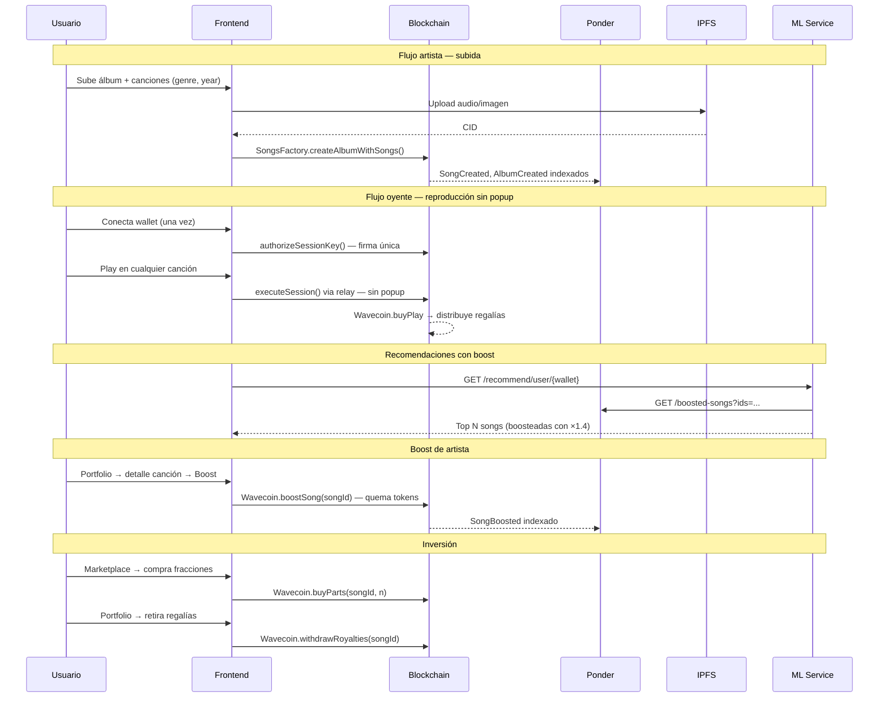

# Wave3 — Status 2026-05-21

> Fecha: 2026-05-21

---

## Resumen ejecutivo

Desde la última reunión (2026-04-12) se cerraron **cuatro de los seis ítems críticos/importantes** del plan. El proyecto está en condiciones de demo. Los dos ítems restantes son playlists y la página de detalle de canción.

---

## Qué se cerró desde el 12-04

### ✅ Boost de recomendación por tokens — implementado end-to-end

El feature más diferenciador de la propuesta está completamente integrado en todos los servicios:

| Capa | Qué se hizo |
|---|---|
| **Contrato** | `Wavecoin.boostSong(songId)` quema tokens y emite `SongBoosted`. `SongsModel.boostExpiry(songId)` expone el timestamp de expiración |
| **Ponder** | Handler `SongsModel:SongBoosted` → tabla `song_boosts`. Endpoint `GET /boosted-songs?ids=...` retorna los activos |
| **ML** | `recommender.py` consulta `/boosted-songs` y aplica `BOOST_MULTIPLIER = 1.4` sobre el score FAISS de canciones boosteadas |
| **Frontend** | `BoostButton.tsx` en el `SongDetailModal` del portfolio: muestra estado activo con fecha de expiración y permite activar el boost |

Esto también cierra parcialmente el ítem de **quema de tokens** de la propuesta (los tokens del boost se queman on-chain).

---

### ✅ Navegación artista / canción — clickeable

`SongCard.tsx` resolvió la navegación sin crear páginas nuevas (propuesta de Mariano):

- Click en nombre de canción → `search?q={nombre}&by=SONG`
- Click en artista → `search?q={artista}&by=ARTIST`

---

### ✅ Filtros en Search y Marketplace — implementados

`SongSearchBar` ya expone toggles por `SONG`, `ALBUM`, `ARTIST` y `GENRE`. El marketplace reutiliza el mismo componente, por lo que tiene filtros nativos sin código adicional.

---

### ✅ Session keys / gasless play — hook completo

`useSponsoredSongPlayback.ts` implementa el flujo completo:

1. Si no hay sesión válida: firma de autorización de session key una sola vez (tx patrocinada por el relay).
2. Cada reproducción posterior firma con la clave efímera local (sin popup de wallet).
3. El relay ejecuta `executeSession` on-chain.

El `PlayButton` usa este hook. Los env vars de activación son:
- `NEXT_PUBLIC_ENABLE_SMART_ACCOUNTS=true`
- `NEXT_PUBLIC_ENABLE_PLAYBACK_SESSIONS=true`

---

## Estado actual de todos los componentes

| Componente | Estado | Notas |
|---|---|---|
| Smart Contracts | ✅ OK | `boostSong`, `boostExpiry`, `SongBoosted` agregados |
| Wavecoin | ✅ OK | `boostSong` quema tokens, resto sin cambios |
| Indexador Ponder | ✅ OK | Handler `SongBoosted` + tabla `song_boosts` + endpoint `/boosted-songs` |
| Ponder REST API | ✅ OK | Nuevo: `/boosted-songs`. Existentes sin cambios |
| ML Recomendación | ✅ OK | Boost multiplier integrado en `recommend_songs_to_user` |
| Session keys / gasless play | ✅ OK | `useSponsoredSongPlayback` con session key completo |
| Navegación artista/canción | ✅ OK | `SongCard` con links a search filtrado |
| Filtros Search/Marketplace | ✅ OK | `SongSearchBar` con SONG/ALBUM/ARTIST/GENRE |
| Boost UI en Portfolio | ✅ OK | `BoostButton` en `SongDetailModal` |
| **Playlists** | ❌ Falta | Tab en menú → sin implementación |
| **Página `/song/:id`** | ❌ Falta | `SongCard` linka a búsqueda, no a página de detalle |
| Tests de frontend | ❌ Falta | 0 archivos de test |
| Admin panel | ❌ Falta | Solo debug de Scaffold-ETH |

---

## Lo que falta — priorizado

### Alta prioridad

| # | Tarea | Esfuerzo | Impacto demo |
|---|---|---|---|
| 1 | **Playlists mínimas** | Medio | Tab vacío en el menú es la primera cosa que se nota |
| 2 | **Página `/song/:id`** | Medio | Player + metadata + compra de fracciones en una sola vista |

### A negociar con el tutor (fuera de scope)

| Item | Argumento |
|---|---|
| Gobernanza DAO | Se priorizó propiedad fraccionada y regalías, que es el core de tokenomics |
| ML descentralizado / federado | Modelo híbrido funcional; entrenamiento federado es investigación en sí mismo |
| Compra con fiat | Requiere payment gateway + KYC — fuera del scope técnico de blockchain |
| Audio cifrado en IPFS | CID on-chain garantiza autenticidad; cifrado agrega complejidad de key management |
| Checkpoints ML en IPFS | Modelo se reentrena on-demand; persistir checkpoints no agrega valor al MVP |

---

## Flujo completo de la plataforma hoy

---

## Propuesta para esta semana

| Quién | Tarea |
|---|---|
| Víctor | Página `/song/:id` — detalle con player, metadata, botón de compra de fracciones |
| Ignacio / Mariano | Playlists mínimas — guardar IDs en localStorage o on-chain simple |
| Todos | Narrativa para el tutor sobre los ítems fuera de scope |
